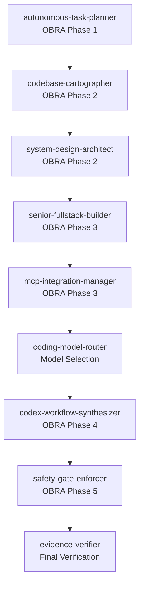

# OBRA Superpowers ↔ Unknowcoding Coding Team Integration

**Version:** 1.0.0  
**Status:** Active  
**Last Updated:** 2026-07-18

---

## Overview

This document maps the **OBRA Superpowers 5-Phase Workflow** with the **Unknowcoding Coding Team Stages** to provide a unified development methodology for SIRINX OS.

---

## Phase Mapping Table

| OBRA Phase | Unknowcoding Stage | Description | Tools |
|------------|-------------------|-------------|-------|
| **Phase 1: Brainstorming** | `autonomous-task-planner` | Task decomposition, goal clarification | clarify, read_file |
| **Phase 2: Writing Plans** | `codebase-cartographer` + `system-design-architect` | Codebase mapping, architecture design | search_files, write_file |
| **Phase 3: Subagent Development** | `senior-fullstack-builder` + `mcp-integration-manager` | Parallel implementation, MCP wiring | delegate_task, terminal |
| **Phase 4: TDD** | `senior-fullstack-builder` + `codex-workflow-synthesizer` | RED-GREEN-REFACTOR cycle | test-driven-development skill |
| **Phase 5: Systematic Debugging** | `safety-gate-enforcer` + `evidence-verifier` | Root cause investigation, verification | systematic-debugging skill |

---

## Detailed Flow

### Entry Point

```bash
# Load bundle
hermes bundle load unknowcoding-coding-team

# Execute workflow
/obra [goal]
```

---

### Phase 1: Brainstorming ↔ autonomous-task-planner

**OBRA Actions:**
- ถามผู้ใช้ 2-3 คำถามสำคัญ
- สร้าง Design Document
- เสนอ Visual Companion

**Unknowcoding Mapping:**
```python
# autonomous-task-planner stage
from skills.autonomous_task_planner import decompose_goal

task_plan = decompose_goal(
    goal=goal,
    context={
        "questions": [
            "แหล่งข้อมูล/requirements หลักอยู่ที่ไหน?",
            "มี constraints พิเศษไหม?",
            "ต้องการ visual companion ไหม?"
        ]
    }
)

# Output: Design document + task list
```

**Output Files:**
- `docs/design/[feature-name].md`
- `docs/design/[feature-name].excalidraw` (optional)

---

### Phase 2: Writing Plans ↔ codebase-cartographer + system-design-architect

**OBRA Actions:**
- แตกงานใหญ่เป็น tasks ย่อย ๆ
- ระบุไฟล์ที่ต้องแก้/สร้าง
- กำหนดวิธีทดสอบ

**Unknowcoding Mapping:**
```python
# codebase-cartographer stage
from skills.codebase_cartographer import map_codebase

codebase_map = map_codebase(
    scope=['apps/**', 'services/**', 'packages/**'],
    forbidden=['.env', 'infra/cloudflare/**']
)

# system-design-architect stage
from skills.system_design_architect import design_architecture

architecture = design_architecture(
    requirements=task_plan.requirements,
    codebase_map=codebase_map
)

# Output: Implementation plan + architecture diagram
```

**Output Files:**
- `docs/implementation-plans/[feature-name].md`
- `docs/architecture/[feature-name].excalidraw`

---

### Phase 3: Subagent Development ↔ senior-fullstack-builder + mcp-integration-manager

**OBRA Actions:**
- สร้าง Subagent แยกกันทำแต่ละ Task (parallel)
- Reviewer Subagent ตรวจผลงาน
- วน loop จนกว่าจะผ่าน

**Unknowcoding Mapping:**
```python
# senior-fullstack-builder stage
from skills.senior_fullstack_builder import build_parallel

tasks = [
    {"goal": "Create base schema for solar leads", "context": "..."},
    {"goal": "Implement ROI calculator engine", "context": "..."},
    {"goal": "Add API endpoints for ROI calculation", "context": "..."}
]

# delegate_task for parallel execution
delegate_task(tasks=tasks)

# mcp-integration-manager stage (if MCP needed)
from skills.mcp_integration_manager import wire_mcp

mcp_config = wire_mcp(
    tools=['firecrawl', 'vector-store'],
    dry_run=True
)
```

**Output Files:**
- Created/modified source files
- MCP config (if needed)
- Subagent execution logs

---

### Phase 4: TDD ↔ senior-fullstack-builder + codex-workflow-synthesizer

**OBRA Actions:**
- เขียน Test ก่อน Production Code
- บังคับ RED-GREEN-REFACTOR cycle
- ห้ามแอบเขียนโค้ดโดยไม่มี Test

**Unknowcoding Mapping:**
```python
# Load TDD skill
from skills.test_driven_development import tdd_cycle

# RED phase
test_case = write_failing_test(
    feature="ROI calculation",
    scenario="Zero consumption returns 0"
)

# GREEN phase
implementation = make_test_pass(
    test_case=test_case,
    min_changes=True
)

# REFACTOR phase
refactored = refactor_code(
    code=implementation,
    extract_utilities=True
)

# codex-workflow-synthesizer stage
from skills.codex_workflow_synthesizer import synthesize_workflow

workflow = synthesize_workflow(
    tests=test_case,
    implementation=implementation,
    refactored=refactored
)
```

**Output Files:**
- Test files: `**/*.test.ts`, `**/*.test.py`
- Test coverage report: `coverage/lcov.info`
- Production code verified

---

### Phase 5: Systematic Debugging ↔ safety-gate-enforcer + evidence-verifier

**OBRA Actions:**
- 4 Phase การสืบสวน (Understand → Reproduce → Fix → Verify)
- หา Root Cause ก่อนแก้
- หยุดถ้าแก้ 3 ครั้งไม่หาย → กลับไปทำ architecture ใหม่

**Unknowcoding Mapping:**
```python
# safety-gate-enforcer stage
from skills.safety_gate_enforcer import check_gates

gates = check_gates(
    checks=['AGENTS.md', 'security', 'performance', 'regression']
)

# evidence-verifier stage
from skills.evidence_verifier import verify_evidence

evidence = verify_evidence(
    files_created=['services/api-opal/lib/roi-engine.ts'],
    tests_passed=12,
    tests_failed=0,
    coverage=0.85,
    no_secrets=True,
    no_deploy=True
)

# systematic-debugging skill (if bugs found)
from skills.systematic_debugging import debug_4phase

debug_result = debug_4phase(
    issue="ROI calculation incorrect for high consumption",
    evidence={
        "understand": "...",
        "reproduce": "...",
        "fix": "...",
        "verify": "..."
    }
)
```

**Output Files:**
- Debug log: `memory/live/debug-[timestamp].md`
- Evidence report: `reports/evidence-[feature-name].md`
- Verification receipt: `receipts/verification-[id].json`

---

## Dependency Order

When using both systems together, preserve this order:



---

## Command Examples

### Example 1: Solar Feature Development

```bash
# Load bundle
hermes bundle load unknowcoding-coding-team

# Execute OBRA workflow
/solar เพิ่มระบบคำนวณ ROI สำหรับโซลาร์เซลล์
```

**Execution Flow:**
1. **autonomous-task-planner** (OBRA Phase 1): Decompose goal, ask questions
2. **codebase-cartographer** (OBRA Phase 2): Map `apps/web-opal/**`, `services/api-opal/**`
3. **system-design-architect** (OBRA Phase 2): Design ROI engine architecture
4. **senior-fullstack-builder** (OBRA Phase 3): Build in parallel via `delegate_task`
5. **mcp-integration-manager** (if MCP needed): Wire knowledge base
6. **coding-model-router**: Select cheapest safe model
7. **codex-workflow-synthesizer** (OBRA Phase 4): TDD cycle
8. **safety-gate-enforcer** (OBRA Phase 5): Check AGENTS.md compliance
9. **evidence-verifier** (OBRA Phase 5): Verify tests pass, no secrets

---

### Example 2: Knowledge Base Scraper

```bash
/automation สร้าง webhook handler สำหรับ LINE live chat
```

**Execution Flow:**
1. **autonomous-task-planner**: Decompose webhook handler task
2. **codebase-cartographer**: Map `services/live-chat-gateway/**`
3. **system-design-architect**: Design event normalization pipeline
4. **senior-fullstack-builder**: Build webhook endpoint + handlers
5. **mcp-integration-manager**: Wire LINE MCP adapter
6. **coding-model-router**: Select model for intent classification
7. **codex-workflow-synthesizer**: TDD for rate limiting
8. **safety-gate-enforcer**: Verify no real LINE send without approval
9. **evidence-verifier**: Evidence for webhook handler functionality

---

## Safety & Authority Boundary

Both systems respect AGENTS.md rules:

```yaml
forbidden:
  - install
  - provider_call
  - live_send
  - push
  - deploy
  - Cloudflare mutation
  - secret access
  - .env reading

required_gates:
  - AGENTS.md compliance
  - No secrets exposure
  - PII masking
  - Human approval for external actions
```

---

## Output Format

Each phase produces structured output:

```json
{
  "workflow": "obra-unknowcoding",
  "phase": "subagent-development",
  "obra_phase": 3,
  "unknowcoding_stage": "senior-fullstack-builder",
  "task_id": "task-001",
  "status": "completed",
  "duration_ms": 45000,
  "files_created": [
    "services/api-opal/lib/roi-engine.ts",
    "services/api-opal/test/roi-engine.test.ts"
  ],
  "tests_passed": 12,
  "tests_failed": 0,
  "coverage": 0.85,
  "evidence_path": "reports/evidence-roi-engine.md",
  "verification_status": "pass"
}
```

---

## Exit Criteria

Workflow complete when:

**OBRA Exit Criteria:**
- [ ] Phase 1: Design document created and approved
- [ ] Phase 2: Implementation plan with tasks defined
- [ ] Phase 3: All subagent tasks completed and reviewed
- [ ] Phase 4: All tests pass (RED-GREEN-REFACTOR verified)
- [ ] Phase 5: No outstanding bugs (or documented as known issues)

**Unknowcoding Exit Criteria:**
- [ ] All stages executed in dependency order
- [ ] Architecture precedes implementation
- [ ] MCP work starts with inventory + dry-run
- [ ] Every completion claim passes evidence-verifier
- [ ] No secrets, no deploy, no push without approval
- [ ] Structured runtime keys use UpperCamelCase

**Combined Exit Receipt:**
```json
{
  "obra_phases_complete": 5,
  "unknowcoding_stages_complete": 9,
  "evidence_verified": true,
  "authority_boundary_respected": true,
  "next_gate": "human_approval_for_deploy",
  "receipt_id": "obra-unknowcoding-receipt-001"
}
```

---

## References

- **OBRA Workflow**: `workflows/obra-superpowers-workflow.md`
- **OBRA Skill**: `obra-superpowers-workflow` (Hermes skill)
- **Unknowcoding Bundle**: `configs/hermes/skill-bundles/unknowcoding-coding-team.yaml`
- **Unknowcoding Skill**: `unknowcoding-coding-team` (Hermes skill)
- **AGENTS.md**: Root operating constitution

---

**Last Updated:** 2026-07-18  
**Maintained By:** SIRINX OS AI Agents
