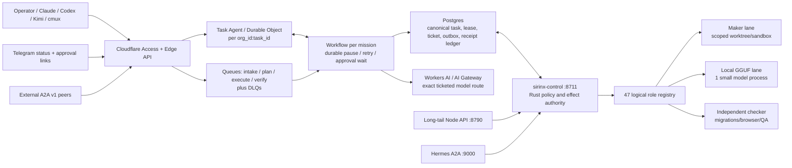

# SIRINX Mac mini M2 Agentic HQ — Research and Architecture Packet

Date: 2026-07-20 (Asia/Bangkok)  
Status: `RESEARCH_COMPLETE / IMPLEMENTATION_HOLD`  
Target host: Mac mini M2, 8 GiB unified memory  
Scope: local agentic coding, 47-role SIRINX roster, A2A interoperability,
Cloudflare coordination/inference, Telegram operations, API-first backend, and
QA/reverse-engineering boundaries.

## 1. Executive decision

Do **not** bulk-clone, bulk-install, download a frontier model, start a provider,
mutate an A2A queue, send Telegram messages, or deploy from the current host.
The host has about 4.8–5.0 GiB free, below the 15 GiB SIRINX implementation
admission floor. Both active repositories also contain substantial pre-existing
dirty work that must be preserved.

The viable target is a hybrid system:

- Postgres is the sole durable authority for tasks, approvals, leases, effects,
  verification, and receipt chains.
- `sirinx-control` on the Mac validates policy and executes scoped work.
- Cloudflare provides authenticated ingress, per-task coordination, durable
  workflows, at-least-once queues with deduplication/DLQ, and optional ticketed
  inference.
- One small local GGUF model may serve drafting/routing at concurrency 1 after
  disk recovery and a model-specific approval.
- The 47 Ronin are 47 logical role identities scheduled across at most three
  active lanes: one coordinator/local-model lane, one maker, and one independent
  verifier.
- Telegram is an alert/status/approval-link surface. It never becomes an
  approval authority or an unrestricted command executor.
- Existing SIRINX `/api/a2a/*` routes remain internal compatibility routes until
  an A2A v1 adapter passes interoperability and security tests.

Production remains `HOLD`.

## 2. Verified local snapshot

The following is a read-only snapshot taken during this research. It is not
runtime-completion evidence.

| Item | Observed state | Decision |
|---|---|---|
| Mac | M2, 8 GiB unified memory, 8 CPU cores | Use bounded local lanes only |
| Disk | approximately 4.8–5.0 GiB free | No install/build/model download |
| `sirinx-co` | branch `agent/b1-b2-command-center`, SHA `1f05814c3e9d173e525234d69b3ce7f2d1b01a57`, ahead and dirty | Preserve; isolate future candidate work |
| `sirinx-os` | branch `migration/v5-rebase`, SHA `b55f81ecd372ff23a34fcf33c2744706447e14ca`, heavily dirty | Preserve; research/docs only |
| Local inference | Ollama installed but daemon not running; `llama.cpp` CLI present | Do not start without model/runtime ticket |
| Port 8711 | stale Node control API from `sirinx-os` observed | Do not kill/rebind without service ticket |
| Port 8790 | canonical Node long-tail default; no listener observed | Reserved; no start performed |
| Port 9000 | Hermes A2A service responded healthy | UI/health is not workflow proof |
| Wrangler | not installed | Use no Cloudflare install/deploy yet |
| Existing model manifests | small Qwen/Llama/DeepSeek entries and one larger GGUF were observed | Manifest presence is not inference proof |

Protected credential/config files were not read. No service was stopped or
started. No model was loaded. No repository was cloned or installed. No provider
was called.

## 3. Truth corrections

### 3.1 The 47 Ronin

`47` is a logical roster/schema target, not 47 resident agents. Current research
found six lead role files and four implemented Rust agents. The production design
must therefore represent roles in a registry and schedule them through bounded
workers. A UI card, queue packet, or role descriptor does not prove an executing
agent.

### 3.2 A2A

The existing SIRINX sync endpoints are internal mesh APIs. They do not by
themselves prove conformance with the Linux Foundation A2A v1 protocol. The
official [A2A specification](https://a2a-protocol.org/latest/specification) and
[official Rust SDK](https://github.com/a2aproject/a2a-rs) support Agent Cards,
JSON-RPC, REST, gRPC, streaming, and explicit task states. External Agent Cards,
messages, repository content, and web pages must be treated as untrusted input.

### 3.3 Authority

Cloudflare Durable Objects, D1, queues, Telegram, and model responses are
projections or transports. None may grant approval or declare an external effect
complete. Postgres plus a validated, single-use action ticket is authoritative.

## 4. Model findings

### 4.1 Frontier models

| Model | Publisher truth | Local M2 8 GiB decision | Remote decision |
|---|---|---|---|
| GLM-5.2 | Official large MoE weights; MIT model weights. Cloudflare exposes `@cf/zai-org/glm-5.2` with reasoning and function calling | Not viable. Official artifacts are hundreds of GiB to over 1 TiB | Eligible only through a paid/provider ticket with data class, call/token/cost limits and expiry |
| “GLM-5.2 uncensored” | No matching official publisher artifact verified | Exclude community fork from corporate runtime until provenance, license, checksum, behavior, and safety review | No aliasing to official GLM |
| Kimi K3 | Official model exists; full local weights were not yet available at the research cutoff | Not installable; publisher-scale deployment is far beyond this host | App/API use requires a separate provider ticket |
| “Kimi K3.0 GGUF/light” | No publisher GGUF/light artifact verified | Do not download a third-party file under this name | Re-evaluate after an official model card, license, files, and digests exist |

Primary sources: [Cloudflare GLM-5.2 model page](https://developers.cloudflare.com/workers-ai/models/glm-5.2/),
[official GLM repository](https://github.com/zai-org/GLM-5),
[Kimi K3 technical page](https://www.kimi.com/blog/kimi-k3), and
[Moonshot official model catalog](https://huggingface.co/moonshotai/models).

“Uncensored” is not an admissible production requirement. Models may propose;
only policy-bound tools may execute.

### 4.2 Local shortlist after disk admission

| Rank | Exact publisher artifact | License | Approx. Q4 size | Intended lane |
|---:|---|---|---:|---|
| 1 | `Qwen/Qwen3-4B-GGUF`, `Q4_K_M` | Apache-2.0 | 2.5 GB | Primary local drafting/reasoning |
| 2 | `Qwen/Qwen2.5-Coder-1.5B-Instruct-GGUF`, `Q4_K_M` | Apache-2.0 | 1.12 GB | Fast code worker |
| 3 | `ibm-granite/granite-3.3-2b-instruct-GGUF`, `Q4_K_M` | Apache-2.0 | 1.55 GB | Router/tool schema work |
| 4 | `microsoft/Phi-3-mini-4k-instruct-gguf`, Q4 | MIT | 2.2 GB | Constrained fallback |

Sources: [Qwen3 4B GGUF](https://huggingface.co/Qwen/Qwen3-4B-GGUF),
[Qwen 2.5 Coder 1.5B GGUF](https://huggingface.co/Qwen/Qwen2.5-Coder-1.5B-Instruct-GGUF),
[Granite 3.3 2B GGUF](https://huggingface.co/ibm-granite/granite-3.3-2b-instruct-GGUF), and
[Phi-3 mini GGUF](https://huggingface.co/microsoft/Phi-3-mini-4k-instruct-gguf).

Initial runtime envelope: one model process, context 4K–8K, concurrency 1,
loopback only, exact file digest pinned, no tool authority by default. Reuse the
existing `llama.cpp` runtime rather than adding another model server unless a
benchmark proves a need.

## 5. Licensed repository shortlist

This is a quarantine/import shortlist, not an instruction to clone or install.

| Candidate | License / source | Use | Disposition |
|---|---|---|---|
| `cloudflare/agents` | MIT, [official repo](https://github.com/cloudflare/agents) | Edge Agent/Durable Object, subagents, workflows, HITL, MCP/A2A patterns | Primary Cloudflare reference/package; exact version and Node compatibility required |
| `a2aproject/a2a-rs` | Apache-2.0, [official repo](https://github.com/a2aproject/a2a-rs) | A2A v1 Rust adapter and conformance | Primary interoperability candidate; integrate only behind a feature flag |
| `a2aproject/A2A` | Apache-2.0, [official repo](https://github.com/a2aproject/A2A) | Protocol/spec/examples | Documentation/test-vector reference only |
| `ggml-org/llama.cpp` | MIT, [official repo](https://github.com/ggml-org/llama.cpp) | Apple Silicon local inference | Already available locally; do not clone a duplicate |
| `VoltAgent/voltagent` | MIT, [official repo](https://github.com/VoltAgent/voltagent) | Supervisor/subagent/workflow/guardrail ideas | Pattern/reference candidate, not a replacement for Rust/Postgres authority |
| `OpenHands/openhands` | MIT core; `enterprise/` has a separate license, [official repo](https://github.com/OpenHands/OpenHands) | Sandbox and coding-agent research | Heavy; sandbox-only evaluation after resource admission; exclude enterprise subtree |

Every candidate must pass: exact URL and commit pin, publisher identity, license
receipt, recursive license scan, dependency/SBOM review, install-script review,
secret/network/static checks, expected disk delta, and rollback plan. GitHub stars
or trend position are discovery signals, never trust signals.

Repositories with non-Apache/MIT source-available terms, ambiguous provenance,
automatic credential ingestion, or “install everything” scripts remain excluded
from the primary path.

## 6. Target architecture



Cloudflare components follow their documented semantics:

- Durable Objects are per coordination atom and reconstructable, not global
  approval authority: [DO rules](https://developers.cloudflare.com/durable-objects/best-practices/rules-of-durable-objects/).
- Queues are at-least-once; consumers require transactional idempotency and a
  DLQ: [delivery guarantees](https://developers.cloudflare.com/queues/reference/delivery-guarantees/) and
  [dead-letter queues](https://developers.cloudflare.com/queues/configuration/dead-letter-queues/).
- Workflows own durable multi-step execution and may pause for human approval:
  [Agents with Workflows](https://developers.cloudflare.com/agents/concepts/workflows/).
- Cloudflare-to-Postgres access should use a restricted role and Hyperdrive;
  approval/gate reads bypass stale caches:
  [Hyperdrive behavior](https://developers.cloudflare.com/hyperdrive/concepts/how-hyperdrive-works/).

## 7. Canonical state and data contracts

```text
DRAFT -> TRIAGED -> PLANNED -> QUEUED -> LEASED -> MAKING
      -> CHECKING -> GUARDED
      -> WAITING_APPROVAL | EXECUTING
      -> VERIFYING -> RECEIPTED -> SUCCEEDED

unknown or untrusted contract -> QUARANTINED
ambiguous external result      -> EFFECT_UNKNOWN
exhausted transport retry      -> DEAD_LETTER
```

Expand-only migrations after 0004 should introduce or harden:

- `tasks` with immutable goal reference, scope/plan hashes, data class, and
  unique idempotency key;
- `task_events` with monotonic sequence and predecessor/payload hashes;
- `stage_leases` with role, node, target paths, nonce, expiry, and CAS version;
- `action_tickets` and one-use `approval_grants`, both bound to exact action,
  target, SHA, plan hash, scope hash, nonce, budget, and expiry;
- transactional `outbox` and `inbox_dedupe`;
- `verification_runs`, content-addressed `artifacts`, `model_catalog`,
  `a2a_peers`, and append-only `receipts`.

D1 may remain a sanitized search/brain projection. Durable Objects remain live
coordination projections. R2 may hold encrypted artifacts; hashes and authority
stay in Postgres.

## 8. Security and QA requirements

| Risk | Required proof before activation |
|---|---|
| Prompt injection from repo/web/A2A | Closed schemas, treat content as data, injection corpus, no free-text shell |
| Malicious dependency/install script | Quarantine clone, exact commit, license receipt, SBOM, static review, no credential read |
| Approval replay/confused deputy | One-use nonce; action/plan/scope/SHA binding; maker/checker split; replay tests |
| Queue duplicate/reorder | Transactional dedupe, monotonic sequence, idempotent effects, duplicate/crash tests |
| Crash after external effect | Move to `EFFECT_UNKNOWN`; never auto-retry; operator reconciliation |
| A2A Agent Card spoofing/webhook SSRF | TLS, allowlisted issuer/host, card digest/signature, protected card, DNS/IP checks |
| Secret/code exfiltration | Literal protected-read boundary, payload minimization, data-class route policy, redacted logs |
| Telegram takeover | Fixed owner/destination, rate limit, dedupe, Access-backed approval; chat text cannot approve |
| Unsafe reverse engineering | Owner-provided/public/authorized target only; no credential extraction, access bypass, malware, or license circumvention |
| Model behavior bypass | Tool policy remains independent of model; no “uncensored” privilege; golden-set and tool-schema tests |

## 9. Exact action gates

Broad phrases such as `APPROVE_IMPLEMENTATION`, “full auto,” or “install all
repos” are not action tickets. Use separate, digest-bound approvals:

```text
APPROVE_DISK_RECOVERY <inventory-id> <exact recoverable targets> <max-bytes>
APPROVE_AGENT_REPO_LAB_CLONE <repo-url> <40-char-commit> <quarantine-path>
APPROVE_AGENT_REPO_LAB_INSTALL <repo-url> <40-char-commit> <lockfile-digest>
APPROVE_LOCAL_MODEL_DOWNLOAD <publisher/model> <revision> <file-digest> <max-bytes>
APPROVE_LOCAL_MODEL_START <file-digest> <loopback-port> <context> <concurrency>
APPROVE_A2A_V1_ADAPTER_IMPLEMENTATION <repo-sha> <plan-hash>
APPROVE_CLOUDFLARE_LOCAL_PREVIEW <repo-sha> <plan-hash>
APPROVE_CLOUDFLARE_PRIVATE_DEV_DEPLOY <ticket-id> <repo-sha> <account-scope>
APPROVE_WORKERS_AI_PROVIDER_CALL <ticket-id> <model-id> <data-class> <max-calls> <max-cost>
APPROVE_TELEGRAM_LIVE_SEND <ticket-id> <fixed-destination> <payload-digest>
APPROVE_QUEUE_MUTATION <ticket-id> <packet-set-digest>
APPROVE_PUSH <ticket-id> <repo> <branch> <sha>
APPROVE_MERGE <ticket-id> <pr> <sha>
APPROVE_DEPLOY <ticket-id> <service> <sha> <environment>
```

Each ticket is single-action, single-use, expires, and includes an evidence and
rollback contract.

## 10. Release evidence chain

The system is not production-complete until the same exact candidate SHA has:

1. Billing Lock release evidence.
2. CI execution evidence (not a no-step/skipped result).
3. Migrations 0003–0004 tested from empty and prior-schema states on disposable
   Postgres, including rollback/restore evidence where supported.
4. Authenticated browser smoke evidence.
5. Independent review evidence and resolved findings.
6. A separate merge ticket and merge receipt.
7. A separate deploy ticket and receipt for each Rust service.
8. Separate Cloudflare/DNS, provider-call, queue-mutation, and Telegram-live
   tickets where applicable.

Receipts from a different or superseded SHA cannot be reused.

## 11. Recommended next safe action

First recover disk to at least 15 GiB using a reviewed, recoverable inventory;
do not delete source, dirty worktrees, Docker volumes, runtime state, browser
state, Ollama models, backups, or user documents by default. Then benchmark the
already-present local runtime before downloading any model. Only after that,
approve one pinned quarantine clone—preferably `a2aproject/a2a-rs`—and perform a
metadata/static review before any package install.

Until those gates pass, the correct state is:

```text
RESEARCH_COMPLETE
INSTALL_BLOCKED_RESOURCE_ADMISSION
EXTERNAL_ACTIONS_HOLD
PRODUCTION_HOLD
```
