# GhostClaw Unified Runtime Extension V1

Status: `DESIGN_ONLY`  
Date: 2026-07-18  
Authority: local architecture and contract proposal only  
Production activation: blocked pending exact human approval

## Task card

Goal:
Define one fail-closed runtime extension for Hermes, Telegram Command Center,
the agent queue, cmux supervision, OmniRoute, evidence, retry/DLQ, and future
worker nodes.

Constraints:

- Preserve the 18 locked Grid Mermaid plans without modification.
- Do not deploy, push, send a live Telegram message, call a provider, install a
  package, read a secret, or mutate cloud infrastructure.
- Treat current Python, JavaScript, SQLite, worker-local, and file queues as
  compatibility inputs, not concurrent execution authorities.
- Unknown schema, tier, action, model, provider, target, or evidence fails
  closed.
- This document grants no runtime authority.

File scope:

- Additive architecture and schema work only.
- Canonical runtime candidate: `services/orchestrator/crates/**`.
- Operator surfaces: `services/dev-control-api/**` and private Command Center
  UI only.

Expected result:

- One bounded control plane.
- One canonical queue/outbox authority.
- Exact, one-use approval contracts.
- Deterministic retry, DLQ, redrive, read-back, and hash-chained evidence.
- A product-native Telegram/Command Center lock specification.

Verification:

- JSON Schema 2020-12 documents parse successfully.
- Local unit tests cover fail-closed behavior.
- Cloudflare Worker and Telegram router pass syntax checks.
- No external side effect occurs.

Report format:

- Evidence observed
- Changes made
- Checks run
- Remaining blockers
- Exact next gate

## Relationship to the locked architecture

The diagrams identified by `docs/MOA_SYSTEMS_LOCK.md` and
`docs/grid/sirinxdev/README.md` remain immutable. The following diagram is an
additive runtime extension and is not a replacement or revision of those 18
plans.

```mermaid
flowchart LR
  IN[Telegram / Local CLI / Schedule / Event] --> ADMIT[Intake + Admission]
  ADMIT -->|valid, deduplicated| CORE[Mission Core]
  ADMIT -->|unknown or unsafe| Q[Quarantine]
  CORE --> TRIAGE[Deterministic Triage]
  TRIAGE --> OUTBOX[Canonical Durable Outbox]
  OUTBOX --> LEASE[Scoped Stage Lease]
  LEASE --> MAKER[Maker]
  MAKER --> CHECKER[Independent Checker]
  CHECKER -->|repair under cap| MAKER
  CHECKER -->|pass| GUARD[Deterministic Guard]
  GUARD -->|LOW| EXEC[Bounded Executor]
  GUARD -->|MEDIUM| ABORT[Abort Window]
  GUARD -->|HIGH| APPROVAL[Exact Human Approval]
  ABORT --> EXEC
  APPROVAL --> EXEC
  EXEC --> VERIFY[Independent Read-back]
  VERIFY --> RECEIPT[Hash-chained Receipt]
  RECEIPT --> DONE[Done]
  OUTBOX -->|transient| RETRY[Delayed Retry]
  OUTBOX -->|fatal or exhausted| DLQ[Dead Letter Queue]
  DLQ --> ALERT[Local Alert Draft]
  ALERT --> REDRIVE[Exact One-time Redrive Gate]
  REDRIVE --> OUTBOX

  CMUX[cmux Operator View] -. read-only .-> CORE
  TG[Telegram Command Center] -. read-only/default preview .-> CORE
  OMNI[OmniRoute Adapter] -. after route policy .-> MAKER
  CF[Cloudflare Future Worker Node] -. registered data plane only .-> LEASE
```



## Evidence state

Baseline findings observed before the local repair:

- The Rust orchestrator already contains the strongest mission, state-machine,
  outbox, approval, dispatch, router, and hash-chain primitives.
- Existing queue behavior is fragmented across multiple non-canonical planes.
- `scripts/full-auto-approval-loop.py` contained self-approval, tier downgrade,
  implicit completion, and automatic Git push paths.
- `scripts/cmux-agent-dispatcher.py` treated missing tiers as safe and lacked a
  durable lease, retry, DLQ, and receipt boundary.
- `scripts/cmux-cli-dispatcher.py` contained a free-text shell execution path.

Current checkout evidence after the local repair:

- Those three entrypoints now require a closed structured action type, round
  risk upward, quarantine unknown or secret-access work, and perform no
  provider, live-send, install, push, deploy, or cloud action.
- The CLI dispatcher is a read-only packet preview; successful worker claims
  remain pending until independent read-back rather than moving directly to
  done.
- The legacy approval engine now loads the checked-in fail-closed policy,
  treats unknown actions as non-approvable X, holds commit/push/deploy/install
  at an exact human gate, requires an independent checker receipt for Tier B,
  and cannot return approval when receipt persistence or replay protection
  fails.
- Offline safety tests cover missing/unknown tiers, oversized input,
  production database mutation, hard-deny actions, assignment, and completion
  verification. This proves checkout behavior only, not runtime activation.
- No current scheduler or exact running process for the first two scripts was
  proven, so containment is code hardening rather than a claimed runtime stop.
- OmniRoute runtime health and provider access remain unverified. Its CLI is
  not a safe inspection path because a version probe attempted to load a local
  environment file.

Inferred, not yet proven:

- The Rust orchestrator is the lowest-risk consolidation target because it
  already has deterministic governance contracts. Persistence and adapters
  still need implementation and tests.
- Cloudflare may later host a registered worker/data-plane adapter, but must not
  become the approval authority or the sole control-plane writer.

## Bounded contexts and authority

| Context | Owns | Must never own |
|---|---|---|
| Intake and identity | authentication, normalized envelope, redaction, dedupe, quarantine | execution, risk downgrade |
| Mission core | legal task state and repair counter | approval or provider selection |
| Governance | risk, capability, lease, panic, exact approval | maker artifact editing |
| Queue/outbox | claim, delay, retry, DLQ, lineage | interpreting user intent |
| Worker fleet | one leased stage and exact targets | self-route, self-approve, redrive |
| Model routing | verified catalog selection, egress and budget checks | Guard or policy authority |
| Verification | deterministic checks and independent read-back | maker repair |
| Evidence ledger | hashes, receipt chain, retention, purge | task outcome decisions |
| Node federation | node identity, trust zone, capability ceiling | leadership self-promotion |
| Operator control | status, pause, panic, exact approval UI | hidden execution |

Initial authority lock:

- Mac mini M2 is the sole control-plane writer.
- cmux is a supervisor/operator view, not runtime truth.
- Telegram is a reporting and exact-approval surface, not an executor.
- OmniRoute is a model transport adapter after policy selection.
- PC, VPS, and Cloudflare nodes start with no leadership, no secret access, no
  public control endpoint, and no external-effect capability.

## Canonical state machines

### Mission

```text
INTAKE -> TRIAGE -> MAKER -> CHECKER
CHECKER_FAIL -> MAKER                 when repair_count < 3
CHECKER_FAIL -> STALLED               at repair limit
CHECKER_PASS -> GUARD
GUARD + LOW -> EXECUTING
GUARD + MEDIUM -> WAITING_WORKFLOW_RELEASE -> EXECUTING
GUARD + HIGH -> WAITING_APPROVAL -> EXECUTING
UNKNOWN or X -> QUARANTINED
EXECUTING -> VERIFYING -> DONE | FAILED | EFFECT_UNKNOWN
```

### Queue

```text
PENDING -> CLAIMED -> VERIFYING -> DELIVERED
CLAIMED -> PENDING                    explicit transient failure and retry due
CLAIMED -> DEAD_LETTER                fatal failure or attempt ceiling
CLAIMED -> EFFECT_UNKNOWN             external effect cannot be proven
DEAD_LETTER -> REDRIVE_REQUESTED      human request only
REDRIVE_REQUESTED -> REDRIVEN         exact one-use approval + NOT_APPLIED proof
```

Transport is at-least-once. Effects must be idempotent. The system must not
claim exactly-once delivery.

Initial retry policy:

- Three total attempts: initial attempt plus two retries.
- Delay: 5 seconds, then 30 seconds.
- Claim lease: 90 seconds; heartbeat: 30 seconds.
- Only a closed allowlist of network timeout, explicit rate limit, and temporary
  service unavailability may be transient.
- Unknown, schema, policy, authentication, MFA, permission, integrity,
  approval, unsafe-target, and secret-like failures are fatal/quarantined.
- An indeterminate external effect is never automatically retried.

## Versioned contract set

All runtime contracts use JSON Schema 2020-12 and closed objects. Rust mirrors
must use `deny_unknown_fields`.

1. `CommandEnvelopeV1`
   - message, correlation, and idempotency IDs
   - source channel, node, and principal references
   - received time, non-executable goal, constraints
   - attachment hashes and payload hash
2. `ActionManifestV2`
   - closed action enum, operation, lane, data class, exact targets
   - dry-run and impact flags
   - call, runtime, and cost caps
   - plan, scope, action, and idempotency hashes
3. `WorkMessageV1`
   - stage, attempt, due time, lease metadata, failure class
   - payload reference/hash and redrive lineage
4. `StageLeaseV1`
   - exact worker, node, stage, actions, targets, resources, nonce, expiry, CAS
5. `StageResultV1`
   - lease identity, artifact/evidence hashes, allowlisted argv receipt,
     telemetry, and timestamps
6. `ApprovalGrantV2`
   - one action, exact targets, action/plan/scope hashes, approver, nonce,
     expiry, and caps
7. `ModelCatalogEntryV1` and `RouteReceiptV1`
   - verified exact provider/model ID, allowed roles/data class, budget and route
     evidence
8. `EvidenceManifestV1` and `TransitionReceiptV2`
   - sanitized artifact reference, digest, expiry, state hashes, predecessor hash
9. `RedriveRequestV1`
   - original DLQ identity/hash, NOT_APPLIED proof, fresh message/idempotency IDs,
     checker/guard receipts, and fresh gated approval when required
10. `NodeManifestV1`
    - trust zone, capabilities, egress/data ceilings, resources, identity-key
      reference, and attestation hash

## Exact red gates

These actions always require a separate exact human approval:

- package install or dependency mutation
- provider call, including nominally free external inference
- live Telegram or customer message
- Git commit publication or push
- deployment, DNS, Cloudflare, or production database mutation
- real price, promotion, shipment, refund, claim, purchase order, or financial
  commitment

Each grant binds task ID, action type, operation, target, scope, approver,
expiry, nonce, and action digest. Generic, inherited, bundled, replayed, or
self-issued approval is invalid. Quarantined X actions cannot be approved.

Immediate quarantine includes unknown contracts, models/providers, target
traversal or wildcards, secret access or extraction, bypass/uncensored intent,
confidential cloud egress, maker/checker identity collision, stale leases,
broken receipts, active panic, unavailable cost evidence, and endpoint drift.
Secret rotation is intentionally absent from V1 and would require a separate
sealed capability and exact human-approved design before implementation.

## Telegram Command Center lock specification

Product thesis:

> A private operator cockpit that makes the next safe decision obvious and
> makes every unavailable action explain why it is blocked.

Audience and high-stakes action:

- Primary user: SIRINX operator on mobile Telegram or private desktop Command
  Center.
- Critical action: inspect evidence, isolate a blocker, and issue one exact
  approval without accidentally triggering an external effect.

Visual and interaction system:

- Preserve SIRINX dark-premium identity; use cyan/teal for observed healthy
  evidence, amber for review, red for blocked/high risk, and violet only for
  secondary routing context.
- Use a quiet rational grid. Grid lines support alignment and never become the
  decoration.
- One dominant `Now / Needs Attention` area; do not render every item as an
  equally weighted card.
- Show `OBSERVED`, `INFERRED`, `UNVERIFIED`, and `BLOCKED` labels explicitly.
- Every action shows autonomy level, tool tier, side-effect class, receipt
  requirement, and last verified time.
- Raw JSON belongs in a disclosure/debug panel, never the default operator
  experience.
- Approval buttons display exact action, target, digest prefix, expiry, cost
  cap, and rollback reference before confirmation.
- Disabled controls remain visible with a concrete blocker and next safe step.

Required responsive states:

- desktop, tablet, and mobile recompose rather than shrink
- default, hover, focus-visible, active, disabled, loading, empty, error,
  blocked, unverified, success, and stale
- keyboard reachability and logical focus order
- no color-only status signaling
- readable Thai text without clipped labels
- reduced-motion behavior for animated status changes

Initial Telegram additions are read-only only:

- `/ui lockspec` returns the product thesis, locked safety mode, schema version,
  and no-external-write assertion.
- `/queue safety` may be added only after the canonical queue can return real
  evidence; a mocked queue must not claim health.

## Cloudflare boundary

Current main-router code is a public web/lead path, not the GhostClaw control
plane. The Command Center must not be added to `sirinx.co` or
`www.sirinx.co`.

Future Cloudflare queue/worker adapters must:

- use explicit bindings and compatibility dates
- process each message independently with per-message `ack()` or `retry()`
- assume at-least-once delivery and enforce idempotency
- use a configured DLQ and capped retry/backoff
- redact logs and never expose tokens in frontend or Worker output
- keep approval, policy, and receipt authority outside the transport adapter
- remain undeployed until the production release gate is approved

Current static main-router review:

- `infra/cloudflare/main-router/wrangler.jsonc` declares a Worker entrypoint,
  compatibility date, public apex/www routes, and a D1 binding.
- `worker.js` parses and validates the documented lead payload shapes and fails
  closed when the D1 binding is absent.
- The request path performs `CREATE TABLE IF NOT EXISTS` before inserts; schema
  migration ownership should move out of the request handler before a release.
- No application-level idempotency key/deduplication, rate-limit adapter,
  Turnstile/abuse control, or explicit CORS allowlist was found in this Worker.
  These are P1 production-hardening gaps, not authorization to change the live
  route.
- This review is static/local. It does not prove the deployed Worker, D1
  binding, DNS route, or current public runtime matches the checkout.

## Evidence retention

- Sanitized working evidence and DLQ bodies expire after exactly seven days.
- `expires_at = created_at + 604800 seconds` is immutable.
- A local hourly janitor may purge expired data only after verifying its digest
  and appending an `EVIDENCE_PURGED` receipt.
- Suspected secrets are discarded immediately; only a redacted incident digest
  remains.
- Non-sensitive tombstones and aggregate counters may remain after purge.
- Overdue purge or evidence-store exhaustion blocks new evidence-producing
  tasks.

No janitor is activated by this document.

## Rollout and rollback

1. Contain unsafe legacy entrypoints without starting or stopping services.
2. Add contracts and deterministic tests.
3. Shadow sanitized intake into the new engine with dispatch disabled.
4. Run synthetic local A/B jobs with a fake worker and durable store.
5. Permit scoped C-tier writes only in disposable fixtures after checker and
   Guard proof.
6. Test an OmniRoute mock; unknown model and endpoint drift must quarantine.
7. Register one private synthetic PC worker with no control authority.
8. Use separate install/deploy gates for VPS or Cloudflare staging.
9. Request production approval only after rollback drills and all release gates.

Feature flags default to false:

```text
intake_shadow=false
dispatch_enabled=false
omniroute_enabled=false
node_federation_enabled=false
external_effects_enabled=false
```

Cutover permits exactly one queue consumer. Rollback disables new claims,
revokes unused capabilities/approvals, waits for leases to expire, preserves
receipts and DLQ, and returns intake to preview. Delivered effects are not
replayed; `EFFECT_UNKNOWN` requires manual reconciliation.

## Acceptance gates before activation

- P0 legacy bypasses are fail-closed and covered by tests.
- One durable queue implementation exists with atomic claim/event update.
- Retry classifier, due-time backoff, DLQ, local alert draft, redrive, and
  read-back have deterministic tests.
- Approval replay, scope mismatch, stale lease, duplicate message, crash after
  effect, and tampered receipt tests pass.
- Model catalog contains only externally verified exact IDs.
- Telegram remains preview-only unless one exact live-send receipt is consumed.
- Private Command Center authentication and public/private boundary tests pass.
- Cloudflare syntax/unit checks pass; no deployment has occurred.
- Rollback and panic drills have evidence.
- Human production approval is explicit and target-bound.
