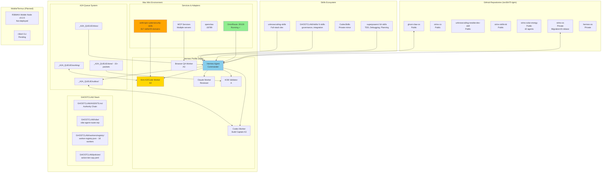

# Production System Architecture
# Generated: Reverse Engineering Analysis
# Source: ton36475-lgtm GitHub org + Local Mac Mini M2



## Kimi K3 Swarm System Analysis

### Agent Hierarchy (From AGENTS.md Chain)
```
Human Operator
    ↓
Hermes Mission Commander (Router)
    ↓
Opus Chief Architect (Design)
    ↓
Codex Build Captain (Code execution)
    ↓
GLM/DeepSeek/Kimi Workers (Module execution)
    ↓
KOB Validator (Testing)
    ↓
Command Broker (Final gate)
```

### Worker Capabilities Matrix
| Worker | Model | Lane | Task Types | Tier |
|--------|-------|------|------------|------|
| codex-worker | Local/OmniRoute | build | code_gen, git_op, docs | A3/B |
| kimi-worker | kimi_k2_7_code | code_patch | code_gen, moa_vote, reference | A2 |
| claude-worker | claude-sonnet-4 | review | arch_design, docs, code_review | A2 |
| glm-worker | glm_5_2_max | research | research, analysis | B |
| deepseek-worker | deepseek-v4 | research | research, analysis | B |
| browser-use-worker | playwright | browser_qa | smoke_test, verify | A3 |

### System Files Integration Map
```
Primary AGENTS.md: /Users/sirinx/sirinx-os/AGENTS.md (422KB)
GHOSTCLAW AGENTS.md: /Users/sirinx/sirinx-os/GHOSTCLAW/AGENTS.md (5KB)
Worker Registry: GHOSTCLAW/workers/registry/worker-registry.json (1086 lines)
Vibe Router: GHOSTCLAW/vibe/vibe-agent-router.mjs (628 lines)
Action Tier: GHOSTCLAW/policies/action-tier-cap.yaml
Security Guard: GHOSTCLAW/policies/security-cost-guard-integration.v1.yaml
```

### Live Sync Status
- OmniRoute :20128 ✓ Running
- A2A Queue : 15+ completed packets
- Kimi Code process : Active (PID 41274)
- Codex processes : 8+ processes active

## Upgrade Path

1. ✓ Kimi & Claude workers added to vibe router
2. ✓ Security skills cloned (Apache-2.0)
3. ✓ Policies integrated
4. 🔄 Testing vib pipeline
5. ⏳ Production deployment (approval required)