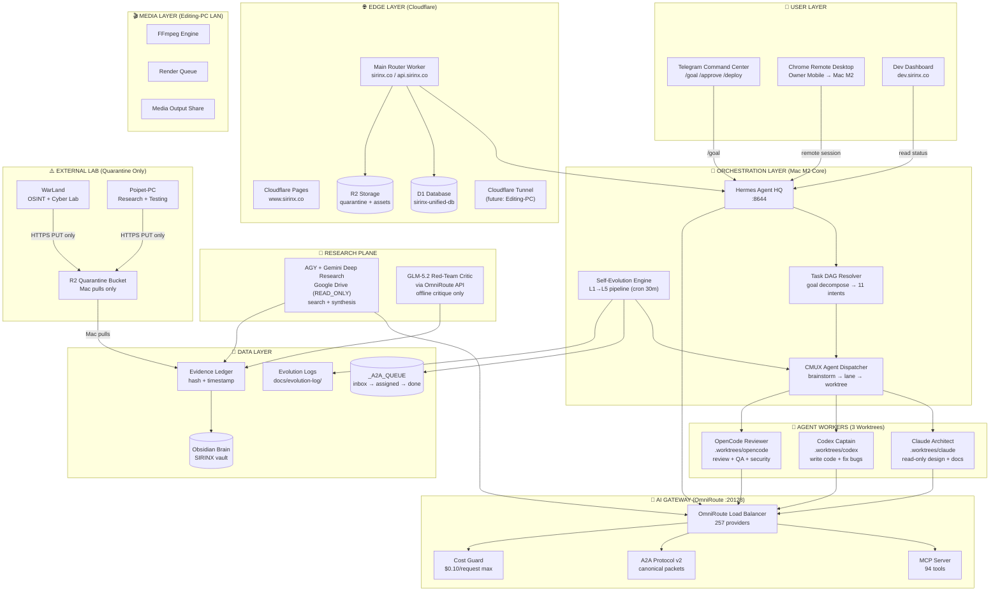
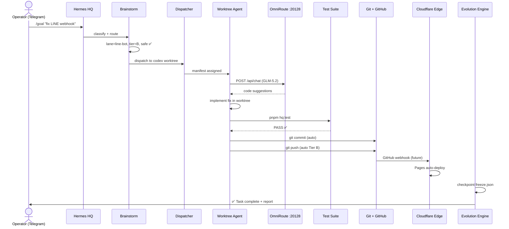
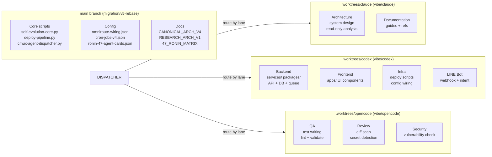
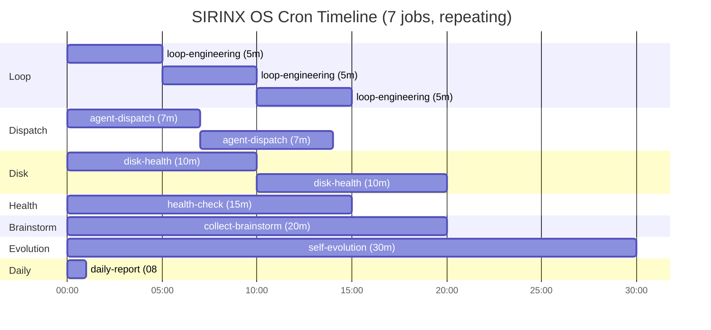
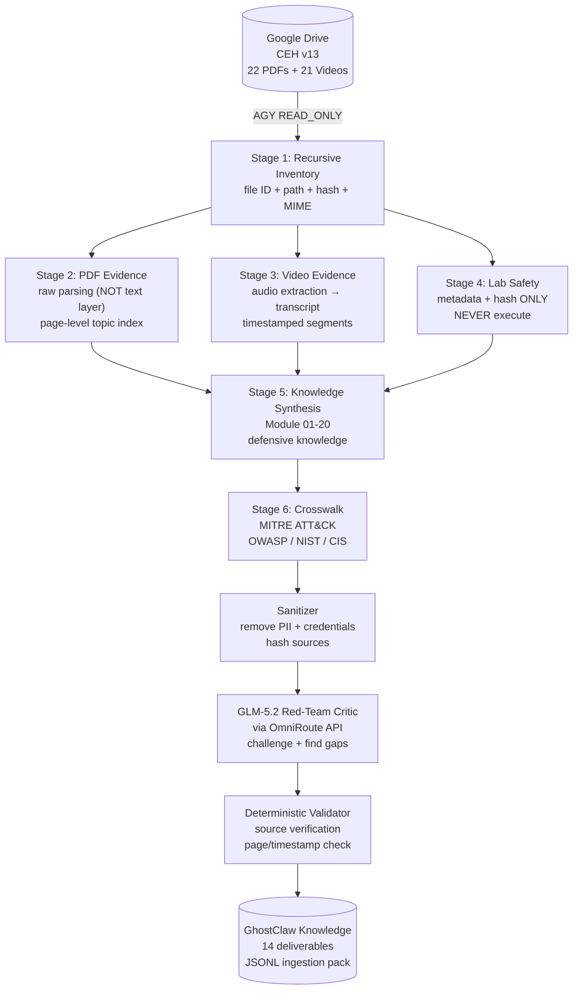
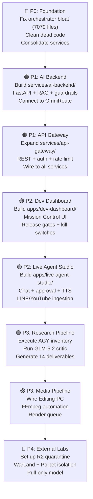

# SIRINX OS — Agentic Coding Architecture (GODMODE Blueprint)

> **MIT License** — End-to-end goal spec driving agent-loop evolution
> Architecture: V4 LOCKED | Research: V1 LOCKED | Node: `local_mac_m2_core`
> All LLM via OmniRoute :20128 (257 providers, 94 MCP tools)

---

## 1. SYSTEM LAYER GRID (Mermaid)



---

## 2. AGENT LOOP EVOLUTION FLOW

```mermaid
flowchart LR
    subgraph INTAKE["📥 INTAKE"]
        IN1["Telegram /goal"]
        IN2["Cron trigger"]
        IN3["Error detected"]
    end

    subgraph BRAINSTORM["🧠 BRAINSTORM (pre-OmniRoute)"]
        BS1["Classify intent<br/>13 keyword patterns"]
        BS2["Determine lane<br/>architecture/backend/qa/..."]
        BS3["Safety scan<br/>10 forbidden patterns"]
        BS4["Tier classify<br/>A=auto / B=auto / C=approve"]
    end

    subgraph DISPATCH["📡 DISPATCH (via OmniRoute)"]
        D1["Create canonical A2A packet"]
        D2["Route to worktree<br/>claude / codex / opencode"]
        D3["Start agent with scoped manifest"]
    end

    subgraph EXECUTE["⚡ EXECUTE (isolated lane)"]
        E1["Agent calls OmniRoute<br/>for LLM inference"]
        E2["Agent writes code<br/>in worktree only"]
        E3["Run pnpm hq:test"]
    end

    subgraph DREAM["😴 DREAM MODE"]
        DM1["Snapshot git state"]
        DM2{"Test PASS?"}
        DM3["✅ Auto-approve"]
        DM4["❌ Rollback"]
    end

    subgraph DEPLOY["🚀 DEPLOY"]
        DP1["git commit (safe files)"]
        DP2["OpenCode review diff"]
        DP3["Telegram: Push? Deploy?"]
        DP4["git push → GitHub"]
        DP5["wrangler deploy → CF"]
    end

    subgraph EVOLVE["🧬 EVOLVE"]
        EV1["Mutation engine<br/>error → knowledge"]
        EV2["Skill creator<br/>pattern → skill"]
        EV3["CMUX checkpoint<br/>freeze.json"]
        EV4["Obsidian brain sync"]
    end

    IN1 --> BS1
    IN2 --> BS1
    IN3 --> EV1

    BS1 --> BS2 --> BS3 --> BS4
    BS4 -->|"Tier A/B"| D1
    BS4 -->|"Tier C/D"| DP3

    D1 --> D2 --> D3 --> E1 --> E2 --> E3
    E3 --> DM1 --> DM2
    DM2 -->|"YES"| DM3 --> DP1
    DM2 -->|"NO"| DM4 --> EV1

    DP1 --> DP2 --> DP3
    DP3 -->|"approve"| DP4 --> DP5
    DP3 -->|"deny"| EV1

    EV1 --> EV2 --> EV3 --> EV4
    EV4 -->|"feedback"| BS1
```



---

## 3. DATA FLOW (End-to-End)



---

## 4. WORKTREE LANE ISOLATION



---

## 5. CRON TIMELINE (7 Jobs)



---

## 6. RESEARCH PIPELINE (CEH v13 → Knowledge)



---

## 7. COMPONENT STATUS MATRIX

| Layer | Component | Status | Files | Action Needed |
|-------|-----------|--------|-------|---------------|
| **Edge** | CF Main Router | ✅ LIVE | 280 LOC worker.js | Route binding (Zone:Edit) |
| **Edge** | CF Pages | ✅ LIVE | sirinx.co 200 | — |
| **Edge** | CF D1 | ✅ Bound | sirinx-unified-db | Schema migration |
| **Edge** | CF R2 | ⚠️ Configured | quarantine bucket | Presigned URL setup |
| **Orchestration** | Hermes HQ | ✅ Running :8644 | v0.18.2 | — |
| **Orchestration** | Self-Evolution | ✅ Cron 30m | self-evolution-core.py | — |
| **Orchestration** | CMUX Dispatcher | ✅ Cron 7m | cmux-agent-dispatcher.py | — |
| **Orchestration** | Task DAG | ✅ Ready | task-dag-resolver.py | — |
| **AI Gateway** | OmniRoute | ✅ UP :20128 | 257 providers | — |
| **AI Gateway** | MCP Tools | ✅ 94 tools | filesystem, git, process | — |
| **AI Gateway** | A2A Protocol | ✅ v2 canonical | 31 packets dispatched | — |
| **AI Gateway** | Cost Guard | ✅ Active | $0.10/req max | — |
| **Agent** | Claude Architect | ⚠️ Idle | .worktrees/claude 2 tasks | Assign work |
| **Agent** | Codex Captain | ⚠️ Idle | .worktrees/codex 20 tasks | Assign work |
| **Agent** | OpenCode Reviewer | ⚠️ Idle | .worktrees/opencode 9 tasks | Assign work |
| **Data** | A2A Queue | ✅ 0 inbox | 31 assigned, 0 blocked | Collect done |
| **Data** | Evidence Ledger | ⚠️ Stub | needs hash schema | Build schema |
| **Data** | Obsidian Brain | ✅ Connected | vault path exists | Auto-sync |
| **Data** | Evolution Logs | ✅ 5 cycles | docs/evolution-log/ | — |
| **Research** | AGY Plane | 🔲 Not started | AGY prompt ready | Execute via AGY CLI |
| **Research** | GLM-5.2 Critic | 🔲 Not started | prompt ready | Execute via OmniRoute |
| **Media** | Editing-PC | 🔲 Offline | LAN worker | Provision when needed |
| **Lab** | WarLand | 🔲 Offline | External lab | Quarantine setup |
| **Lab** | Poipet-PC | 🔲 Offline | External lab | Quarantine setup |
| **App** | sirinx-site | ✅ 11 files | Live on CF | Polish UI |
| **App** | solar-intelligence | ✅ 27 files | opal.sirinx.co | Deploy |
| **App** | dev-dashboard | ⚠️ 2 files | stub | **BUILD OUT** |
| **App** | centerbrain-shell | ⚠️ 19 files | partial | Complete features |
| **App** | live-agent-studio | ⚠️ 4 files | stub | **BUILD OUT** |
| **Service** | api-gateway | ⚠️ 4 files | ghostclaw routes only | Expand |
| **Service** | dev-control-api | ✅ 150 files | full API | Polish |
| **Service** | skills-api | ✅ 9 files | running :3800 | Expand skills |
| **Service** | orchestrator | ⚠️ 7079 files | bloated | **AUDIT + TRIM** |
| **Deploy** | GitHub remote | ✅ Pushed | ton36475-lgtm/sirinx-os | PR #1 open |
| **Deploy** | Deploy Pipeline | ✅ Ready | deploy-pipeline.py | — |

---

## 8. REFACTOR PRIORITY (End-to-End Rebuild Order)



---

## 9. SKILL INTEGRATION MAP

| Skill | Category | Integrates With |
|-------|----------|-----------------|
| sirinx-unified-master-v2 | autonomous | ALL (master orchestrator) |
| godmode-autonomous-evolution | autonomous | evolution engine, dream mode |
| sirinx-unified-master-orchestrator | autonomous | replaced by v2 |
| goal-decomposer | automation | DAG resolver, dispatcher |
| telegram-approval-workflow | automation | deploy pipeline, Telegram bot |
| autonomous-loop-engineering | autonomous | loop engineering cron |
| antigravity-support | — | AGY research plane |
| claude-code | autonomous-ai-agents | claude worktree |
| codex | autonomous-ai-agents | codex worktree |
| opencode | autonomous-ai-agents | opencode worktree |
| dynamic-workflow | autonomous-ai-agents | fan-out workflow |
| vibe-coding-sidebar | autonomous-ai-agents | parallel coding |
| hermes-agent | — | Hermes HQ config |

---

## 10. CANONICAL FILE MAP

```
sirinx-os/
├── scripts/
│   ├── self-evolution-core.py       # L1-L5 evolution engine
│   ├── cmux-agent-dispatcher.py     # brainstorm → dispatch → collect
│   ├── deploy-pipeline.py           # commit → review → push → deploy
│   ├── task-dag-resolver.py         # goal → 11 intents → route
│   ├── a2a-bridge.py                # inbox → CLI dispatch
│   ├── auto-loop-engineering.mjs    # cron 5m loop cycle
│   ├── cron-disk-check.mjs          # cron 10m disk monitor
│   ├── cron-health-check.mjs        # cron 15m services
│   └── cron-daily-report.mjs        # cron 8am report
├── config/
│   ├── omniroute-wiring.json        # gateway config
│   ├── omniroute-gateway-wiring.json # per-agent model routing
│   ├── ronin-47-agent-cards.json    # 47 agents, 12 departments
│   ├── unified-skills-registry.json # 188 skills
│   └── cron-jobs-v4.json            # 7 cron definitions
├── docs/
│   ├── CANONICAL_NETWORK_ARCHITECTURE_V4.md   # topology LOCKED
│   ├── CANONICAL_RESEARCH_ARCHITECTURE_V1.md  # research LOCKED
│   ├── ARCHITECTURE_SCHEMA_V3.md              # superseded by V4
│   ├── 47_RONIN_ENTERPRISE_MATRIX.md          # org chart
│   └── evolution-log/                         # cycle reports
├── infra/cloudflare/
│   ├── main-router/                 # Worker (LIVE)
│   └── sirinx-edge-worker.js        # Edge worker
├── _A2A_QUEUE/
│   ├── inbox/                       # 0 (all dispatched)
│   ├── assigned/{claude,codex,opencode}/  # 31 tasks
│   ├── done/                        # 0 (pending collection)
│   ├── blocked/                     # 0
│   └── archive/                     # 140 historical
├── storage/
│   ├── cmux_snapshots/freeze.json   # checkpoint
│   ├── dream-sandbox/               # Dream Mode test area
│   ├── mutations/                   # error mutations
│   ├── agent-tasks/                 # worktree manifests
│   └── agent-results/               # dispatch reports
└── skills/autonomous/
    └── sirinx-unified-master-v2/SKILL.md  # MASTER (MIT)
```
