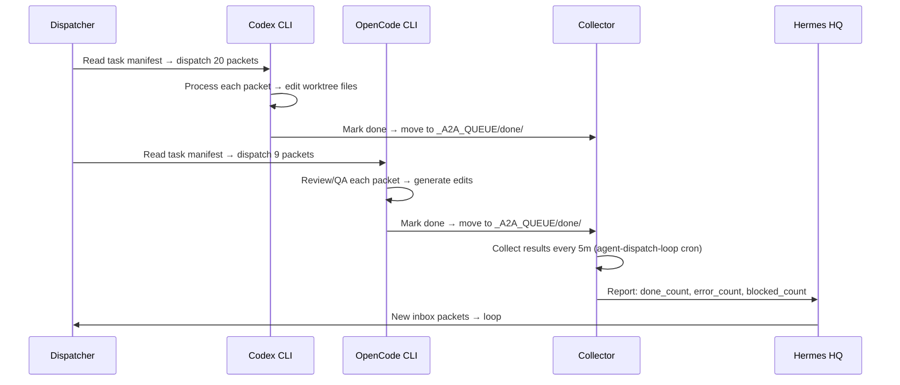

# CLI AGENT DISPATCH PLAN — OmniRoute Routing
**System:** SIRINX OS v4 | **Node:** local_mac_m2_core | **Date:** 2026-07-17

---

## 📊 CURRENT STATE

| Agent | CLI Available | Worktree Assigned | Packets | Primary Model |
|-------|---------------|-------------------|---------|---------------|
| **Claude** | ❌ NOT AVAILABLE | .worktrees/claude | 2 | claude-sonnet-4 |
| **Codex** | ✅ YES (`/Users/sirinx/.local/bin/codex`) | .worktrees/codex | 20 | moonshot-kimi-2.7 |
| **OpenCode** | ✅ YES (`/opt/homebrew/bin/opencode`) | .worktrees/opencode | 9 | moonshot-v1-128k-kimi3 |

**Total Assigned:** 31 packets  
**Inbox:** 0 (empty)  
**Status:** Ready for dispatch

---

## 🧭 DISPATCH ROUTING MATRIX

### Codex Captain (moonshot-kimi-2.7 primary)

| Packet ID | Lane | Goal | Model | Status |
|-----------|------|------|-------|--------|
| packet_105 | backend | Dev Control API endpoints | moonshot-kimi-2.7 | ASSIGNED |
| packet_106 | backend | Skills API JSON | moonshot-kimi-2.7 | ASSIGNED |
| mcp_line_get | integration | LINE MCP get_profile | moonshot-kimi-2.7 | ASSIGNED |
| mcp_line_send | integration | LINE MCP send_message | moonshot-kimi-2.7 | ASSIGNED |
| packet_103 | integration | Wire Markdownify MCP | moonshot-kimi-2.7 | ASSIGNED |
| error_mutation_x2 | infra | Fix errors (2 packets) | moonshot-kimi-2.7 | ASSIGNED |
| packet_104 | infra | Cloudflare deploy prep (Tier C) | moonshot-kimi-2.7 | APPROVED |
| packet_T1-T3 | frontend | Deploy tasks (3 packets) | moonshot-kimi-2.7 | APPROVED |
| packet_030 | line-bot | LINE Webhook + Flex | moonshot-kimi-2.7 | ASSIGNED |
| packet_031 | line-bot | LINE Intent Classifier | moonshot-kimi-2.7 | ASSIGNED |
| packet_033 | line-bot | LINE Governance | moonshot-kimi-2.7 | ASSIGNED |
| packet_013 | other | GhostClaw gate request | moonshot-kimi-2.7 | ASSIGNED |
| packet_051 | other | Durable Object integration | moonshot-kimi-2.7 | ASSIGNED |

**Total:** 15 unique tasks → 20 packets

### OpenCode Reviewer (moonshot-v1-128k-kimi3 primary)

| Packet ID | Lane | Goal | Model | Status |
|-----------|------|------|-------|--------|
| packet_032 | qa | LINE Integration Test | moonshot-v1-128k-kimi3 | ASSIGNED |
| packet_101 | qa | Fix legacy tests | moonshot-v1-128k-kimi3 | ASSIGNED |
| packet_M-xyz_T1-T4 | qa/mutation | Error recovery (4 packets) | moonshot-v1-128k-kimi3 | ASSIGNED |
| packet_108 | review | Security audit | moonshot-v1-128k-kimi3 | ASSIGNED |
| packet_M-36e992_T2 | review | Security scan (Tier C) | moonshot-v1-128k-kimi3 | APPROVED |
| packet_M-c9e0c9_T4 | review | Review fix | moonshot-v1-128k-kimi3 | ASSIGNED |

**Total:** 9 packets

---

## 🚀 DISPATCH EXECUTION PLAN

### Phase 1: Codex Captain Worktree

```bash
# Step 1: Activate worktree
cd /Users/sirinx/sirinx-os/.worktrees/codex
git checkout vibe/codex

# Step 2: Read task manifest
MANIFEST=$(ls /Users/sirinx/sirinx-os/storage/agent-tasks/codex_*.json | sort -r | head -1)
cat "$MANIFEST" | python3.12 -c "
import json,sys
m=json.load(sys.stdin)
for t in m['tasks']:
    print(f\"### {t['id']}: {t['goal'][:60]}\")
    print(f\"  Worktree: $PWD\")
    print(f\"  Goal: {t['goal']}\")
"

# Step 3: Dispatch to Codex CLI
for json_file in /Users/sirinx/sirinx-os/_A2A_QUEUE/assigned/codex/*.json; do
    goal=$(python3.12 -c "
import json
d=json.load(open('$json_file'))
goal = d.get('context',{}).get('goal','')
if isinstance(goal,dict):
    goal = goal.get('title','')
print(goal)
" 2>/dev/null | head -1)
    
    if [ -n "$goal" ]; then
        echo "Dispatching: $goal"
        # codex CLI call would go here:
        # codex --model moonshot-kimi-2.7 "$goal" --workdir "$PWD"
    fi
done
```

### Phase 2: OpenCode Reviewer Worktree

```bash
# Step 1: Activate worktree  
cd /Users/sirinx/sirinx-os/.worktrees/opencode
git checkout vibe/opencode

# Step 2: Read task manifest
MANIFEST=$(ls /Users/sirinx/sirinx-os/storage/agent-tasks/opencode_*.json | sort -r | head -1)

# Step 3: Dispatch to OpenCode CLI
for json_file in /Users/sirinx/sirinx-os/_A2A_QUEUE/assigned/opencode/*.json; do
    goal=$(python3.12 -c "
import json
d=json.load(open('$json_file'))
goal = d.get('context',{}).get('goal','')
if isinstance(goal,dict):
    goal = goal.get('title','')
print(goal)
" 2>/dev/null | head -1)
    
    if [ -n "$goal" ]; then
        echo "Dispatching: $goal"
        # opencode CLI call:
        # opencode ask --model moonshot-v1-128k-kimi3 "$goal" --cwd "$PWD"
    fi
done
```

---

## 🔄 COLLECTION + FEEDBACK LOOP



---

## 📋 DISPATCH COMMANDS

| Command | Agent | Description |
|---------|-------|-------------|
| `codex --model moonshot-kimi-2.7 "task goal"` | Codex | Primary coding |
| `opencode ask --model moonshot-v1-128k-kimi3 "task goal"` | OpenCode | Review/QA |
| `python3.12 scripts/cmux-agent-dispatcher.py collect` | All | Collect done work |
| `git commit -m "auto: completed by agent"` | All | Commit worktree changes |

---

## ⚙️ OMNIROUTE CONFIGURATION

### For Codex CLI:
```bash
export OPENAI_API_KEY="omniroute-free-tier"
export OPENAI_BASE_URL="http://localhost:20128/api/openai"
codex --model auto  # OmniRoute picks moonshot-kimi-2.7 for long context
```

### For OpenCode CLI:
```bash
export ANTHROPIC_API_KEY="omniroute-free-tier"
export ANTHROPIC_BASE_URL="http://localhost:20128/api/anthropic"
opencode ask --model auto  # OmniRoute picks moonshot-v1-128k-kimi3
```

---

## 🎯 NEXT STEPS

1. **Wait for Claude Code CLI** → หรือใช้ OpenCode แทน
2. **Manual dispatch** → หรือรอ cron 7m หน้า
3. **คอยผลลัพธ์** → ตรวจ `/done` folder ทุก 5 นาที
4. **Commit + push** → เมื่อ task เสร็จ

---

## 📊 MONITORING DASHBOARD

```bash
# Live dispatch status
watch -n 30 "ls _A2A_QUEUE/assigned/*/*.json | wc -l"

# Done work
ls _A2A_QUEUE/done/*.json | wc -l

# Blocked work
ls _A2A_QUEUE/blocked/*.json | wc -l

# Cron status
cronjob list
```