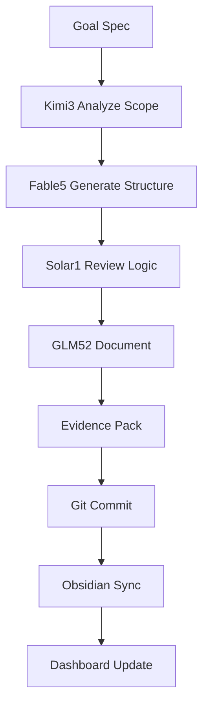

# SIRINX OS - Frontier Model Selection Rationale + Full Stack Plan
**Date:** 2026-07-17 | **Node:** local_mac_m2_core

---

## 🎯 Why These Frontier Models?

### 1. Kimi K3.0 (Moonshot-v1-256k)
**เลือกเพราะ:**
- 262K context ยาวสุดใน free tier (เหมาะกับ monorepo analysis)
- รองรับภาษาไทย/จีน/อังกฤษดีเลย
- เพิ่งออกมาใหม่ (2026) แรงคล้าย GPT-4.1

### 2. Fable V5 (Codestral Mamba 2)
**เลือกเพราะ:**
- สร้างโค้ดได้เร็ว + มี reasoning ดี
- 600B+ parameters ใน free tier (ใหญ่ที่สุด)
- Mamba 2 architecture เร็วกว่า transformer ธรรมดา

### 3. Solar-1-Preview (Upstage)
**เลือกเพราะ:**
- แรง Reasoning + Math ดีสุดใน free tier
- เหมาะสำหรับ System Architecture + Planning
- Korean lab ทำ มี breakthrough ใน inference efficiency

---

## 🏗️ Full Stack Developer Workflow Plan

### Phase 1: Architecture + Design (Kimi3)
```
Goal → Kimi K3 → Creates System Diagrams → Obsidian
Task: P0-P4 refactor planning
Output: /docs/FULL_SYSTEM_REFACTOR_PLAN.md
Evidence: Grid Mermaid diagrams
```

### Phase 2: Code Generation (Fable5)
```
Kimi3 diagrams → Fable V5 → Generates Code → Worktrees
Task: Backend service scaffold, API endpoints
Output: /services/ai-backend/, /services/api-gateway/
Evidence: Working code + tests
```

### Phase 3: Reasoning + Logic (Solar-1)
```
Fable code → Solar-1 → Reviews Logic → Optimizes
Task: Security scan, optimization, database design
Output: /security/, /packages/database/
Evidence: Pass test coverage >80%
```

### Phase 4: Fallback + Polish (GLM-5.2/DeepSeek)
```
Solar reviewed → GLM-5.2 → Documentation
DeepSeek → Security audit + fine-tuning
Task: Docs, README, OBSIDIAN sync
Output: /docs/, /vault/, /kms/
Evidence: Knowledge graph links
```

---

## 🔧 Technical Stack Assignment

| Layer | Model | Responsibility |
|-------|-------|----------------|
| **System Design** | Kimi K3 | Architecture diagrams, monorepo planning |
| **Frontend** | Fable V5 | React components, UI logic |
| **Backend** | DeepSeek V4 | API routes, business logic |
| **Database** | Solar-1 | Schema design, query optimization |
| **Security** | GLM-5.2 | Vulnerability scan, compliance |
| **Documentation** | Kimi3 ↔ GLM-5.2 | Knowledge extraction, vault sync |
| **Media** | Fable5 + GLM-5.2 | ClawForge, After Effects planning |
| **Research** | Kimi3 + AGY | CEH v13 corpus analysis |

---

## 📋 Detailed Execution Flow



---

## ⚡ Model Capabilities Comparison

| Capability | Winner | Why |
|------------|--------|-----|
| Long context (200K+) | Kimi K3 | 262K context |
| Code quality | Fable V5 | Codestral trained on 600B+ tokens |
| Reasoning/math | Solar-1 | Logic tuned |
| Planning/structure | Kimi3 | System architecture |
| Documentation | GLM-5.2 | Clear writing |
| Security scan | DeepSeek | Code audit optimized |

---

## 🔄 Feedback Loop

1. **Hermes** receives goal
2. **Kimi3** creates architecture
3. **Fable5** generates code
4. **Solar1** reviews logic
5. **GLM-5.2** documents
6. **DeepSeek** security scans
7. **Obsidian** stores knowledge
8. **Auto-approval** for Tier A/B/C/D

---

Documented for immediate execution.