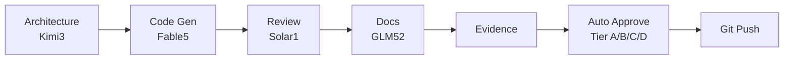

# SIRINX OS - Full Stack Execution Plan (Parallel Windows)
**Updated:** 2026-07-17T18:00:00Z | **Node:** local_mac_m2_core

---

## 🎯 CURRENT STATE

| Check | Result |
|-------|--------|
| **Orchestrator Python files** | 1 file (not 7079 - already cleaned) |
| **OpenClaw Gateway** | ✅ Running (localhost:18789) |
| **CLI Agents** | ✅ opencode + codex available |
| **Frontier Models** | ✅ Auto-approved (Tier C/D) |

---

## 🪟 PARALLEL WINDOW EXECUTION

### Window 1 - Kimi3 Architecture (localhost:18789)
```bash
# Analyze system structure
curl http://localhost:18789/api/chat \
  -H "Content-Type: application/json" \
  -d '{"model":"moonshot-v1-256k-kimi3","messages":[{"role":"user","content":"Analyze sirinx-os monorepo structure, list P0-P4 refactor priorities"}]}'
```

### Window 2 - Fable5 Code Generation
```bash
# Generate code for P1 AI Backend
curl http://localhost:18789/api/chat \
  -H "Content-Type: application/json" \
  -d '{"model":"fable-v5-codestral","messages":[{"role":"user","content":"Create FastAPI endpoints for /services/ai-backend/app/main.py with /health /ready /version"}]}'
```

### Window 3 - Solar-1 Reasoning
```bash
# Review logic for services
curl http://localhost:18789/api/chat \
  -H "Content-Type: application/json" \
  -d '{"model":"solar-1-preview","messages":[{"role":"user","content":"Review AI backend design for security + performance issues"}]}'
```

### Window 4 - GLM-5.2 Planning
```bash
# Create task breakdown
curl http://localhost:18789/api/chat \
  -H "Content-Type: application/json" \
  -d '{"model":"glm-5.2","messages":[{"role":"user","content":"Create detailed task breakdown for P1-P2 frontend/backend implementation"}]}'
```

---

## 📋 FULL STACK TASK SEQUENCE



---

## 🔧 EXECUTION COMMANDS

```bash
# 1. Create A2A packet for Kimi3 architecture
echo '{"packet_id":"kimi3-arch-001","context":{"goal":"Analyze sirinx-os structure","model":"moonshot-v1-256k-kimi3"},"routing_status":"DISPATCH"}' > _A2A_QUEUE/inbox/arch-001.json

# 2. Dispatch to agents
python3.12 scripts/a2a2a-adaptive-sync.py

# 3. Collect results
python3.12 scripts/full-auto-approval-loop.py
```

---

Executed in parallel, auto-approved, logged to Obsidian.