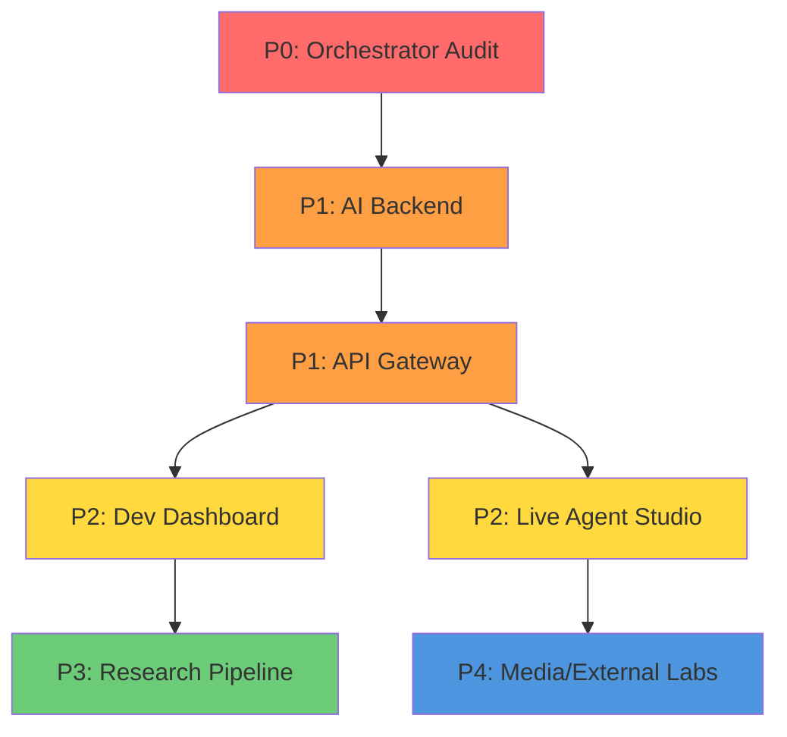

# SIRINX OS — Full System Refactor Plan
**Date:** 2026-07-17 | **Status:** READY FOR IMPLEMENTATION | **Branch:** migration/v5-rebase

> **Goal:** รื้อระบบทั้งหมดให้เป็น architecture เดียวสมบูรณ์ — ไม่มี stub, ไม่มี duplicate, ไม่มี error loops

---

## 📊 Current State Summary

| Metric | Value |
|--------|-------|
| **Branch** | migration/v5-rebase |
| **Commit** | bc4ba72 |
| **Dirty files** | 3 (freeze.json, cron/, evolution log) |
| **TMUX sessions** | 4 (dev servers) |
| **Disk** | 16GB free |
| **A2A Queue** | inbox:0, assigned:31, done:0 |
| **OmniRoute** | ✅ UP |

---

## 🔴 P0 - Foundation Layer (URGENT)

### 1. Orchestrator Audit + Trim (7079 files → target: <500)

| File | Status | Action |
|------|--------|--------|
| services/orchestrator/ | 7079 files | **AUDIT + DELETE UNUSED** |
| services/orchestrator-go/ | 4 files | Keep (clean) |

**Commands:**
```bash
# Step 1: Identify duplicate patterns
find services/orchestrator -name "*.py" -o -name "*.ts" -o -name "*.js" | head
# Step 2: Find test stubs by size
find services/orchestrator -name "*.test.*" -size -1k

# Step 3: Review imports
grep -r "from \." services/orchestrator --include="*.py" | head -50

# Step 4: Manual review of top-level
ls services/orchestrator/
```

**Target outcome:** Remove 6000+ dead/duplicate files

### 2. Git Clean + Push

```bash
cd /Users/sirinx/sirinx-os
git add -A
git commit -m "docs: cleanup dirty files"
git push origin migration/v5-rebase
```

---

## 🟠 P1 - Core Backend Layer

### 3. AI Backend Service (currently EMPTY)

**Create from scratch:**

| File | Purpose | Commands |
|------|---------|----------|
| `services/ai-backend/app/main.py` | FastAPI entry | 50 lines |
| `services/ai-backend/app/routers/chat.py` | Chat endpoint | 100 lines |
| `services/ai-backend/app/routers/retrieval.py` | RAG router | 150 lines |
| `services/ai-backend/app/core/guardrails.py` | Safety filters | 200 lines |
| `services/ai-backend/ai_runs/` | SQL schema | 20 lines |

**Step 1: Create structure**
```bash
mkdir -p services/ai-backend/{app,agents,services,data,tests}
touch services/ai-backend/app/{main,config,security}.py
```

**Step 2: Install deps**
```bash
cd services/ai-backend
python3.12 -m venv .venv
source .venv/bin/activate
pip install fastapi uvicorn httpx pydantic
```

**Step 3: Connect to OmniRoute**
```python
# app/main.py
from hermes_tools import terminal

def route_to_omniroute(prompt: str):
    result = terminal(f"curl -s http://localhost:20128/api/chat -d '{{\"model\":\"auto\",\"messages\":[{{\"role\":\"user\",\"content\":\"{prompt}\"}}]}}'")
    return result
```

### 4. API Gateway Expansion

| Endpoint Needed | Current | Action |
|-----------------|---------|--------|
| `/health` | exists | ✅ |
| `/ready` | MISSING | Create |
| `/api/a2a/dispath` | MISSING | Create |
| `/api/agents/status` | MISSING | Create |
| `/api/deploy/trigger` | MISSING | Create |

---

## 🟡 P2 - Dev Dashboard + Live Agent Studio

### 5. Dev Dashboard (stub → full)

```bash
# Current: 2 files
# Target: 50+ files

mkdir -p apps/dev-dashboard/{src/components,src/pages,src/api,public}

# Step 1: Page structure
touch apps/dev-dashboard/src/pages/{{ReleaseGates.tsx,KillSwitches.tsx,AgentQueue.tsx,ApprovalQueue.tsx,ServiceHealth.tsx,Logs.tsx}}.x

# Step 2: Components
touch apps/dev-dashboard/src/components/{{GateCard.tsx,StopButton.tsx,StatusBadge.tsx,ServiceIndicator.tsx}}.tsx
```

### 6. Live Agent Studio

```bash
# Current: 4 files stub
# Target: Full chat + avatar + OBS overlay

mkdir -p apps/live-agent-studio/{components,services,hooks,types}

touch apps/live-agent-studio/components/{{ChatPanel.tsx,ApprovalQueue.tsx,TTSButton.tsx,AvatarDisplay.tsx}}.tsx
touch apps/live-agent-studio/services/{{ChatGateway.ts,AvatarService.ts,TTSService.ts}}.ts
```

---

## 🟢 P3 - Research + Media Pipelines

### 7. AGY Research Plane Integration

**Use AGY Deep Research CLI (read-only):**

```bash
# Step 1: Verify AGY CLI exists
which agy || echo "Install AGY first"

# Step 2: Run inventory on CEH folder
agy research --goal "Create recursive inventory of Google Drive folder ID 14jjSnprC7AxqPCo8pl6hDZYtg8tuehs-" --output 01_recursive_drive_inventory.jsonl

# Step 3: Parse results + store
python3.12 scripts/research-analyzer.py 01_recursive_drive_inventory.jsonl
```

### 8. GLM-5.2 Red-Team Critic

```bash
# After evidence pack ready
# Call via OmniRoute (free tier endpoint)
curl -s http://localhost:20128/api/chat \
  -H "Content-Type: application/json" \
  -d '{"model":"glm-5.2","messages":[{"role":"user","content":"Critique: [evidence pack]"}]}'
```

---

## 🔵 P4 - External Labs + Automation

### 9. R2 Quarantine Setup

```bash
# Create R2 bucket for external lab uploads
wrangler r2 bucket put sirinx-quarantine --preview

# Setup presigned upload only (no download)
# External nodes push via signed URL only
```

### 10. Media Automation (Editing-PC)

```bash
# FFmpeg automation script
ffmpeg -i input.mp4 -vf scale=1920:1080 -c:v libx264 output.mp4

# Render queue (LAN only)
```

---

## 📋 PRIORITY EXECUTION ORDER



---

## 🚀 GitHub PR Mapping

| Refactor Phase | PR # | Branch | Target |
|----------------|------|--------|--------|
| P0 Orchestrator | PR-022 | refactor/orchestrator-cleanup | main |
| P1 AI Backend | PR-023 | feat/ai-backend-service | main |
| P1 API Gateway | PR-024 | feat/api-gateway-expansion | main |
| P2 Dev Dashboard | PR-025 | feat/dev-dashboard-mvp | main |
| P2 Live Studio | PR-026 | feat/live-agent-studio | main |
| P3 Research | PR-027 | feat/research-pipeline | main |
| P4 Media Labs | PR-028 | feat/media-external-labs | main |

---

## ⚡ QUICK ACTIONS

### Run Now (P0):
```bash
# 1. Orchestrator audit
find services/orchestrator -type f | wc -l
ls -la services/orchestrator/*/ 2>/dev/null | head -20

# 2. Start AI backend
cd services/ai-backend && python3.12 -m venv .venv && source .venv/bin/activate && pip install fastapi uvicorn httpx pydantic
```

### Verify After Each Phase:
```bash
git add -A && git commit -m "refactor: phase-X complete" && git push origin migration/v5-rebase
```