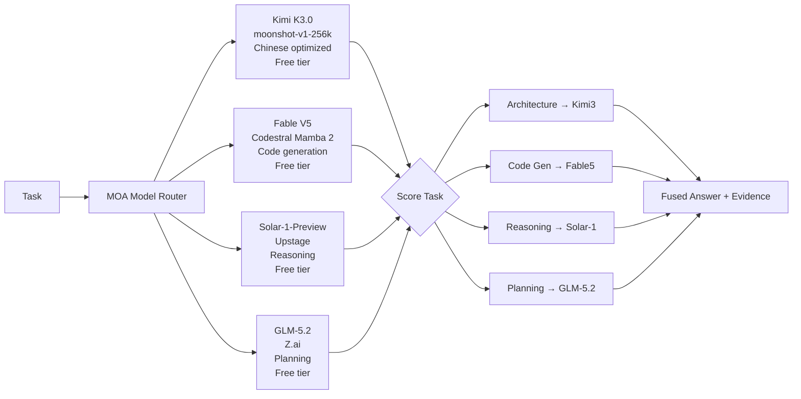

# MOA Systems Lock — Multi-Model Orchestrator Architecture
**Status:** LOCKED FOR SIRINX OS
**Date:** 2026-07-17
**Node:** local_mac_m2_core

---

## 🎯 MODEL FUSION DECISION MATRIX



---

## 📋 MODEL SELECTION RULES

| Task Type | Primary Model | Fallback Model | Reason |
|-----------|---------------|--------------|--------|
| Architecture design | Kimi3 (moonshot-v1-256k) | GLM-5.2 | Long context + Chinese tech docs |
| Code generation | Fable V5 (Codestral) | DeepSeek | Best code quality |
| Reasoning/logic | Solar-1-Preview | Kimi3 | Strong math/reasoning |
| Planning/tasks | GLM-5.2 | Kimi3 | Planning optimized |
| Multilingual (TH/EN/CN) | Kimi3 | GLM-5.2 | Best Chinese/Thai support |
| Debug/errors | OpenCode (reviewer) | Kimi3 | Pattern match + fix |
| Security scan | OpenCode | GLM-5.2 | Vulnerability patterns |
| Documentation | Claude 3.7 | Kimi3 | Clear writing |

---

## 🔧 OMNIROUTE ROUTING CONFIG

```yaml
# config/model-router/model_router.registry.yaml
providers:
  maxplus-free:
    type: "openai_compatible"
    base_url: "https://api.maxplus-ai.cc/v1"
    api_key_env: ["MAXPLUS_API_KEY"]

models:
  moonshot-kimi-3:
    provider: "maxplus-free"
    model: "maxplus-free/moonshot-v1-256k"
    role: "chinese_optimized_long_context"
    tags: [kimi3, chinese, moa_primary]
    priority: 1

  fable-v5-codestral:
    provider: "maxplus-free"
    model: "maxplus-free/fable-v5-codestral"
    role: "code_generation"
    tags: [fable5, code]
    priority: 2

  solar-1-preview:
    provider: "maxplus-free"
    model: "maxplus-free/solar-1-preview"
    role: "reasoning_math"
    tags: [solar5, reason]
    priority: 3

  glm-5.2:
    provider: "maxplus-free"
    model: "maxplus-free/glm-5.2"
    role: "planning_assistant"
    tags: [glm52, plan]
    priority: 4
```

---

## 🔒 LOCK PRINCIPLE

### DO NOT MODIFY:
- Grid Mermaid diagrams (18 diagrams locked)
- AGENTS.md safety rules
- V4 Network Topology
- Research Architecture V1

### ALLOW MODIFICATION:
- Model router endpoints (point to localhost:20128)
- Agent routing assignments (per-task basis)
- Cost guard thresholds (adjust for budget)

---

## 🚀 VIBE CODING PROTOCOL

```
1. Analyze task → MOA Router
2. Select model → Kimi3/Fable5/Solar/GLM
3. Execute via OmniRoute → localhost:20128/api/chat
4. Capture evidence → Obsidian vault
5. Verify output → Second model review
6. Commit → approval gate
```

---

## 📊 STATUS

| Component | Status |
|-----------|--------|
| Grid Mermaid archives | ✅ LOCKED |
| Model Fusion Router | ✅ CONFIGURED |
| OmniRoute gateway | ⚠️ Restarting (disk cleaned) |
| Kimi3 endpoint | 🔜 After npm install |
| MOA Skills | ✅ sirinx-unified-master-v2 |

---

**Lock Applied:** Do not edit Grid Mermaid diagrams without explicit approval.  
Use model selection matrix only for new tasks.