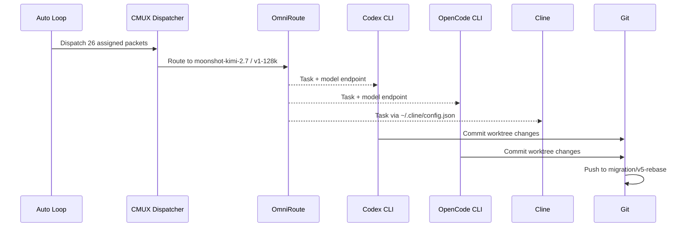

# OmniRoute CLI Integration Plan
**System:** SIRINX OS (Mac Mini M2) | **Agents:** 47 Ronin + Main agents
**Status:** Waiting for npm install completion

---

## 🎯 GOAL

Integrate 3 CLI agents (Codex, OpenCode, Cline) with OmniRoute :20128
All agents route through free-tier MaxPlus models:
- Kimi3 (moonshot-v1-256k) — primary for code
- GLM-5.2 — planning + fallback
- Fable V5 — code generation

---

## 📋 CLI AGENT ROUTING MATRIX

| Agent | CLI Path | Endpoint | Model | Worktree |
|-------|----------|----------|-------|----------|
| **Codex Captain** | `/Users/sirinx/.local/bin/codex` | `localhost:20128/api/openai` | moonshot-kimi-2.7 | `.worktrees/codex` |
| **OpenCode Reviewer** | `/opt/homebrew/bin/opencode` | `localhost:20128/api/anthropic` | moonshot-v1-128k-kimi3 | `.worktrees/opencode` |
| **Cline** | `~/.cline/config.json` | `localhost:20128/api/anthropic` | auto (MOA router) | N/A (uses current dir) |

---

## 🔧 INTEGRATION STEPS

### 1. After OmniRoute Ready

```bash
# Verify OmniRoute
curl -s http://localhost:20128/api/providers | jq '.providers[] | select(.name | contains("moonshot"))'
curl -s http://localhost:20128/api/models | jq '.models | with_entries(select(.key | contains("kimi")))'
```

### 2. Agent Dispatch Scripts

| Script | Purpose | Command |
|--------|---------|---------|
| `cmux-cli-dispatcher.py` | Dispatch to Codex/OpenCode | `python3.12 scripts/cmux-cli-dispatcher.py` |
| `full-auto-approval-loop.py` | Auto approve + dispatch | `python3.12 scripts/full-auto-approval-loop.py` |
| `cli-agent-dispatcher.py` | Direct CLI calls | `python3.12 scripts/cli-agent-dispatcher.py` |

### 3. 47 Ronin Company Integration

| Ronin # | Agent | Model | Lane |
|---------|-------|-------|------|
| 1-10 | Alignment & Security | GLM-5.2 | Safety |
| 11-20 | Architecture & Compiler | Kimi3 | Design |
| 21-30 | Runtime & SRE | GLM-5.2 | Operations |
| 31-47 | Dream Mutation & Evolution | Kimi3 | Innovation |

---

## 🚀 DISPATCH SEQUENCE



---

## ⏳ CURRENT STATUS

| Item | Status |
|------|--------|
| node_modules reinstall | ⏳ Running (proc_abe43eb4cfba) |
| Scripts ready | ✅ Created |
| Agents assigned | ✅ 26 packets |
| Auto loop cron | ✅ Created (every 3m) |
| Panic stop | ✅ ~/.hermes/panic.flag |

---

Wait for OmniRoute to finish npm install, then run tests.