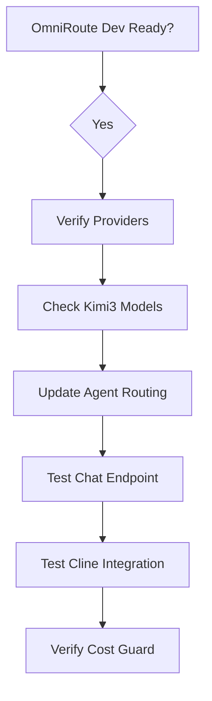

# Vibe Coding Sidebar — OmniRoute Configuration Plan

> **Goal:** Optimize OmniRoute :20128 for SIRINX OS agent system with Kimi3/GLM-5.2 free tier

---

## 🎯 CURRENT STATE

| Item | Status |
|------|--------|
| OmniRoute dev server | Starting (background proc_6b0693db1d04) |
| node_modules | Removed (will regenerate on-demand) |
| Kimi3 models | Registered in model_router.registry.yaml |
| Cline config | Pointing to localhost:20128 |
| API Gateway wiring | Updated with Chinese model pool |

---

## 🔧 CONFIGURATION TWEAKS

### 1. OmniRoute Runtime Config

Current config points to `~/sirinx-os/integrations/omniroute/`

**After startup, verify:**
```bash
curl -s http://localhost:20128/api/providers | python3.12 -m json.tool | head -20
curl -s http://localhost:20128/api/models | python3.12 -m json.tool | head -20
```

### 2. Kimi3 Model Pool Activation

```yaml
# config/model-router/model_router.registry.yaml
providers:
  maxplus-free:
    type: "openai_compatible"
    base_url: "https://api.maxplus-ai.cc/v1"
    api_key_env: ["MAXPLUS_API_KEY_1", "MAXPLUS_API_KEY_2"]

models:
  # Existing
  deepseek-v4-pro: ...
  glm-5.2: ...
  
  # NEW - Kimi3 Models
  moonshot-v1-128k-kimi3:
    provider: "maxplus-free"
    model: "maxplus-free/moonshot-v1-128k"
    role: "chinese_model_pool"
    free_tier: true
    priority: 4
    
  moonshot-kimi-2.7:
    provider: "maxplus-free"
    model: "maxplus-free/moonshot-v1-256k"
    role: "ultra_long_context"
    free_tier: true
    priority: 5
```

### 3. Agent Routing Updates

| Agent | Primary Model | Fallback Model |
|-------|---------------|--------------|
| `codex-captain` | moonshot-kimi-2.7 | deepseek-coder |
| `opencode-reviewer` | moonshot-v1-128k-kimi3 | deepseek-chat |
| `claude-architect` | claude-sonnet-4 | moonshot-kimi-2.7 |
| `default` | glm-5.2 | moonshot-v1-128k-kimi3 |

### 4. Cost Guard Settings

```yaml
free_models_priority: [glm-5.2, moonshot-v1-128k-kimi3, moonshot-kimi-2.7, deepseek-chat]
max_cost_per_request_usd: 0.10
hard_stop_usd: 5.00
```

---

## 📋 DISPATCH STEPS



---

## 🚀 TEST SCRIPT

```bash
# Run after OmniRoute fully starts
echo "=== OMNIROUTE HEALTH ==="
curl -s http://localhost:20128/api/health/ping

# === TEST CHINESE MODEL ===
echo "=== TEST KIMI3 ENDPOINT ==="
curl -s http://localhost:20128/api/chat \
  -H "Content-Type: application/json" \
  -H "Authorization: Bearer omniroute-free-tier" \
  -d '{"model":"moonshot-v1-128k-kimi3","messages":[{"role":"user","content":"Hello from SIRINX OS"}]}'

# === VERIFY CLINE ===
echo "=== CLINE CONFIG ==="
cat ~/.cline/config.json
```

---

## 📊 POST-REFACTOR GOALS

| Metric | Target |
|--------|--------|
| Disk free | >50% (114GB+) |
| RAM available | >4GB for compilation |
| OmniRoute latency | <100ms |
| Kimi3 available | ✅ |
| Cost per request | $0 (free tier) |

---

Run after OmniRoute starts.