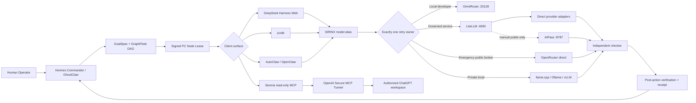

# SIRINX PC Node — Unified AI Fabric

Status: `HOLD_LOCAL_ONLY / REGISTRY_ONLY_DISABLED`

This document consolidates the Windows PC Node work into one governed model and
agent fabric. It is an implementation foundation, not evidence that any provider,
model, tunnel, gateway, browser session, GPU runtime, or PC worker is currently
online.

## Mission

Turn the Windows PC into a governed compute and coding worker that can use:

- DeepSeek Harness Web as an operator-facing agent client;
- jcode as a low-overhead terminal coding client;
- AutoClaw/OpenClaw and Freebuff-derived agent patterns as clients or design
  references, never as independent routing authorities;
- Gemini, Claude, DeepSeek, Z.AI/GLM, Qwen, OpenAI, xAI/Grok, NVIDIA, Hugging
  Face, Cloudflare Workers AI, OpenRouter, local llama.cpp/Ollama/vLLM, and future
  OpenAI-compatible or Anthropic-compatible providers;
- Serena through an outbound OpenAI Secure MCP Tunnel in a read-only pilot;
- the AIPass proxy only as an optional, loopback-only, public-data experimental
  sidecar under the user's own account and quota.

The Mac mini remains the authoritative Hermes Commander. The PC Node receives
leased work, executes within a declared capability and data class, returns test
and evidence receipts, and does not self-promote.

## Canonical topology



## Non-negotiable routing rules

1. One request has exactly one retry owner.
2. DSH, jcode, AutoClaw, Serena, and Freebuff patterns are clients or tools; none
   owns cross-provider fallback in the governed path.
3. LiteLLM owns retries for the cloud-governed lane.
4. OmniRoute owns retries for the local-developer lane.
5. OpenRouter owns retries only when called as the direct emergency-broker lane.
   It must not be nested behind another router while its fallbacks are enabled.
6. Direct local inference has zero automatic retries until resource admission and
   deterministic failure behavior are proven.
7. 9Router remains compatibility-sandbox only and is not a production route.
8. Clients request aliases such as `sirinx-code`; they never pin a provider's raw
   model ID.
9. A catalog entry is not an active route. Activation requires account-visible
   model discovery, bounded canary evidence, and a receipt containing the actual
   provider and model.
10. Free capacity is best-effort development capacity, not an availability SLA.

The machine-readable source of these rules is
`config/pc-node-model-fabric.v1.json`.

## Model aliases

| Alias | Intended use | Data classes | Lane |
| --- | --- | --- | --- |
| `sirinx-free-general` | Public research, drafting, classification | Public only | Cloud governed |
| `sirinx-code` | Implementation, refactor, tests | Public, internal | Cloud governed |
| `sirinx-review` | Independent code/security/architecture review | Public, internal | Cloud governed |
| `sirinx-vision` | Visual QA and UI review | Public, internal | Cloud governed |
| `sirinx-local-private` | Private code/documents and offline work | Public, internal, sensitive | Direct local |
| `sirinx-long-context` | Large repositories and documents | Public, internal, sensitive | Local developer |
| `sirinx-emergency-free` | Public low-risk overflow | Public only | OpenRouter direct |
| `sirinx-aipass-public` | Manual educational experiment | Public only | Governed experimental sidecar |

Raw model IDs remain registry data behind an alias. They can change after model
catalog discovery without forcing every client to change configuration.

## Provider adaptation strategy

The fabric is protocol-first rather than brand-first:

- `openai-compatible`: DeepSeek-compatible gateways, Gemini compatibility mode,
  Z.AI/GLM, Qwen/DashScope, xAI/Grok, NVIDIA NIM, Hugging Face endpoints,
  OpenRouter, local llama.cpp/Ollama/vLLM, and future compatible services;
- `openai-responses`: providers that implement the Responses protocol;
- `anthropic-messages`: Anthropic/Claude and compatible gateways;
- `provider-native`: capabilities that require a provider-specific adapter, such
  as Cloudflare bindings or provider-native authentication.

Every provider family starts as `UNCONFIGURED`, `UNVERIFIED`, or `DISABLED`.
Runtime discovery must record only models visible to the authenticated account.
No snapshot model name in documentation is treated as current truth.

## DeepSeek Harness integration

DeepSeek Harness is the preferred Web agent surface for the PC Node, not the
provider router. Its current source requires Node `^22.19.0 || >=24.0.0` and is a
rapidly changing developer preview, so the Windows installation must use an
approved package version and integrity record rather than an unpinned `latest`.

The prepared example is:

```text
config/dsh-pc-node.settings.example.yaml
```

It defines only two custom OpenAI-compatible routes:

- `sirinx-governed` → LiteLLM on `127.0.0.1:4000/v1`;
- `sirinx-local` → OmniRoute on `127.0.0.1:20128/v1`.

Provider keys stay behind the gateways. DSH receives only a dedicated local
virtual key through its credential store. Emergency OpenRouter and AIPass routes
are deliberately absent from the default DSH configuration.

A future approved start command must pin the package:

```powershell
$env:SIRINX_DSH_VERSION = "<approved npm version>"
npx --yes "@deepseek-ai/dsh@$env:SIRINX_DSH_VERSION" web --no-open
```

The workspace permission policy must begin read-only or approval-on-write. DSH
can otherwise read and edit files, execute commands, and delegate tasks, so a
selected workspace is a capability boundary rather than a convenience setting.

## jcode integration

jcode is a client profile, not a second provider router. The prepared TOML is:

```text
config/jcode-pc-node.example.toml
```

It declares `sirinx-governed` and `sirinx-local` as OpenAI-compatible profiles,
uses environment credential references, disables provider routing, and selects
SIRINX aliases. The expected invocation is:

```powershell
jcode --provider-profile sirinx-governed --model sirinx-code run "<approved task>"
```

Do not use the upstream one-line remote install command in the governed setup.
Select a release, verify its checksum/signature or build provenance, stage it in
quarantine, run `--version` and a no-network smoke, and then promote the exact
artifact.

## AutoClaw/OpenClaw and Freebuff

AutoClaw/OpenClaw may use the same local gateway and aliases. It must not keep its
own automatic provider-fallback chain for governed requests. The screenshot that
motivated this work shows a capacity failure and multiple Node toolchains; the
bootstrap doctor therefore inventories every `node`, `npm`, `npx`, and `pnpm`
resolution instead of trusting the first PATH entry.

Freebuff is treated as a public-source architecture reference for typed agent
definitions, bounded steps, planner/editor/reviewer separation, explicit tool
lists, code-map selection, and structured outputs. It is not promoted as a
provider pool or control-plane authority.

## AIPass experimental sidecar

`aipass-proxy` exposes an OpenAI-compatible loopback endpoint but relies on an
undocumented, reverse-engineered browser-authenticated upstream. It is therefore
quarantined with all of these constraints:

- disabled by default;
- own account and own quota only;
- manual interactive authentication only;
- SIRINX never reads its session file;
- loopback `127.0.0.1:8787` only;
- public, low-risk, educational tasks only;
- no consequential actions, background automation, certificate farming, quota
  evasion, or automatic fallback;
- zero retries at the adapter;
- one request/one response turn, then independent checking;
- immediate disable on upstream interface drift, policy uncertainty, or account
  warning.

This sidecar is never counted as always-on capacity.

## Serena and Secure MCP Tunnel

The community DWB starter is useful for Windows packaging and DPAPI handling,
but it does not define SIRINX authority. Use a pinned copy and the official
OpenAI `tunnel-client` binary. The runtime API key must have only tunnel runtime
permissions; an admin key is forbidden.

Initial Serena exposure is restricted to:

```text
ALLOW: symbols, references, diagnostics, semantic_search
DENY:  execute_shell_command, write, memory_write, delete, git_push
```

Only one explicitly selected project may be active. The returned project path
must be reviewed before any task. The tunnel is stopped when not in use. A later
write-enabled phase requires a separate threat review, path lease, one-use
approval, diff preview, checker, and rollback test.

## Free-first selection policy

Free-first does not mean “send everything to any free endpoint.” The order is:

1. Local private model for sensitive or offline work.
2. Verified direct free quota or an explicit OpenRouter `:free` deployment for a
   known public task.
3. The OpenRouter free router only for public, low-risk work where the exact model
   is not important.
4. Paid direct providers through LiteLLM with project budget, circuit breaker,
   and receipt.
5. Direct OpenRouter emergency broker with its own bounded fallback policy.
6. AIPass only after explicit manual experimental enablement; never as an
   automatic fallback.

The router must record capacity rejection, rate limit, invalid credentials,
model unavailable, context overflow, policy rejection, tool incompatibility,
and malformed output as distinct outcomes. A client must never silently retry
across brands after the gateway has already retried.

## PC Node activation sequence

### Gate 0 — Source and environment inventory

Run from the repository root:

```powershell
powershell -ExecutionPolicy Bypass -File .\scripts\pc-node-bootstrap.ps1 -Action Plan
powershell -ExecutionPolicy Bypass -File .\scripts\pc-node-bootstrap.ps1 -Action Doctor
```

The script performs no install, service start, provider call, or secret output.
It reports command origins, Node compatibility, local listener state, and only
whether required environment variables are present.

### Gate 1 — Static validation

```powershell
node --test .\services\dev-control-api\src\pc-node-model-fabric.test.mjs
```

Required result: all tests pass and the config SHA-256 is recorded.

### Gate 2 — Artifact pinning

Pin and verify, independently:

- DeepSeek Harness NPM version and registry integrity;
- jcode release/source commit and artifact checksum;
- LiteLLM and OmniRoute versions/container digests;
- Serena commit/release and `uv` package provenance;
- OpenAI `tunnel-client` release and checksum;
- the exact DWB starter commit if any of its scripts are used;
- the AIPass proxy commit if the experimental lane is reviewed.

No curl-pipe-shell or PowerShell-pipe-execute installer is admitted directly into
the approved runtime.

### Gate 3 — Gateway local-only start

Start exactly one routing owner per lane. Bind service ports to loopback. Run
negative authentication tests before any valid canary. Confirm that gateways do
not expose secret values through status, logs, stack traces, or model catalogs.

### Gate 4 — Account-visible model discovery

For each configured provider:

1. query the provider-supported catalog through the selected adapter;
2. store raw provider/model identity in the registry, not in clients;
3. map only capability-verified models to aliases;
4. mark stale entries after the configured TTL;
5. do not route to an entry until its canary state is `CANARY_READY` or
   `APPROVED_ROUTE`.

### Gate 5 — Bounded canaries

Each canary is action-bound to provider, alias, prompt hash, maximum tokens,
budget, expiry, data class, and expected schema. Test:

- success path;
- invalid-key rejection without key disclosure;
- forced primary failure;
- retry ownership and attempt count;
- structured-output validation;
- tool-call compatibility;
- timeout/cancellation;
- actual provider/model receipt;
- independent checker verdict.

### Gate 6 — PC Node pairing

Produce a signed node identity containing hostname, hardware/OS facts, repo root,
release manifest SHA-256, executable hashes, public-key fingerprint, capability
set, and timestamp. Complete challenge-response pairing with the independent
fleet authority and record three signed heartbeats.

### Gate 7 — Serena read-only tunnel

Only after the runtime key, tunnel ID, organization/workspace association,
project path, tool allowlist, DPAPI storage, and `tunnel-client doctor` output are
verified may the read-only tunnel be marked `CANARY_READY`.

### Gate 8 — Controlled work canary

Lease one non-consequential repository task to the PC Node. Require maker output,
focused tests, independent checker, guard verdict, post-action verification, and
receipt. Rehearse cancellation and rollback before promoting the worker.

## Failure semantics

Every result is one of:

- `ACTION_SUCCEEDED` — side effect completed and post-action verification passed;
- `ACTION_EXECUTED_FAILED` — side effect was attempted but verification failed;
- `ACTION_NOT_EXECUTED` — blocked, previewed, expired, cancelled, or denied;
- `RESULT_UNKNOWN` — only when the executor cannot prove whether a side effect
  occurred; automatic retry is forbidden until reconciled.

Capacity errors such as the UI message “high demand” are not generic LLM errors.
They are `CAPACITY_EXHAUSTED` evidence owned by the active lane router. The UI must
show which component owns the next retry and whether an attempt remains.

## Included implementation

- `config/pc-node-model-fabric.v1.json` — canonical lanes, aliases, providers,
  clients, AIPass quarantine, Serena policy, gates, and receipt fields;
- `config/dsh-pc-node.settings.example.yaml` — DSH routes to SIRINX gateways;
- `config/jcode-pc-node.example.toml` — jcode client profiles;
- `services/dev-control-api/src/pc-node-model-fabric.mjs` — config loader,
  invariant validator, status projection, and no-network route preview;
- `services/dev-control-api/src/pc-node-model-fabric.test.mjs` — fail-closed tests;
- `scripts/pc-node-bootstrap.ps1` — non-mutating Windows plan/doctor;
- `docs/PC_NODE_PRODUCT_DESIGN.md` — operator UX and visual truth rules.

## Current stop point

`CONFIG_VERIFIED_RUNTIME_DISABLED` is the highest valid state for this change.
No provider call, package install, browser login, tunnel start, model download,
PC pairing, deployment, push to production, or external message is performed by
these files.

## Primary sources

- DeepSeek Harness documentation and repository:
  `https://github.com/deepseek-ai/deepseek-harness`
- LiteLLM documentation: `https://docs.litellm.ai/`
- OpenRouter free-router and provider-routing documentation:
  `https://openrouter.ai/docs/`
- OpenAI Secure MCP Tunnel client:
  `https://github.com/openai/tunnel-client`
- Serena: `https://github.com/oraios/serena`
- DWB Serena Tunnel Starter:
  `https://github.com/sphakanin/dwb-serena-tunnel-starter`
- jcode: `https://github.com/1jehuang/jcode`
- AIPass proxy: `https://github.com/dsplayed/aipass-proxy`
