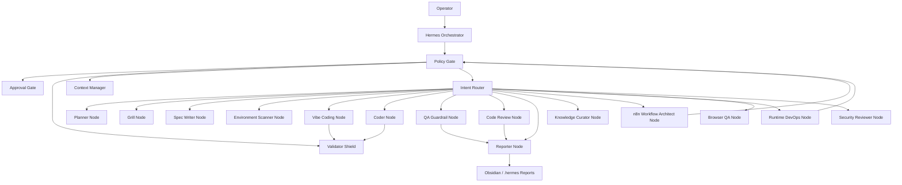

# SIRINX Agent Team Topology

Generated: 2026-05-28 02:30 +0700
Status: draft-only, local-only, not dispatched

## Purpose

Define the SIRINX sub-agent team, all node roles, routing lanes, skill bindings, and stop rules for Hermes-driven work.

This is a configuration draft, not an active runtime launch. It does not start agents, MCP servers, providers, or external connectors.

## Prime Rule

Hermes is the orchestrator. Every other node is a bounded worker, reviewer, or evidence lane.

No node may bypass:

- Human approval gates.
- Validator Shield.
- External evidence gates.
- Secret redaction.
- Local-only execution boundaries.

## Team Graph



## Role Matrix

| Node | Primary role | Skill binding | Autonomy | Allowed before implementation approval | Blocked before implementation approval |
| --- | --- | --- | --- | --- | --- |
| Hermes Orchestrator | Route work, enforce gates, produce stop points | `hermes-project-planning`, `sirinx-spec-first-swarm` | A4 local | planning, routing docs, evidence | live dispatch, external mutation |
| Context Manager | Maintain `.hermes/context.md` and `.hermes/state.json` | `sirinx-spec-first-swarm` | A2 | state updates, decision logs | source implementation |
| Grill Node | Extract missing requirements | `sirinx-spec-first-swarm` | A2 | questions, acceptance criteria | implementation |
| Planner Node | Decompose goals into phase plans | `hermes-project-planning` | A2 | plans, role maps, stop rules | dispatch |
| Spec Writer Node | Requirements, spec, implementation plan, QA plan | `sirinx-spec-first-swarm` | A2 | docs/spec packets | source edits |
| Environment Scanner Node | Detect scripts, services, status, dirty state | `start-run-debug` | A1 | read-only checks | install/start services without approval |
| Vibe Coding Node | Recommend safe next code path and draft implementation cards | `subagent-driven-development`, local vibe plan | A3 draft | implementation packet, file scope, test plan | code changes without `APPROVE_IMPLEMENTATION` |
| Coder Node | Implement approved source tasks | TDD/debugging skills as needed | A4 | none until exact approval | all source edits |
| QA Guardrail Node | Run tests, browser checks, secret scan, diff check | `verification-before-completion`, `website-browser-automation` | A2 | verification commands | completion claims without evidence |
| Code Review Node | Review risk, maintainability, scope drift | `code-review`, `requesting-code-review` | A2 | local review notes | merging/pushing |
| Runtime DevOps Node | Local service status, port and config checks | `start-run-debug` | A2 | status checks | gateway restart, install, deploy |
| Browser QA Node | Browser-local dashboard checks | `website-browser-automation`, Browser plugin | A2 | localhost checks | public crawling or authenticated external action |
| Knowledge Curator Node | Update Obsidian and repo knowledge docs | `knowledge-curator`, `sirinx-ai-hq` | A2 | summaries, provenance, digest | raw chat logs/secrets |
| n8n Workflow Architect Node | Draft n8n workflow patterns and MCP policy | `mcp-builder` | A2 | docs-only workflow architecture | n8n workflow read/write/execute |
| Security Reviewer Node | Secret boundary, validator shield, external gates | Validator Shield, secret scan | A2 | audit reports, blocked-action matrix | exploit, credential, destructive actions |
| Reporter Node | Final report, changed files, commands, risk, next action | `sirinx-spec-first-swarm` | A2 | reports | completion without verification |

## Node Lanes

| Lane | Nodes | Output |
| --- | --- | --- |
| Control | Hermes Orchestrator, Policy Gate, Approval Gate | allowed/blocked decision |
| Planning | Planner, Grill, Spec Writer | requirements/spec/plan |
| Build | Vibe Coding, Coder | approved implementation only |
| Verification | QA, Browser QA, Security Reviewer | test and risk evidence |
| Runtime | Environment Scanner, Runtime DevOps | local status and runbook |
| Workflow | n8n Workflow Architect | workflow policy and draft designs |
| Knowledge | Knowledge Curator, Reporter | Obsidian and `.hermes/reports` updates |

## Default Execution Flow

1. Operator goal enters Hermes Orchestrator.
2. Policy Gate classifies autonomy and risk.
3. Context Manager updates local state if needed.
4. Planner/Grill/Spec Writer produce the implementation packet.
5. Vibe Coding Node proposes file scope and test path.
6. Stop unless exact implementation approval exists.
7. After approval, Coder Node implements the smallest target.
8. Validator Shield and QA Guardrail run checks.
9. Reporter writes changed files, commands, verification, risks, and next action.

## Stop Rules

- If task asks for install: stop for approval.
- If task asks for clone: stop for repo intake approval.
- If task asks for MCP registration: stop for MCP permission approval.
- If task asks for source code changes: stop for `APPROVE_IMPLEMENTATION`.
- If task asks for message send: stop for recipient/token evidence and send approval.
- If task asks for deploy/push/publish: stop for target, rollback, and release approval.

## Next Implementation Candidate

Recommended first source implementation target:

```text
APPROVE_IMPLEMENTATION for n8n permission policy display
```

Scope if approved:

- Add a local API/dashboard display of `docs/integrations/N8N_MCP_PERMISSION_POLICY.md`.
- Do not register MCP.
- Do not start n8n.
- Do not read workflows.
- Do not read credentials.

