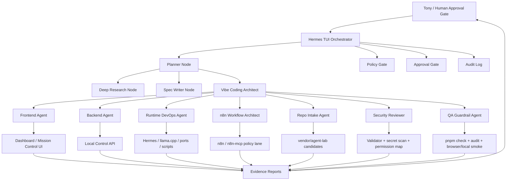

# SIRINX Fullstack Agentic Team Node Diagram - 2026-05-28

Status: DRAFT-ONLY, NOT DISPATCHED

This document defines the fullstack developer and agentic team topology requested for the next SIRINX Godmode Vibe Coding phase.

It does not start subagents, register MCP servers, install repositories, call providers, run workflows, deploy, push, publish, or send external messages.

## Team Topology



## Agent Role Config

| Node | Mission | Inputs | Outputs | Permission ceiling now |
| --- | --- | --- | --- | --- |
| Hermes TUI Orchestrator | Route every operator request | prompt, state, reports | action class, owner node, stop point | A3 |
| Planner Node | Split old backlog into phases | context, docs, memory notes | phase plan | A3 |
| Deep Research Node | Refresh official docs and repo metadata | public docs, GitHub metadata | research matrix | A2 |
| Spec Writer Node | Convert broad asks into acceptance criteria | state, grid, plan | spec docs and QA checklist | A3 |
| Vibe Coding Architect | Convert spec into implementation cards | approved plan | file-by-file implementation packet | A3 |
| Frontend Agent | Dashboard and control-panel UI | approved implementation card | source patch after approval | A4 after target approval |
| Backend Agent | API routes and contracts | approved implementation card | source patch after approval | A4 after target approval |
| Runtime DevOps Agent | Local ports, scripts, Hermes status | local commands, no secrets | runbook/status | A2 |
| n8n Workflow Architect | n8n policy and workflow drafts | n8n docs, local capability manifest | policy/draft workflow | A3 |
| Repo Intake Agent | Third-party repo safety review | repo URLs, manifests | install matrix and risk packet | A3 |
| Security Reviewer | Detect secrets/dangerous commands | diffs, manifests, scripts | pass/fail evidence | A2 |
| QA Guardrail Agent | Prove claims with commands | tests, diff, reports | verification bundle | A2 |
| Reporter Node | Close the loop | changed files, checks, risks | final report and next approval | A2 |

## Routing Syntax

```text
goal -> Hermes -> action_class -> owner_node -> artifact -> verification -> stop_or_next_approval
```

Examples:

```text
Deep research agent repos -> A2 -> Deep Research Node -> install matrix -> git diff --check + audit -> wait for clone approval
```

```text
Implement n8n policy display -> A4 -> Backend/Frontend Agent -> API/UI patch -> pnpm check + browser smoke -> report
```

```text
Register n8n MCP -> A5 -> n8n Workflow Architect -> blocked packet -> wait for APPROVE_HERMES_N8N_MCP_REGISTER
```

## Vibe Coding Control Rules

1. Vibe Coding is a fast planning style, not permission bypass.
2. Every generated code file routes through Validator Shield before execution.
3. Every external repo routes through Repo Intake Agent before clone.
4. Every MCP connector routes through manifest plus permission mapping before registration.
5. Every provider lane stays blocked until exposed tokens are rotated outside chat.
6. Every completion claim requires fresh verification output.

## First Team Mission

```text
Mission: Local-only n8n MCP permission policy display.
Target: API/dashboard visibility only.
Allowed: source patch after exact approval.
Blocked: MCP registration, workflow access, credential access, sends, deploy, push, publish.
Approval: APPROVE_IMPLEMENTATION for n8n permission policy display
```

## Second Team Mission

```text
Mission: Agent Repo Lab metadata-only shallow clone.
Target: vendor/agent-lab.
Allowed: git clone --depth 1 only, then manifest/security review.
Blocked: install, postinstall, Docker, MCP start, provider config, desktop control.
Approval: APPROVE_AGENT_REPO_LAB_CLONE for vendor/agent-lab metadata-only shallow clone
```
