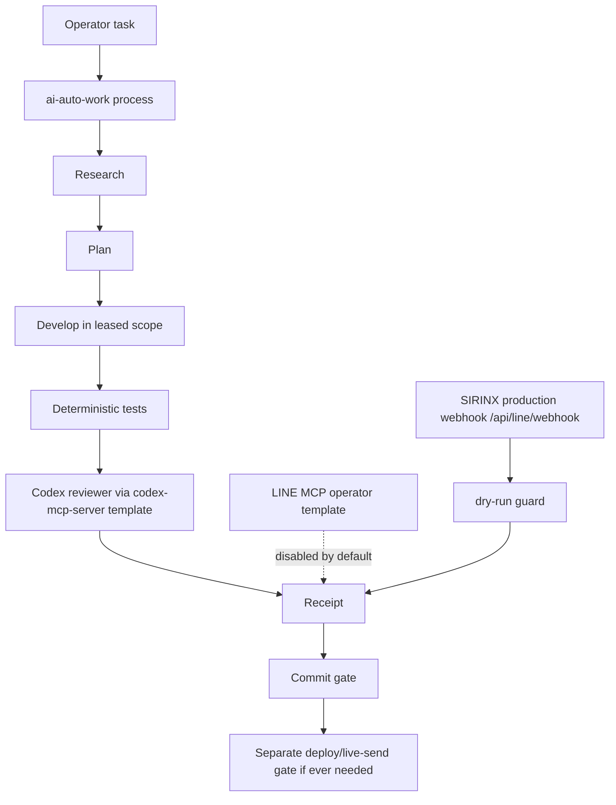

# GhostClaw Workflow MCP Layer V1

Status: `LOCAL_SAFE_ARCHITECTURE_LOCKED`
Packet: `P092_LINE_OA_AUTOMATION_UPGRADE`
Date: `2026-07-07`

## Purpose

Add a workflow and MCP integration layer to GhostClaw/SIRINX without changing the production LINE path or opening live-send capability. This layer uses workflow automation and MCP tooling as controlled operator infrastructure, not as autonomous production authority.

## Layer Map

| Layer | Tool | Role | Default Gate |
| --- | --- | --- | --- |
| Workflow | `ai-auto-work` pattern | Research -> Plan -> Develop -> Review -> Test -> Commit gate | Local-safe docs/process only |
| Executor | Claude/OpenCode/Codex lane | Implement scoped local tasks under file lease | Local mutation gate |
| Reviewer | `codex-mcp-server` template | Codex adversarial review for concurrency, edge cases, boundaries, and security | Review-only |
| LINE Operator | `@line/line-bot-mcp-server` template | Manual operator testing for Flex/rich menu/push drafts | Disabled by default |
| LINE Production | SIRINX webhook | Customer traffic through `/api/line/webhook` with existing dry-run guard | Human-gated |

## Control Flow



## Production LINE Boundary

Production customer traffic must continue to use:

```text
https://www.sirinx.co/api/line/webhook
```

Required safe defaults:

```text
SIRINX_LINE_MODE=dry-run
SIRINX_LINE_AUTO_REPLY_APPROVED=false
```

The LINE MCP server is not a production automation path. It is an operator/admin tool for manual testing only and starts disabled in the repository template.

## MCP Config Boundary

`config/opencode.mcp.sirinx.template.json` is a template. It is not written to a live OpenCode config by this packet, and it must not be executed through `npx` until an install/run gate is approved.

Template intent:

- `codex-cli`: enabled template for Codex review bridge.
- `line-bot`: disabled template for manual LINE operator testing.
- `line-bot.broadcast*`: disabled.
- `line-bot.push*`: disabled.

## Risk Controls

Allowed in this packet:

- Create architecture docs.
- Create OpenCode MCP template.
- Create LINE MCP operator policy.
- Create P092 runbook and receipt.
- Run local syntax/format checks on created files.

Blocked in this packet:

- Installing packages or running `npx`.
- Codex/OpenCode/LINE MCP live startup.
- `codex --login` or account authentication changes.
- Provider/model calls.
- Secret reads, prints, or credential validation.
- Git push or deploy.
- Cloudflare/R2/D1/KV/DNS mutation.
- LINE webhook activation.
- LINE/Telegram/email/customer live send.
- CRM/customer data storage.

## Review Expectations

OpenCode review should verify:

1. The OpenCode MCP file is template-only.
2. `line-bot.enabled` remains `false`.
3. LINE push/broadcast tools are disabled.
4. The policy preserves the SIRINX webhook production path.
5. No environment secret value is present.
6. No live-send/deploy/cloud mutation is approved.
7. Commit and deploy remain separate gates.

## Next Safe Gate

`P092_OPENCODE_REVIEW_WORKFLOW_MCP_LAYER`

Review-only. No mutation beyond review artifact creation.
