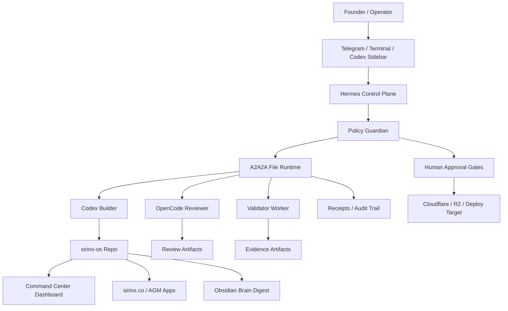
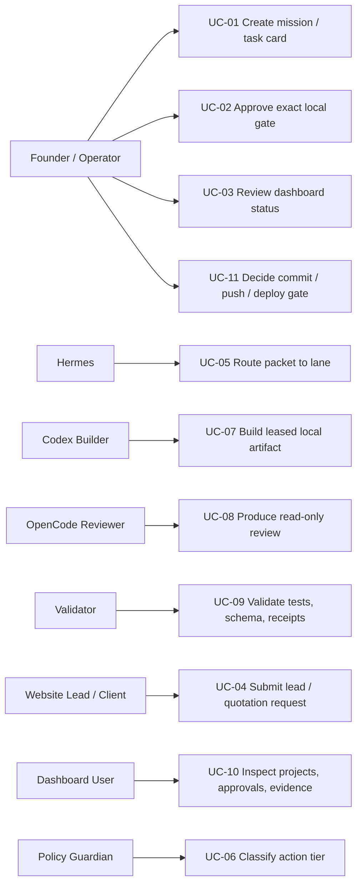
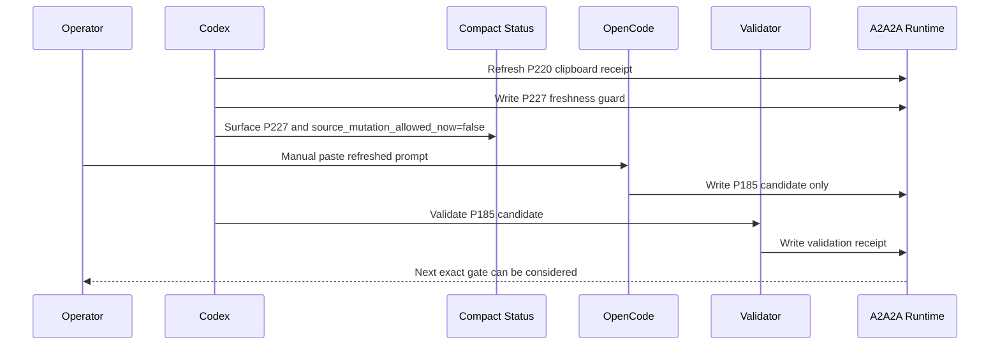
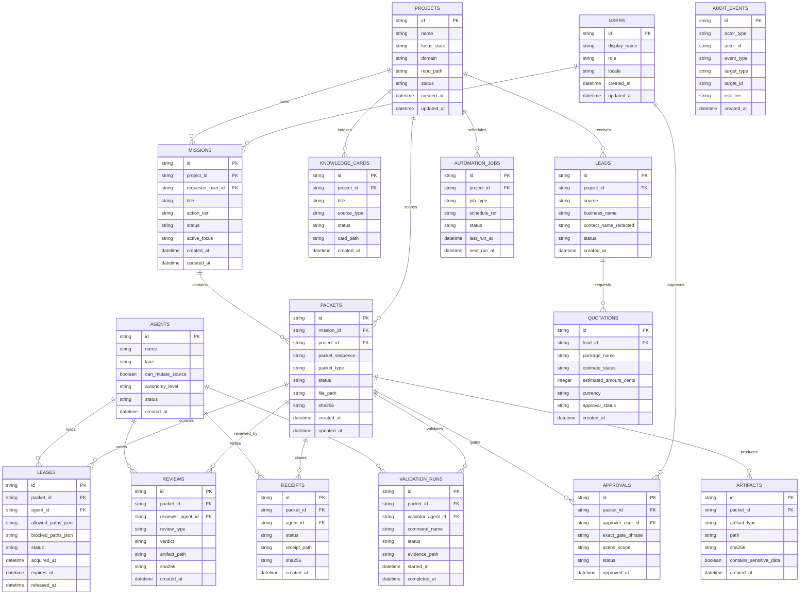
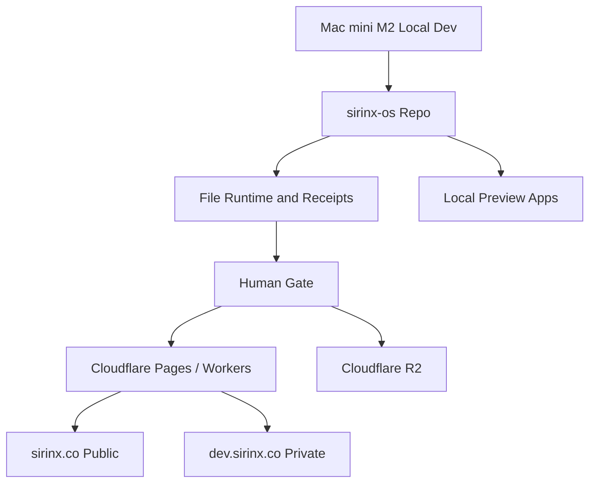

# SIRINX GhostClaw Full-Stack Architecture, Use Cases, and Database Model

Generated: 2026-07-04  
Scope: `sirinx-os`, active focus `sirinx.co` and `AGM AutoFlow`  
Status: architecture document only, no deploy, no provider call, no live send

## 1. Executive Architecture

SIRINX GhostClaw is a local-first AI operating system for controlled, secure, auditable, and scalable project execution. The system keeps the repo and file-based runtime as the current source of truth, while preparing a future database-backed control plane for dashboards, reports, approvals, and automation history.

Core rule:

```text
Idea -> Spec -> Queue Packet -> Lease -> Build/Review -> Validate -> Receipt -> Handoff -> Human Gate
```

Active scope:

- `sirinx.co`: public/private website and business operating layer.
- `AGM AutoFlow`: AGM portfolio/automation demo and AutoGlow dashboard layer.

Paused scope:

- Kusala
- Phitsanulok News

## 2. System Context



## 3. Layered Architecture

| Layer | Responsibility | Current implementation | Future hardening |
|---|---|---|---|
| Operator Interface | Telegram, terminal, Codex sidebar, OpenCode sidebar | human-triggered local commands and manual paste gates | authenticated command gateway |
| Hermes Control Plane | mission intake, routing, gate status, lane state | `.ghostclaw_runtime/a2a2a/status/**` and scripts | API-backed orchestration service |
| Policy Guardian | block unsafe action classes | exact gate phrases, compact status, blocked action maps | policy engine with signed approvals |
| A2A2A Runtime | packet queues, inbox/outbox, leases, receipts | file-based runtime under `.ghostclaw_runtime/a2a2a/**` | durable DB tables plus file export |
| Codex Builder | scoped local code/docs builder | mutates only leased local files | isolated worktree workers |
| OpenCode Reviewer | read-only review and QA | manual candidate review output | signed review result ingestion |
| Validator | deterministic checks | tests, diff check, secret scan, JSON checks | CI runner and validation matrix |
| Apps | site, dashboard, AGM AutoFlow, APIs | `apps/*`, `services/*`, `packages/*` | staged deploy with rollback |
| Knowledge | distilled memory and Obsidian pulse | docs, reports, digest note | knowledge-card DB and search |

## 4. Backend Boundaries

### Services

| Service | Role | Examples |
|---|---|---|
| `services/dev-control-api` | local control API, gates, active-focus checks, approval evidence | policy status, lead contracts, model routing approval |
| `services/hermes-api` | Hermes-facing inbox and adaptive command gateway | inbox, command gateway tests |
| `scripts/ghostclaw_a2a_agent_orchestrator.py` | A2A2A packet, guard, compact status, review handoff logic | P185/P195/P208/P227/P229 packet flow |
| `scripts/*.mjs` | active-focus local UAT and evidence generators | `active-focus:*`, secret scan, validation |

### Frontend and Apps

| App/package | Role |
|---|---|
| `apps/sirinx-site` | public `sirinx.co` website layer |
| `apps/agm-site` | AGM public portfolio/demo layer |
| `apps/agm-autoglow-dashboard` | AGM AutoFlow dashboard layer |
| `packages/autoglow-core` | shared automation/domain core |
| `apps/dev-dashboard` | local command center dashboard |

## 5. Use Case Diagram



## 6. Primary Use Cases

### UC-01: Create Mission / Task Card

Actor: Founder or Hermes  
Trigger: new work request from terminal, Telegram, Codex sidebar, or manual file.  
Preconditions: request is classified into project and action tier.  
Main flow:

1. Hermes reads scope and active focus.
2. Policy Guardian classifies the task.
3. Hermes creates a mission envelope or queue packet.
4. Packet is assigned to Codex, OpenCode, Validator, or a hold state.
5. Compact status is refreshed for sidebar visibility.

Postcondition: packet is pending, blocked, or ready for a specific exact gate.

### UC-02: Execute Local-Safe Build Packet

Actor: Codex Builder  
Preconditions: file lease exists, action tier is local-safe, blocked paths are excluded.  
Main flow:

1. Read target files.
2. Patch only leased paths.
3. Run deterministic validation.
4. Write report and receipt.
5. Stop before commit, push, deploy, live send, provider call, or cloud mutation.

Postcondition: work is ready for OpenCode review or human gate.

### UC-03: OpenCode Review Candidate Flow

Actor: OpenCode Reviewer  
Current packet focus: `packet_078`  
Main flow:

1. Codex prepares a prompt and local clipboard receipt.
2. Operator manually pastes the prompt into OpenCode.
3. OpenCode writes only the P185 candidate review artifact.
4. Codex validates the candidate.
5. Only after candidate validation can real result-path transition be considered.

Blocked: automatic paste, provider call by Codex, P175 real result write, P193 command write, and queue write until the next exact gate.

### UC-04: Website Lead and Quotation Preview

Actor: Website visitor / client lead  
Main flow:

1. User submits lead or quotation interest on public site.
2. API validates and stores lead locally or in configured CRM adapter.
3. Owner receives draft status in dashboard.
4. Quotation preview is generated as draft only.
5. Human approval is required before sending or publishing.

Postcondition: lead and quotation draft are audit-visible, not auto-sent.

### UC-05: Active-Focus Local UAT

Actor: Validator / operator  
Scope: `sirinx.co`, AGM AutoFlow  
Main flow:

1. Build active apps locally.
2. Start preview servers on local ports.
3. Probe routes and dashboard endpoints.
4. Store evidence and receipt.
5. Shut down local servers.

Blocked: deploy, push, Cloudflare/R2 mutation, customer-data routing, package install.

## 7. Sequence: Current Packet 078 Review Gate



## 8. Logical Database Model

Current MVP source of truth is file-based: markdown, JSON, YAML, receipts, and runtime folders. The following database model is the target logical schema for SQLite/Postgres once the control plane is promoted beyond file-only state.

Design rules:

- Keep raw secrets out of the DB.
- Store hashes and paths for artifacts, not large raw logs.
- Preserve every approval, lease, receipt, and validation result.
- Separate project/business data from runtime orchestration data.
- Every external or destructive action requires an approval row.

## 9. ER Diagram



## 10. Table Responsibilities

| Table | Why it exists | Critical constraints |
|---|---|---|
| `projects` | separates active, paused, support, research projects | `focus_state` blocks out-of-scope queue execution |
| `missions` | stores business intent and current lifecycle | must include action tier and requester |
| `packets` | unit of execution | packet status must not advance without receipt/validation |
| `leases` | prevents file collisions | one active lease per file scope |
| `approvals` | stores exact gate decisions | no broad approval is durable |
| `reviews` | separates reviewer output from builder output | reviewer must not equal builder for critical gates |
| `receipts` | audit proof | required before packet close |
| `validation_runs` | deterministic proof | no LLM-only pass for critical work |
| `artifacts` | paths/hashes of docs, screenshots, logs | store paths and hashes, not raw secret-bearing logs |
| `knowledge_cards` | distilled long-term memory | raw dumps should be distilled before storage |
| `leads` | business workflow | redact PII in logs and dashboards |
| `quotations` | near-money workflow | never send without owner approval |
| `automation_jobs` | cron/webhook planning | no paid polling loop by default |
| `audit_events` | complete trace | append-only |

## 11. API Surface Proposal

| Area | Endpoint | Method | Notes |
|---|---|---|---|
| Health | `/api/health` | GET | local stack status |
| Dashboard | `/api/dashboard/status` | GET | compact active-focus summary |
| Projects | `/api/projects` | GET/POST | file-backed now, DB later |
| A2A2A | `/api/a2a2a/packets` | GET | packet list and gate state |
| A2A2A | `/api/a2a2a/dispatch/dry-run` | POST | never executes live workers |
| Approvals | `/api/approval/request` | POST | create exact gate request |
| Approvals | `/api/approval/confirm` | POST | records human approval |
| Reviews | `/api/reviews` | GET/POST | reviewer artifacts and verdicts |
| Receipts | `/api/receipts` | GET | receipt audit trail |
| Knowledge | `/api/knowledge-cards` | GET/POST | distilled memory cards |
| Leads | `/api/leads` | GET/POST | PII-redacted lead flow |
| Quotation | `/api/quotation/preview` | POST | draft only |
| Quotation | `/api/quotation/generate` | POST | requires approval gate before send |
| Automation | `/api/automation/schedule` | GET/POST | cron plan, no paid polling loop |
| Security | `/api/security/policy` | GET | blocked action map |

## 12. Deployment Topology



Current state: local-safe architecture and evidence only. Cloudflare/R2 mutation remains blocked until exact approval.

## 13. Security and Safety Architecture

Hard blocks by default:

- secret read or print
- real `.env` edits
- provider/model calls
- live Telegram/LINE/email/customer send
- install, migration, push, deploy
- Cloudflare/R2 mutation
- customer data external routing
- destructive deletes

Required controls:

- exact gate phrase per high-impact action
- file lease before mutation
- receipt after mutation
- OpenCode review for critical transitions
- deterministic validation before pass
- Obsidian pulse only after meaningful local work, no secrets

## 14. Implementation Roadmap

### Phase 1: Stabilize Current File Runtime

- Keep `.ghostclaw_runtime/a2a2a/**` as source of truth.
- Add DB-ready schemas without changing runtime behavior.
- Finish P185 candidate review path for `packet_078`.
- Keep active focus on `sirinx.co` and AGM AutoFlow.

### Phase 2: Dashboard Read Model

- Build read-only API that indexes file runtime into dashboard DTOs.
- Display packets, gates, receipts, active focus, and blocked actions.
- No write operations except approved local status records.

### Phase 3: Database Persistence

- Add SQLite/Postgres tables from the logical ER model.
- Create one-way importer from file runtime to DB.
- Keep file receipts as export/audit backup.

### Phase 4: Controlled Write APIs

- Add approval request/confirm endpoints.
- Add packet create/update with lease checks.
- Add review result ingestion with signature/hash verification.

### Phase 5: Staging Deployment Gate

- Only after local validation and human approval.
- Cloudflare/R2 deploy path requires separate rollback plan.
- Public/private domain separation must be validated before production.

## 15. Definition of Done for This Architecture

- System layers are explicit.
- Active and paused scope are separated.
- Use cases define actors, flows, and blocked actions.
- Database model supports orchestration, business workflow, and audit history.
- Diagrams are Mermaid-compatible.
- No live integration is claimed.
- Next engineering phase can be implemented one packet at a time.
