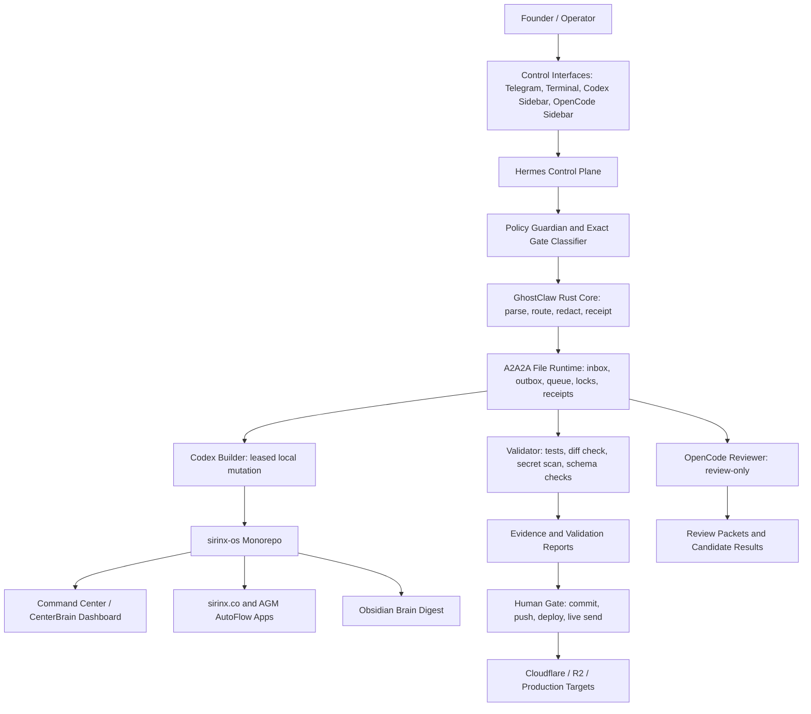
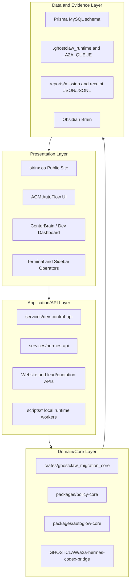
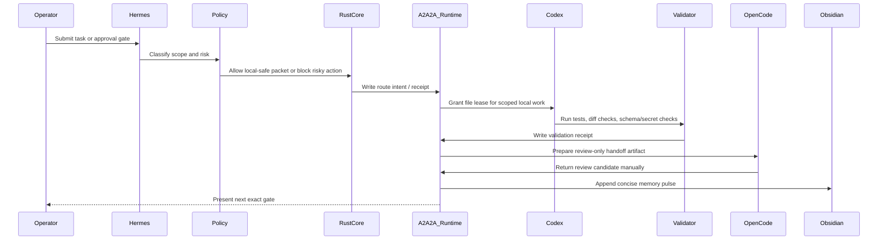
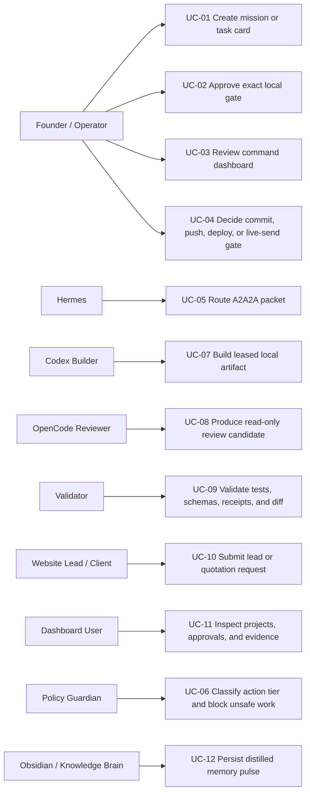
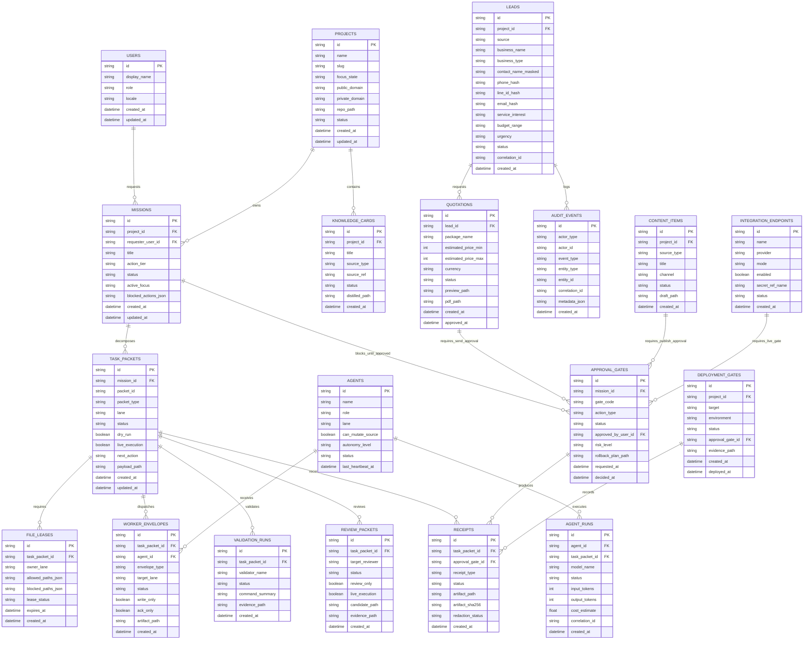
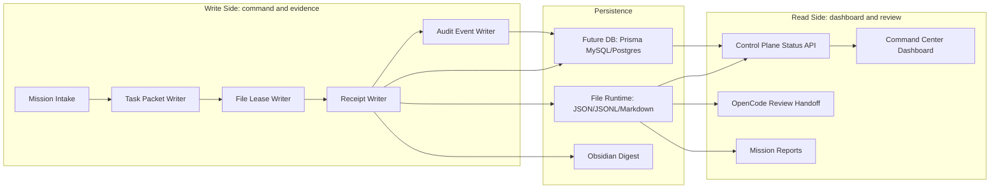
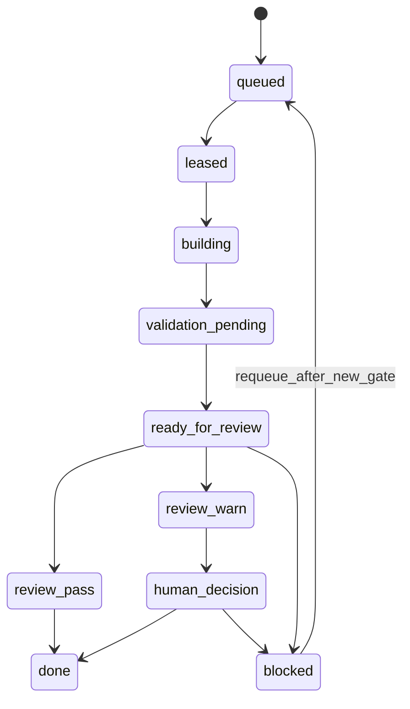
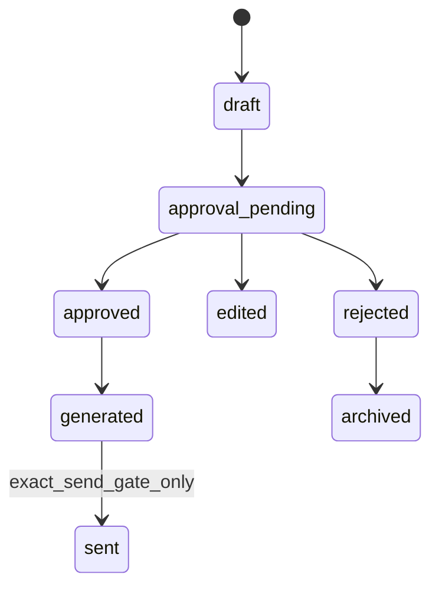
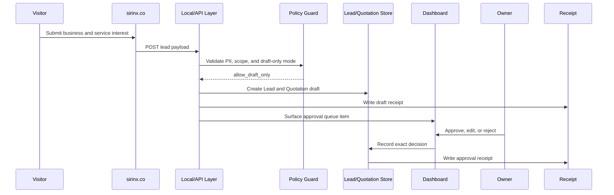
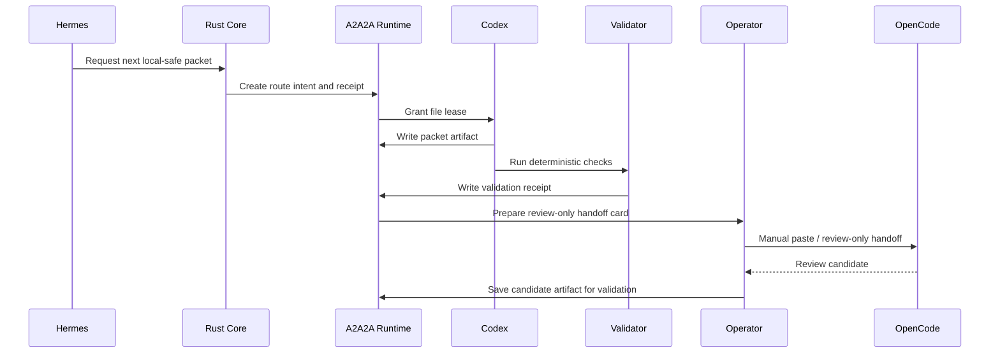

# SIRINX GhostClaw Master Architecture, Use Cases, and Database Design

Generated: 2026-07-05
Scope: `sirinx-os`, SIRINX/GhostClaw control plane, Rust migration core, A2A2A adaptive sync, `sirinx.co`, and AGM AutoFlow
Status: architecture/design artifact only. No deploy, no push, no live Telegram send, no provider call, no Cloudflare/R2 mutation.

## 1. Executive Summary

SIRINX GhostClaw is a local-first AI operating system for founder-led project execution. The platform turns raw intent into controlled work packets, routes those packets through Hermes/Codex/OpenCode/Validator lanes, records every important step as evidence, and stops before external actions until a human grants an exact gate.

Senior full-stack rule:

```text
Intent -> Spec -> Policy Gate -> Queue Packet -> File Lease -> Build/Review -> Validate -> Receipt -> Dashboard -> Human Gate
```

Current source of truth:

- Repo files, docs, fixtures, Rust crate tests, A2A2A runtime artifacts, and receipts.
- Database models exist as a foundation, but the runtime is still primarily file/receipt-driven.
- External execution remains gated. Preview artifacts are not the same as live execution.

## 2. Product Domains

| Domain | Role | Current surfaces | Notes |
|---|---|---|---|
| SIRINX Core OS | Founder command center and operating system | Hermes, Codex, OpenCode, Obsidian, Rust core | Private/control-plane first |
| GhostClaw | Agentic execution protocol and audit layer | A2A2A, receipts, file leases, policy gates | Local-safe by default |
| `sirinx.co` | Public website and business surface | Site, lead flow, quotation draft flow | Public/private separation required |
| AGM AutoFlow | Media/portfolio automation project | AutoGlow core and dashboard | Active focus, not mixed with paused projects |
| Knowledge Brain | Long-term distilled memory | Obsidian digest, docs, knowledge cards | No secrets or raw logs |
| Future Cloud Edge | Deployment target | Cloudflare Workers, R2, Pages, D1/KV candidates | Only after explicit deploy/cloud gate |

Paused/out-of-focus for this build lane:

- Kusala / กุศลา
- Phitsanulok News
- Final Farewell
- unrelated local development projects

## 3. System Context



## 4. Container Architecture



## 5. Layer Responsibilities

| Layer | Owns | Must not own yet |
|---|---|---|
| UI/Operator | status visibility, human decisions, manual paste/review handoff | automatic deploy, automatic live send |
| Dev Control API | local status, approval evidence, lead/CRM contracts, model routing gates | secret values, production mutation |
| Hermes API | command gateway, inbox/adaptive command surfaces | bypassing Rust/policy guard |
| Rust Core | command schema, policy block, redaction, route intent, receipts | live Telegram runtime, live Codex execution, cloud mutation |
| A2A2A Runtime | queue packets, leases, envelopes, receipts | treating preview/status as real execution |
| Codex Lane | local implementation with file lease | self-approval, push/deploy/install |
| OpenCode Lane | review-only evidence | source mutation unless separately leased |
| Validator Lane | deterministic proof | claiming human approval |
| Database | normalized audit/business state | raw secrets, huge logs, unredacted customer data |

## 6. Runtime Sequence: Safe Local Work Packet



## 7. Use Case Diagram



## 8. Primary Use Cases

### UC-01: Mission Intake and Task Card

Actor: Founder, Hermes
Goal: convert a request into a bounded execution packet.
Preconditions:

- Active project is known.
- Scope and blocked actions are explicit.
- If unclear, Hermes asks for narrower gate instead of assuming full autonomy.

Main flow:

1. Operator submits a task from Telegram, terminal, Codex sidebar, or manual prompt.
2. Hermes extracts goal, constraints, file scope, expected result, verification, and report format.
3. Policy Guardian classifies the request as read-only, local-safe write, gated external action, or blocked.
4. Rust core or A2A2A runtime creates a route intent and receipt.
5. Dashboard/status layer displays next safe action.

Data touched:

- `Mission`
- `TaskPacket`
- `ApprovalGate`
- `Receipt`

Success result: a packet exists and is ready for a specific lane or exact gate.

### UC-02: Local-Safe Build With File Lease

Actor: Codex Builder
Goal: modify only approved local files and produce evidence.
Preconditions:

- File lease exists.
- Blocked paths are excluded.
- No source mutation outside the active packet.

Main flow:

1. Codex reads target files and current diff.
2. Codex patches only leased paths.
3. Codex runs focused tests and formatting/diff checks.
4. Codex writes a report and receipt.
5. Codex stops before commit, push, deploy, live send, provider call, or cloud mutation.

Data touched:

- `FileLease`
- `AgentRun`
- `ValidationRun`
- `Receipt`

### UC-03: Review-Only OpenCode Candidate

Actor: OpenCode Reviewer
Goal: produce review feedback without mutating source.
Preconditions:

- Review packet is ready.
- Handoff target is `opencode_review_only`.
- Manual operator paste or review action is used if external UI is involved.

Main flow:

1. Codex prepares a compact review packet.
2. Operator hands packet to OpenCode manually.
3. OpenCode returns a candidate review artifact.
4. Validator checks candidate identity, packet id, and no-mutation requirements.
5. Hermes marks the next gate as ready or blocked.

Data touched:

- `ReviewPacket`
- `ReviewCandidate`
- `ValidationRun`
- `Receipt`

Blocked: automatic provider calls, automatic source mutation, automatic live queue consumption.

### UC-04: Website Lead and Quotation Draft

Actor: Website visitor, Founder
Goal: capture business interest and generate draft quotation artifacts.
Preconditions:

- Public form collects only required business/contact fields.
- Data handling policy is visible and approval-gated for outbound sends.

Main flow:

1. Visitor submits business info and service interest.
2. API validates lead payload and creates a lead record.
3. Quotation service calculates a draft estimate.
4. Draft appears in dashboard approval queue.
5. Owner approves, edits, or rejects before any customer send.

Data touched:

- `Lead`
- `Quotation`
- `ApprovalGate`
- `AuditEvent`

Success result: quote draft exists; no customer message is sent automatically.

### UC-05: Telegram Command Readiness

Actor: Founder, Hermes
Goal: verify Telegram command routing without unsafe live sends.
Preconditions:

- Gateway config is presence-checked only.
- No secret values are read or printed.

Main flow:

1. Operator requests readiness or preview.
2. Hermes checks config presence, command registry, and error-loop guard.
3. System creates a Telegram-safe draft.
4. Live send requires exact approval.

Data touched:

- `Command`
- `IntegrationEndpoint`
- `ApprovalGate`
- `Receipt`

### UC-06: A2A2A Adaptive Sync Packet Flow

Actor: Hermes, Codex, Validator
Goal: keep multi-lane work moving without scope drift.
Preconditions:

- Current packet id is explicit.
- Paused projects are excluded.
- ACK-only gates remain ACK-only.

Main flow:

1. Hermes reads current packet status.
2. Orchestrator selects only a safe next packet.
3. Codex writes local envelope/status/receipt artifacts.
4. Role worker ACK or review candidate is accepted only after matching gate.
5. Compact status suppresses stale packet resurfacing.

Data touched:

- `TaskPacket`
- `WorkerEnvelope`
- `PacketAck`
- `OrchestratorSnapshot`

### UC-07: Knowledge Distillation to Obsidian Brain

Actor: Codex, Knowledge Brain
Goal: preserve concise memory without leaking secrets or dumping raw logs.
Preconditions:

- Work was meaningful enough to merit a pulse.
- Evidence path exists.

Main flow:

1. Codex writes durable doc/report/receipt in repo.
2. Codex appends one short pulse to Obsidian digest.
3. Pulse includes what changed, evidence path, and next safe action.
4. Raw logs, secret values, and `.env` content are excluded.

Data touched:

- `KnowledgeCard`
- `Receipt`
- Obsidian digest note

### UC-08: Human Deployment Gate

Actor: Founder
Goal: approve or reject external release actions.
Preconditions:

- Local validation passed.
- Review result has no blocking issue.
- Rollback plan exists.
- Scope is exact: commit, push, deploy, Cloudflare/R2 mutation, or live send.

Main flow:

1. System presents evidence bundle and risk summary.
2. Founder grants one exact gate or rejects.
3. If approved, executor performs only that one action.
4. Receipt records result and next rollback/safety state.

Data touched:

- `ApprovalGate`
- `DeploymentGate`
- `AuditEvent`
- `Receipt`

## 9. API and Module Map

| Area | Current modules | Responsibility |
|---|---|---|
| Control API | `services/dev-control-api/src/*.mjs` | local status, approval evidence, model routing, team bridge, lead/CRM contracts |
| Hermes API | `services/hermes-api/src/*` | inbox and adaptive command gateway |
| Rust core | `crates/ghostclaw_migration_core/src/*` | command parsing, policy, redaction, receipts, queue/review adapter models |
| A2A bridge | `GHOSTCLAW/a2a-hermes-codex-bridge/*` | TypeScript packet bus, lane registry, rollback manifest |
| Dashboard | `apps/centerbrain-shell`, `apps/dev-dashboard` | operator-visible status and command center surfaces |
| Shared policy | `packages/policy-core` | action classification and guard rules |
| AGM automation | `packages/autoglow-core`, AGM app packages | AGM AutoFlow domain logic |
| Data | `prisma/schema.prisma`, runtime JSON/JSONL | persisted business/runtime model foundation |

## 10. Database Strategy

### Current implemented Prisma baseline

The current Prisma schema contains:

- `LiveChatEvent`
- `SolarLead`
- `Agent`
- `AgentRun`
- `TaskQueue`

These are useful but not enough for the full control plane. They should be treated as the first database foundation, not the complete runtime model.

### Target logical schema

The target schema separates business data from orchestration/audit data.



## 11. Database Design Notes

### 11.1 IDs and correlation

- Use `cuid`/UUID style IDs for app entities.
- Every action that crosses a module boundary must carry `correlation_id`.
- Human-visible packet ids such as `packet_078` remain separate from primary keys.

### 11.2 PII and secret storage

- Do not store raw API keys, OAuth tokens, browser cookies, private keys, or `.env` values.
- Store `secret_ref_name` only, such as `TELEGRAM_BOT_TOKEN`, not the value.
- Hash phone, email, and LINE identifiers where possible.
- Keep full customer data out of local test fixtures.

### 11.3 Evidence model

- Store artifact path and SHA256 in `RECEIPTS`.
- Store large logs in files, not DB columns.
- Validation rows should contain short command summaries and evidence paths.

### 11.4 Outbox pattern

Use an outbox table or file-backed queue for future external effects:

```text
draft_external_action -> approval_gate -> exact execution -> receipt -> audit_event
```

No email, Telegram, LINE, Cloudflare, R2, or deploy action should execute directly from a form submission or LLM response.

## 12. Public/Private Domain Boundary

| Zone | Examples | Allowed | Blocked |
|---|---|---|---|
| Public | `sirinx.co`, AGM public pages | marketing content, lead forms, public offers | dashboard URLs, secret refs, internal packet ids |
| Private | `dev.sirinx.co`, local dashboard | project registry, agent memory, approvals, receipts | public exposure without auth |
| Local Runtime | `.ghostclaw_runtime`, `_A2A_QUEUE`, reports | local proof, dry-run packets, review handoff | claiming live execution without target proof |
| Cloud Edge | Cloudflare Workers/Pages/R2 | staging/production after exact gate | DNS/R2/deploy mutation without exact approval |

## 13. Security and Approval Gates

| Action class | Default | Required gate |
|---|---|---|
| Read local docs/source | Allowed | none |
| Write local docs/fixtures/reports | Allowed when scoped | file lease or local task scope |
| Run existing tests | Allowed when no install needed | none |
| Commit local changes | Blocked by default in this lane | exact local commit gate |
| Push to GitHub | Blocked | exact push gate |
| Deploy / Cloudflare / R2 mutation | Blocked | exact deploy/cloud gate |
| Telegram/LINE/email live send | Blocked | exact live-send gate |
| Provider/model paid call | Blocked | exact provider-call gate with budget/scope |
| Secret read/print | Blocked | do not perform |

## 14. Senior Full-Stack Build Order

```text
1. Domain model and ERD
2. Policy/action-tier contract
3. Queue packet and receipt schema
4. Rust core deterministic adapter contract
5. API route contracts
6. API implementation with tests
7. Dashboard state hooks
8. Dashboard components
9. Public pages or private pages one by one
10. Local UAT and accessibility/performance checks
11. Review packet and validation report
12. Human commit/deploy/live-send gate
```

## 15. Next Implementation Packets

| Packet | Goal | Allowed paths | Blocked |
|---|---|---|---|
| P102 | Convert target DB model into Prisma proposal | `docs/database/**`, `prisma/schema.prisma` proposal only | migration, DB write |
| P103 | Add API contract for mission/task/receipt status | `docs/api/**`, test fixtures | live runtime execution |
| P104 | Dashboard architecture map and state hooks plan | `docs/frontend/**`, `apps/centerbrain-shell` docs/tests | public deploy |
| P105 | Quotation flow DB/API draft | docs and local tests | customer send |
| P106 | Cloudflare staging gate packet | `docs/cloudflare/**`, reports | deploy/cloud mutation |

## 16. Senior Full-Stack Implementation Blueprint

This section is the senior developer handoff shape: what to build, which module owns it, which API/data boundary it touches, and what must be validated before the next layer opens.

### 16.1 Bounded contexts

| Context | Purpose | Primary modules | Data owner | Critical rule |
|---|---|---|---|---|
| Control Plane | mission intake, exact gates, compact status | Hermes, Rust core, `services/dev-control-api` | `Mission`, `TaskPacket`, `ApprovalGate` | no self-approval |
| Execution Runtime | A2A2A packet queue, leases, worker envelopes | `.ghostclaw_runtime`, `_A2A_QUEUE`, Rust adapters | `TaskPacket`, `FileLease`, `WorkerEnvelope` | packet id must stay exact |
| Build Lane | leased local source/docs mutation | Codex, local tests | `AgentRun`, `ValidationRun`, `Receipt` | one packet, one layer, one lease |
| Review Lane | read-only review candidate lifecycle | OpenCode handoff artifacts, review packet adapter | `ReviewPacket`, `ReviewCandidate` | reviewer must not mutate source |
| Business Workflow | lead, quotation, offer, CRM-safe draft flow | `sirinx.co`, quotation APIs, dashboard | `Lead`, `Quotation`, `ApprovalGate` | draft only until owner approval |
| Knowledge Brain | distilled memory and evidence index | docs, Obsidian digest, knowledge cards | `KnowledgeCard`, `Receipt` | no raw log or secret dump |
| Release Gate | commit, push, deploy, Cloudflare/R2, live send | approval packets, Cloudflare docs | `DeploymentGate`, `AuditEvent` | exact gate per external action |

### 16.2 Use-case to API and database mapping

| Use case | API boundary | Writes | Reads | Validation before pass |
|---|---|---|---|---|
| UC-01 Mission intake | `POST /api/missions` later; file packet now | `Mission`, `TaskPacket`, `Receipt` | project registry, policy rules | JSON schema, blocked-action scan |
| UC-02 Local-safe build | local worker adapter, no public API required | `FileLease`, `AgentRun`, `ValidationRun`, `Receipt` | leased files, tests | focused tests, `git diff --check`, secret scan |
| UC-03 OpenCode review | `POST /api/reviews` later; manual candidate now | `ReviewPacket`, `ReviewCandidate`, `Receipt` | completed packet, validation report | review-only flag, no source mutation |
| UC-04 Lead/quotation draft | `POST /api/leads`, `POST /api/quotation/preview` | `Lead`, `Quotation`, `ApprovalGate` | offers, pricing rules | payload validation, PII masking, no send |
| UC-05 Telegram readiness | `GET /api/integrations/telegram/status` later | `IntegrationEndpoint`, `Receipt` | config presence only | no secret value read/print |
| UC-06 A2A2A adaptive sync | `GET /api/a2a2a/status`, dry-run dispatch later | `WorkerEnvelope`, `PacketAck`, `OrchestratorSnapshot` | current packet, ACK receipts | stale packet suppression, active-focus guard |
| UC-07 Obsidian brain pulse | local script only | `KnowledgeCard` index later, digest note now | report/receipt paths | concise pulse, no secrets, evidence path exists |
| UC-08 Human deployment gate | `POST /api/approval/confirm` later | `ApprovalGate`, `DeploymentGate`, `Receipt` | review result, rollback plan | exact gate phrase, rollback evidence |

### 16.3 Control-plane read/write model



Design decision: file runtime remains the write source of truth until DB persistence is proven. The database becomes a query/read index first, then a transactional write store only after a separate migration gate.

### 16.4 Database state machines





The first state machine applies to `TaskPacket`. The second applies to near-money objects such as `Quotation` and public-facing content. No state transition to `sent`, `deployed`, or `published` is legal without an exact approval row.

### 16.5 Quotation flow sequence



### 16.6 A2A2A review handoff sequence



### 16.7 Implementation checklist per layer

| Layer | Definition of done |
|---|---|
| Domain | entities, status vocabulary, and action tiers documented |
| Database | additive schema proposal reviewed; no migration yet |
| API | OpenAPI/JSON schema and example response exist before handler |
| Backend | handler reads local fixtures/files first; tests cover blocked actions |
| Frontend | dashboard cards render from contract; empty/error states present |
| Review | OpenCode packet is review-only and manually operated |
| Validation | deterministic checks pass; no LLM-only pass for critical work |
| Memory | one concise Obsidian pulse links evidence and next safe action |

## 17. Architecture Decision

Keep the system hybrid:

- Rust core for deterministic policy/routing/receipt logic.
- TypeScript/Node for local dashboard/API/product surfaces.
- File-backed A2A2A runtime until DB schema is hardened.
- MySQL/Prisma as the future normalized control-plane database.
- Cloudflare only as a gated deployment target, not the source of truth.

Final lock:

```yaml
architecture_status: master_design_snapshot_enhanced_with_senior_fullstack_blueprint
source_of_truth_now: repo_files_and_local_receipts
database_status: target_logical_schema_defined
live_runtime_started: false
deploy_or_cloud_mutation: false
next_safe_action: P234_review_handoff_manifest_status_or_P103_control_plane_status_handler
```
