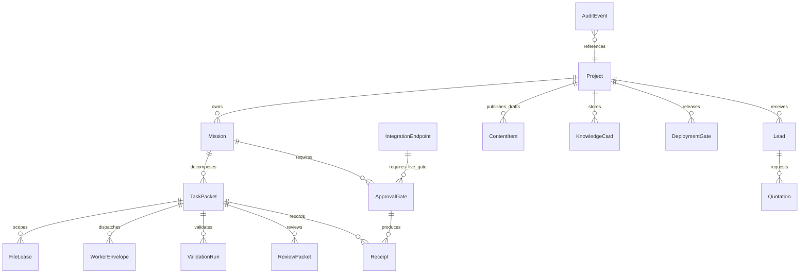

# GhostClaw Control Plane Database Proposal

Packet: `P102_DATABASE_SCHEMA_PROPOSAL`
Date: 2026-07-05
Mode: proposal only, no migration, no database write, no cloud mutation

## 1. Purpose

This proposal converts the master architecture ERD into an implementation-ready database plan for the SIRINX/GhostClaw control plane. It does not modify `prisma/schema.prisma`; it defines the safe next shape so the owner can approve a later schema merge and migration packet.

The current runtime is still file/receipt-first:

```text
A2A2A runtime files -> reports/mission -> receipts -> Obsidian pulse
```

The database should become a normalized index of missions, packets, approvals, validation, review, leads, quotations, and evidence. It must not become a place for raw secrets, large logs, or uncontrolled live execution.

## 2. Current Baseline

Current Prisma baseline:

- `LiveChatEvent`
- `SolarLead`
- `Agent`
- `AgentRun`
- `TaskQueue`

Current SQL draft in `services/dev-control-api/schema.sql` covers:

- `agents`
- `agent_runs`
- `approval_queue`

Gap: neither baseline currently models the full A2A2A control-plane lifecycle: mission, task packet, file lease, worker envelope, review packet, validation run, receipt hash, deployment gate, integration endpoint, knowledge card, quotation, and audit event.

## 3. Schema Strategy

Use an additive, low-risk rollout:

| Phase | Scope | Migration risk |
|---|---|---|
| Phase 1 | Add control-plane tables only; no changes to existing tables | low |
| Phase 2 | Add optional relations from existing `Agent`, `AgentRun`, `TaskQueue`, `SolarLead` | medium |
| Phase 3 | Backfill runtime artifacts into DB indexes | medium |
| Phase 4 | Dashboard reads from DB with file fallback | medium |
| Phase 5 | Runtime writes DB + file receipt in one transaction/outbox | higher, separate gate |

Do not rename or delete existing tables in the first migration.

## 4. Proposed Entity Groups

### 4.1 Control Plane

| Entity | Role |
|---|---|
| `Project` | active project registry: SIRINX Core, GhostClaw, `sirinx.co`, AGM AutoFlow |
| `Mission` | user/Hermes objective with action tier and active focus |
| `TaskPacket` | exact packet/gate unit such as `packet_078` or `P102` |
| `FileLease` | allowed/blocked paths and owner lane |
| `WorkerEnvelope` | dispatch or ACK envelope for Codex/OpenCode/Validator lanes |
| `ApprovalGate` | exact human approval requirement and status |

### 4.2 Evidence and Review

| Entity | Role |
|---|---|
| `ValidationRun` | deterministic validation command summary and evidence path |
| `ReviewPacket` | review-only packet and candidate path |
| `Receipt` | append-only artifact pointer with hash/redaction status |
| `AuditEvent` | timeline of important state changes |

### 4.3 Business System

| Entity | Role |
|---|---|
| `Lead` | lead capture from public or private surfaces |
| `Quotation` | owner-approved draft/preview/PDF quotation lifecycle |
| `ContentItem` | generated content drafts and approval state |
| `KnowledgeCard` | distilled memory card index |

### 4.4 Integrations and Release

| Entity | Role |
|---|---|
| `IntegrationEndpoint` | configured provider/endpoint metadata with secret ref names only |
| `DeploymentGate` | deploy target, approval linkage, evidence, and result |

## 5. Core Relationships



## 6. Field Design Rules

| Rule | Decision |
|---|---|
| IDs | Use `String @id @default(cuid())` to match current Prisma style |
| JSON | Use `Json?` for structured low-volume metadata; do not store large logs |
| Artifact data | Store `artifactPath` and `artifactSha256`, not raw report body |
| Secrets | Store `secretRefName` only, never values |
| PII | Store masked values or hashes for contact fields |
| Runtime flags | Every packet/review/envelope must include `dryRun` and `liveExecution` |
| Correlation | Every cross-lane action should carry `correlationId` |
| Status | Use string fields first; promote to enums after stable workflow vocabulary |

## 7. Proposed Prisma Fragment

Review-only fragment:

- `/Users/sirinx/sirinx-os/docs/database/prisma/GHOSTCLAW_CONTROL_PLANE_PROPOSAL_20260705.prisma`

This file is not imported by Prisma yet. It is a proposal for a later `prisma/schema.prisma` merge packet.

## 8. Migration Plan

### P102A: Review Proposal

Allowed:

- review docs
- compare with current Prisma baseline
- decide model names and relation strategy

Blocked:

- `prisma migrate`
- DB connection
- production write

### P102B: Schema Merge Draft

Allowed:

- create a branch or local patch that appends additive models to `prisma/schema.prisma`
- run `prisma format`
- run schema validation only if dependencies are already installed

Blocked:

- migration execution
- database reset
- seed write

### P102C: Local Migration Preview

Allowed after exact approval:

- create migration SQL locally
- inspect generated SQL
- write migration review report

Blocked:

- applying migration to any shared or production database

### P102D: Runtime Backfill Design

Allowed:

- map existing `.ghostclaw_runtime` and `reports/mission` artifacts into proposed tables
- create dry-run importer plan

Blocked:

- writing DB rows without a separate gate

## 9. Senior Developer Review Checklist

- [ ] No existing Prisma model is renamed or removed in the first migration.
- [ ] Every external action has an `ApprovalGate`.
- [ ] Every packet-like entity has `dryRun` and `liveExecution`.
- [ ] Every evidence entity stores path/hash, not raw large logs.
- [ ] Secret values are represented only by reference names.
- [ ] Customer contact fields are masked or hashed.
- [ ] Query indexes support dashboard pages: active missions, pending approvals, latest packets, latest receipts, pending quotations.
- [ ] File runtime remains source of truth until the DB write path is proven.

## 10. Next Safe Packet

`P103_API_CONTRACT_FOR_CONTROL_PLANE_STATUS`

Goal: define API response contracts for projects, missions, packets, approvals, receipts, and dashboard status before implementing handlers.

Still blocked: deploy, push, DB migration, cloud mutation, live sends, provider calls, secret reads.
