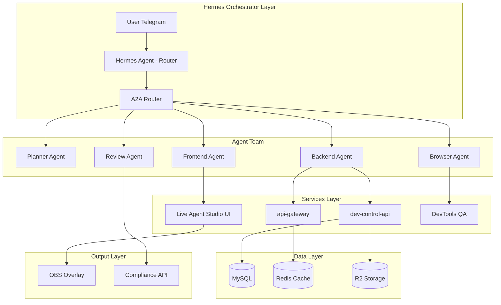
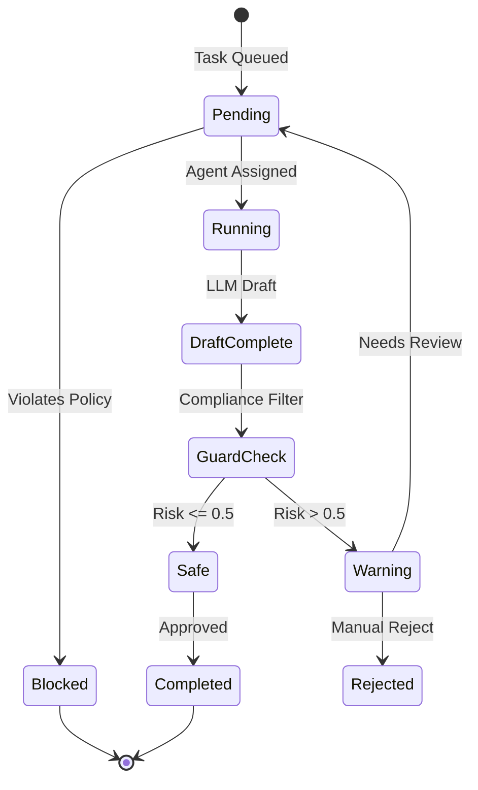
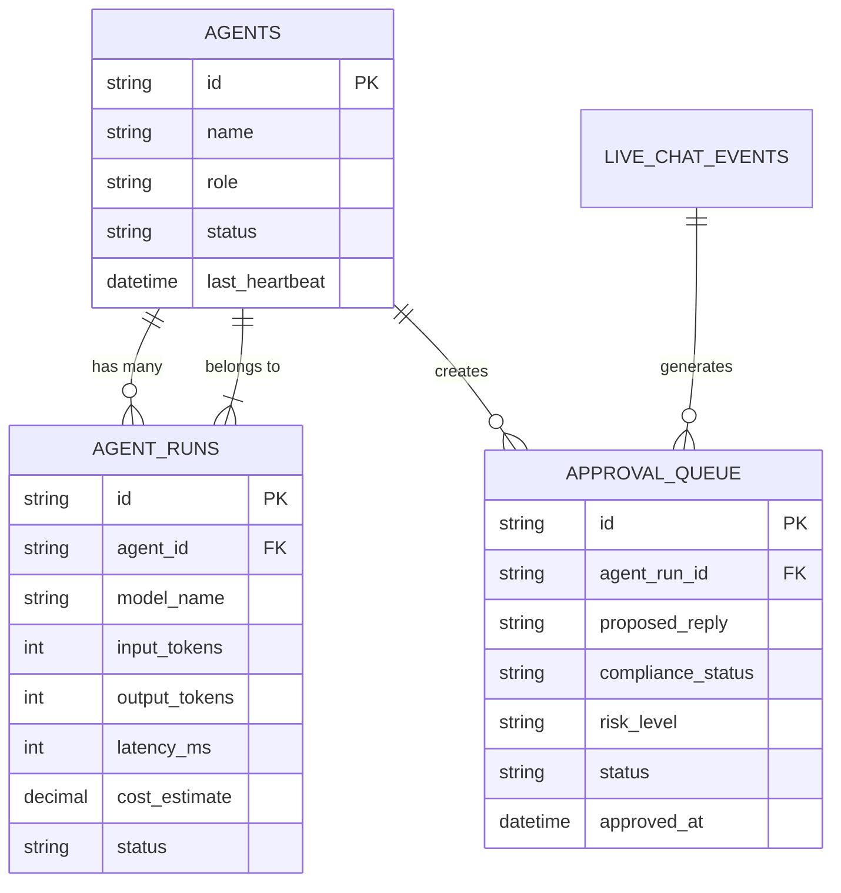
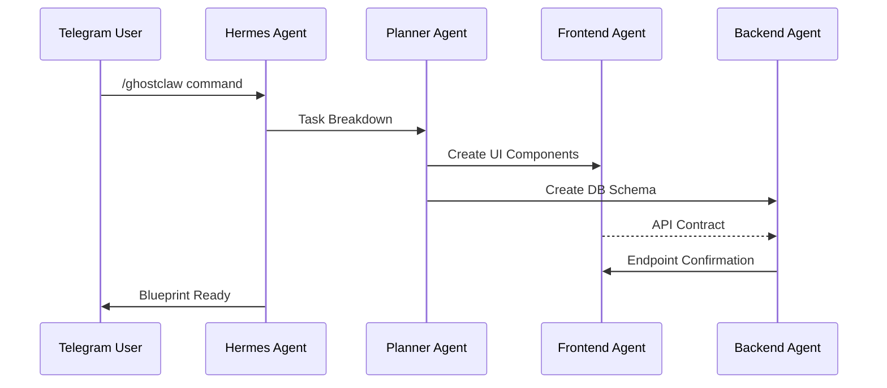

# GHOSTCLAW_LOOP_ENGINEERING Architecture

## System Overview

```mermaid
graph TB
    subgraph HermesLayer[Hermes Orchestrator Layer]
        User[User Telegram] --> Hermes[Hermes Agent - Router]
        Hermes --> Router[A2A Router]
    end
    
    subgraph AgentTeam[Agent Team]
        Router --> Planner[Planner Agent]
        Router --> Frontend[Frontend Agent]
        Router --> Backend[Backend Agent]
        Router --> Browser[Browser Agent]
        Router --> Review[Review Agent]
    end
    
    subgraph Services[Services Layer]
        Backend --> API[api-gateway]
        Backend --> ControlAPI[dev-control-api]
        Frontend --> UI[Live Agent Studio UI]
        Browser --> QA[DevTools QA]
    end
    
    subgraph Data[Data Layer]
        ControlAPI --> MySQL[(MySQL)]
        API --> Redis[(Redis Cache)]
        ControlAPI --> R2[(R2 Storage)]
    end
    
    subgraph Output[Output Layer]
        UI --> OBS[OBS Overlay]
        Review --> Compliance[Compliance API]
    end
```

## Agent State Flow

```mermaid
stateDiagram-v2
    [*] --> Pending: Task Queued
    Pending --> Running: Agent Assigned
    Running --> DraftComplete: LLM Draft
    DraftComplete --> GuardCheck: Compliance Filter
    GuardCheck --> Warning: Risk > 0.5
    GuardCheck --> Safe: Risk <= 0.5
    Warning --> Pending: Needs Review
    Safe --> Completed: Approved
    Pending --> Blocked: Violates Policy
    Blocked --> [*]
    Warning --> Rejected: Manual Reject
    Completed --> [*]
```

## Database Schema Grid

```mermaid
erDiagram
    AGENTS ||--o{ AGENT_RUNS : "has many"
    AGENTS ||--o{ APPROVAL_QUEUE : "creates"
    AGENT_RUNS }|--|| AGENTS : "belongs to"
    LIVE_CHAT_EVENTS ||--o{ APPROVAL_QUEUE : "generates"
    
    AGENTS {
        string id PK
        string name
        string role
        string status
        datetime last_heartbeat
    }
    
    AGENT_RUNS {
        string id PK
        string agent_id FK
        string model_name
        int input_tokens
        int output_tokens
        int latency_ms
        decimal cost_estimate
        string status
    }
    
    APPROVAL_QUEUE {
        string id PK
        string agent_run_id FK
        string proposed_reply
        string compliance_status
        string risk_level
        string status
        datetime approved_at
    }
```

## API Wiring Diagram

```mermaid
sequenceDiagram
    participant User as Telegram User
    participant Hermes as Hermes Agent
    participant Planner as Planner Agent
    participant Front as Frontend Agent
    participant Back as Backend Agent
    
    User->>Hermes: /ghostclaw command
    Hermes->>Planner: Task Breakdown
    Planner->>Front: Create UI Components
    Planner->>Back: Create DB Schema
    Front-->>Back: API Contract
    Back->>Front: Endpoint Confirmation
    Hermes->>User: Blueprint Ready
```