# GhostClaw OS — System Workflow Architecture
> ฺBy SIRINX · v4 Architecture · 2026-07-26

```mermaid
flowchart TB
    subgraph USER["👤 User Layer"]
        TG["📱 Telegram<br/>Command Center"]
        WEB["🌐 WhiteSide Dashboard<br/>9router-api.tondhm-z999.workers.dev"]
        CLI["💻 Terminal / cmux<br/>11 Agents CLI"]
        CUA["🖱️ CUA Driver<br/>Desktop Automation"]
    end

    subgraph CLOUD["☁️ Cloudflare Edge"]
        WK["🚀 9router Worker<br/>API Gateway + Dashboard"]
        TN["🌉 Cloudflare Tunnel<br/>omni-route"]
        DNS["📡 DNS<br/>*.dev.sirinx.co"]
    end

    subgraph BRIDGE["🔗 A2A Model Bridge"]
        BCFG["📋 Bridge Config<br/>11 Agents<br/>config.yaml"]
        BSTATE["💾 Bridge State<br/>bridge-state.json"]
        OUTBOX["📤 Outbox System<br/>${agent}/outbox/"]
        QUEUE["📋 Queue Tasks<br/>TASK-*.json"]
        SYNC["🔄 Live Sync<br/>live-a2a-sync.sh"]
    end

    subgraph ORCHESTRATOR["🤖 Orchestration Layer"]
        N8N["⚡ n8n Workflow Engine<br/>Docker :5678<br/>Visual Automation"]
        CMUX["🖥️ cmux Agent Loop<br/>cmux-agent-loop.sh"]
        CRON["⏰ Hermes Cron<br/>13 Jobs<br/>QA + Health + Sync"]
        AGENTCTRL["🎮 Agent Control<br/>gc-agent-control.sh"]
    end

    subgraph AGENTS["🧠 11 Agents (47 Ronin)"]
        HERMES["Hermes<br/>Commander"]
        CODEX["Codex<br/>Build Captain"]
        OPENCODE["OpenCode<br/>Reviewer"]
        ZCODE["ZCode<br/>Safety Architect"]
        KIRO["Kiro<br/>Default Builder"]
        COPILOT["Copilot<br/>Git Assistant"]
        CLAUDE["Claude<br/>Chief Architect"]
        ANTI["Antigravity2<br/>Support"]
        WEBMCP["WebMCP<br/>Web Automation"]
        PLAN["Planner<br/>Strategic"]
        ZAI["ZAI TUI<br/>Terminal Interface"]
    end

    subgraph AI["🧬 AI Gateway"]
        OMNIR["🔄 OmniRoute<br/>:20128<br/>391 Models · 29 Providers"]
        TUNNEL["🌉 TryCloudflare<br/>hoping-hypothesis..."]
        ALIYUN["🇨🇳 Aliyun MaaS<br/>151 Models"]
        OPENROUTER["🌐 OpenRouter<br/>300+ Models"]
        LOCAL["💻 Local Models<br/>Ollama + LM Studio"]
    end

    subgraph STORE["💾 Data & State"]
        FS["📁 Filesystem<br/>.ghostclaw_runtime/"]
        DOCKER["🐳 Docker Volumes<br/>n8n_data · postgres"]
        GIT["📦 Git Repo<br/>sirinx-os v5-rebase"]
        OBSIDIAN["🧠 Obsidian Brain<br/>Neural Knowledge"]
    end

    subgraph MONITOR["📊 Monitoring"]
        QA["🔍 QA Gate<br/>qa-auto-review.sh<br/>every 15m"]
        HEALTH["❤️ Health Check<br/>cron-health-check<br/>every 15m"]
        REPORT["📋 Daily Report<br/>cron-daily-report<br/>08:00 daily"]
        TELEGRAM["🤖 Telegram Status<br/>gc-quick-status.sh"]
    end

    %% Connections - User Layer
    TG --> WK
    WEB --> WK
    CLI --> CMUX
    CUA --> WEB

    %% Connections - Cloudflare
    WK --> TUNNEL
    WK --> DNS
    TN --> TUNNEL
    TN --> OMNIR
    TN --> N8N

    %% Connections - Bridge
    BCFG --> BSTATE
    BSTATE --> OUTBOX
    OUTBOX --> QUEUE
    SYNC --> OUTBOX
    BRIDGE --> WK

    %% Connections - Orchestration
    N8N --> TG
    N8N --> WK
    N8N --> OUTBOX
    CMUX --> AGENTS
    AGENTCTRL --> AGENTS
    CRON --> SYNC
    CRON --> QA

    %% Connections - Agents
    HERMES --> OMNIR
    KIRO --> OMNIR
    ZCODE --> OMNIR
    HERMES --> OUTBOX
    CODEX --> OUTBOX
    KIRO --> OUTBOX

    %% Connections - AI Gateway
    OMNIR --> ALIYUN
    OMNIR --> OPENROUTER
    OMNIR --> LOCAL
    TUNNEL --> OMNIR

    %% Connections - Data
    DOCKER --> N8N
    FS --> BSTATE
    FS --> OUTBOX
    OBSIDIAN --> BRIDGE

    %% Connections - Monitoring
    QA --> WK
    HEALTH --> OMNIR
    REPORT --> TG
    TELEGRAM --> TG

    %% Styling
    classDef cloud fill:#f0f4ff,stroke:#4f6ef7,color:#1a1d2e
    classDef local fill:#f0fdf4,stroke:#22c55e,color:#1a1d2e
    classDef agent fill:#fef3c7,stroke:#f59e0b,color:#1a1d2e
    classDef bridge fill:#eef2ff,stroke:#8b5cf6,color:#1a1d2e
    classDef monitor fill:#fce7f3,stroke:#ec4899,color:#1a1d2e
    classDef user fill:#f5f5f4,stroke:#78716c,color:#1a1d2e
    classDef ai fill:#e0f2fe,stroke:#0ea5e9,color:#1a1d2e
    classDef store fill:#f8fafc,stroke:#94a3b8,color:#1a1d2e

    class WK,TN,DNS cloud
    class OMNIR,TUNNEL,OPENROUTER,ALIYUN,LOCAL ai
    class AGENTS,HERMES,CODEX,OPENCODE,ZCODE,KIRO,COPILOT,CLAUDE,ANTI,WEBMCP,PLAN,ZAI agent
    class BCFG,BSTATE,OUTBOX,QUEUE,SYNC bridge
    class QA,HEALTH,REPORT,TELEGRAM monitor
    class TG,WEB,CLI,CUA user
    class FS,DOCKER,GIT,OBSIDIAN store
```



## Architecture Overview

| Layer | Component | Technology | Status |
|-------|-----------|-----------|--------|
| **👤 User** | Telegram · Dashboard · CLI · CUA | Multi-platform | ✅ Live |
| **☁️ Cloudflare** | 9router API · Tunnel · DNS | Workers + Tunnel | ✅ Live |
| **🔗 A2A Bridge** | 11 Agents · Outbox · Queue | Config-driven | 🔄 Upgrading |
| **🤖 Orchestration** | **n8n** · cmux · Cron · Control | Docker + Scripts | ✅ **NEW** |
| **🧠 AI Gateway** | OmniRoute · 391 models | Node.js Proxy | ✅ Live |
| **📊 Monitoring** | QA Gate · Health · Reports | Cron jobs | 🔄 Fixing |

## Data Flow

```
Telegram → 9router API → Tunnel → OmniRoute → AI Providers (Aliyun, OpenRouter, Local)
                                        ↓
Dashboard ← Bridge ← 11 Agents ← n8n ← Outbox System
                                        ↓
                                  Telegram Command Center
                                        ↓
                                  Cron Jobs → QA → Health Reports
```
