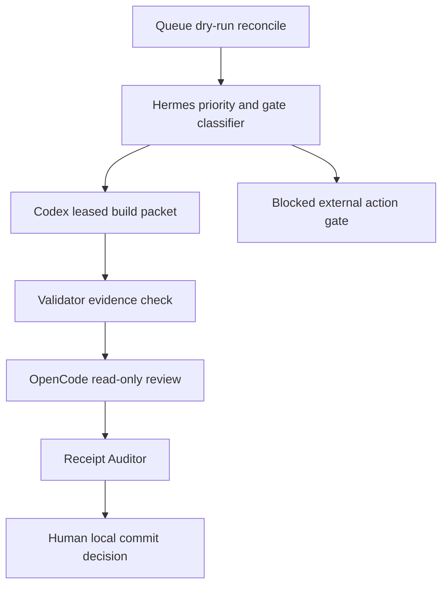

# A2A2A Agent Orchestrator Task Graph

Packet: `A2A2A-P077-AGENT-ORCHESTRATOR-ACCELERATION-PLAN-20260703`
Status: `P077B_LOCAL_DRY_RUN_ORCHESTRATOR_IMPLEMENTED`

## Role Map

| Role | Owner | Allowed now | Blocked now |
|---|---|---|---|
| Hermes Orchestrator | control plane | status, gate, receipt docs | self-approval, live send |
| Codex Builder | source builder | planning docs, evidence | source implementation before gate |
| OpenCode Reviewer | QA lane | read-only review packet | source mutation |
| KOB Context Router | context lane | compress/rank/summarize | live dispatch |
| Validator | evidence lane | JSON/YAML/diff checks | source mutation |

## Packet Sequence

| Packet | Purpose | Mutation | Gate |
|---|---|---|---|
| P077A | spec, graph, receipt, Hermes state | docs/runtime evidence only | complete in this packet |
| P077B | implement local orchestrator dry-run module | source code | complete |
| P077C | add focused tests for routing/blocked actions | source tests | complete |
| P077D | add dashboard/status wiring if already local | UI/API source | separate page/API lease if needed |
| P077E | OpenCode read-only review packet | review artifact | no source mutation |
| P077F | local commit gate review | inspect/optional commit | no push/deploy |

## Routing Algorithm Draft

1. Load current queue state and project queue manifests.
2. Classify project focus:
   - active: `sirinx_site`, `agm`
   - paused: `kusala`, `phitsanulok_news`
   - support: everything else
3. Classify action tier:
   - read-only and local docs: route
   - source mutation: require implementation gate and lease
   - external/high-impact: block and create gate record
4. Score packets:
   - active project: `+50`
   - ready dry-run/local packet: `+20`
   - missing receipt/evidence: `-30`
   - blocked action: `-100`
   - paused project: `-200`
5. Produce a dry-run plan with one next packet per lane.
6. Do not mutate queue files in dry-run mode.

## Implemented Result

`scripts/ghostclaw_a2a_agent_orchestrator.py` implements the ranking model above.
It calls the existing queue coordinator in dry-run mode, ranks active-focus
packets first, suppresses paused-project packets, assigns Hermes/Codex/OpenCode/
KOB/Validator lane actions, and writes evidence/receipt only when `--write` is
provided.

Latest selected next packet:

- `packet_041`
- `_A2A_QUEUE/outbox/packet_041_sirinx_website_visual_correction_evidence_receipt.json`
- focus: `sirinx.co`
- lane status: `ready_for_local_worker_plan`
- score: `70`

## Handoff Chain

## Stop Conditions

- implementation gate is missing
- target file lease is missing
- queue packet requests live Telegram/customer send
- packet requires provider/model call
- packet requests install, push, deploy, or Cloudflare/R2 mutation
- packet would route Kusala or Phitsanulok News as active focus
- packet attempts secret read or key printing
