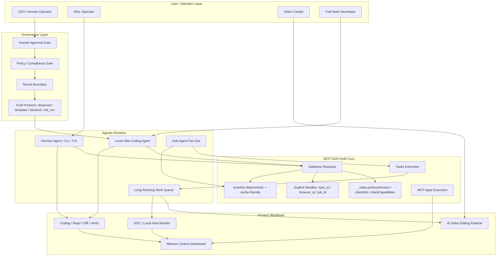

# 01 - Master Grid: MCP Stateless Agent-Native OS

Status: source split from `docs/knowledge/SIRINX_MCP_HERMES_VIDEO_AI_GRID_MERMAID_2026-05-26.md`

## Implementation Note

Use this as the parent map only. Do not add implementation details here; split work into the child grid files.

