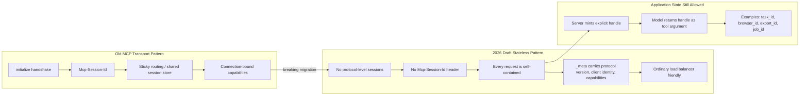

# 02 - MCP Migration Grid

Status: verified technical source required before implementation

## Definition Of Done

- Identify which SIRINX MCP-like endpoints assume hidden transport sessions.
- Replace hidden session assumptions with explicit handles.
- Stop before running any real MCP server or connector.

