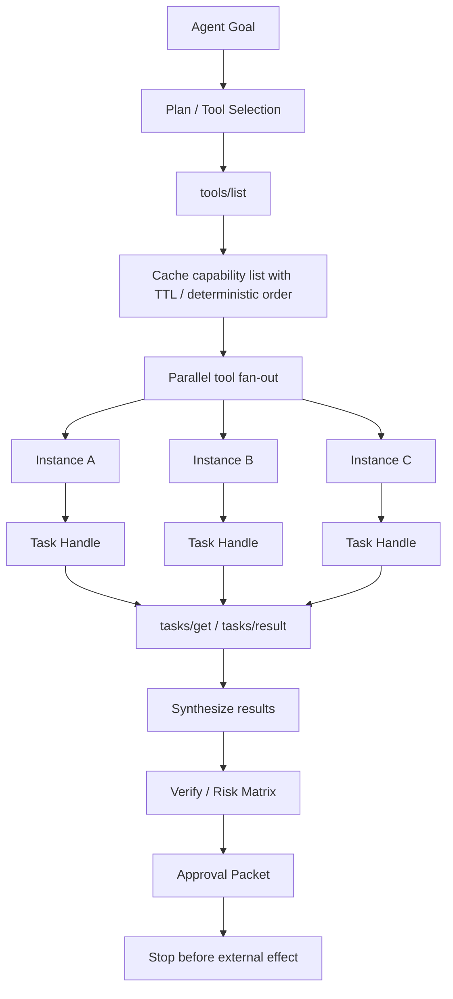

# 03 - Agentic Parallel Tool Grid

Status: architecture pattern, local-only

## Definition Of Done

- One fan-out job must have an explicit handle per worker.
- Each worker output must be merged through verification, not trusted directly.
- External writes remain blocked until an approval packet exists.

