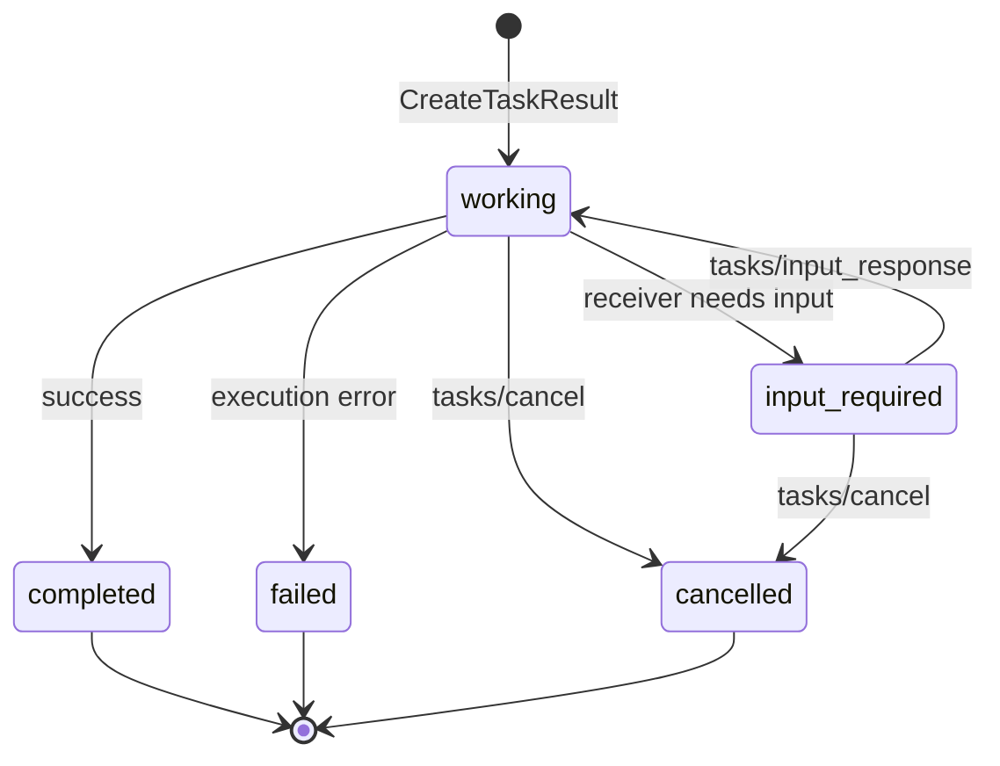

# 04 - MCP Tasks Lifecycle Grid

Status: verified technical source required before implementation

## Definition Of Done

- Long-running work returns a `task_id` instead of blocking the request.
- `tasks/get` can inspect state without mutating production.
- `tasks/cancel` must be idempotent and safe.

