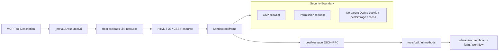

# 05 - MCP Apps Grid

Status: verified technical source required before implementation

## Definition Of Done

- UI runs in a sandboxed iframe.
- UI actions use JSON-RPC/tool calls, not direct privileged access.
- No secret or private host data is exposed to the iframe.

