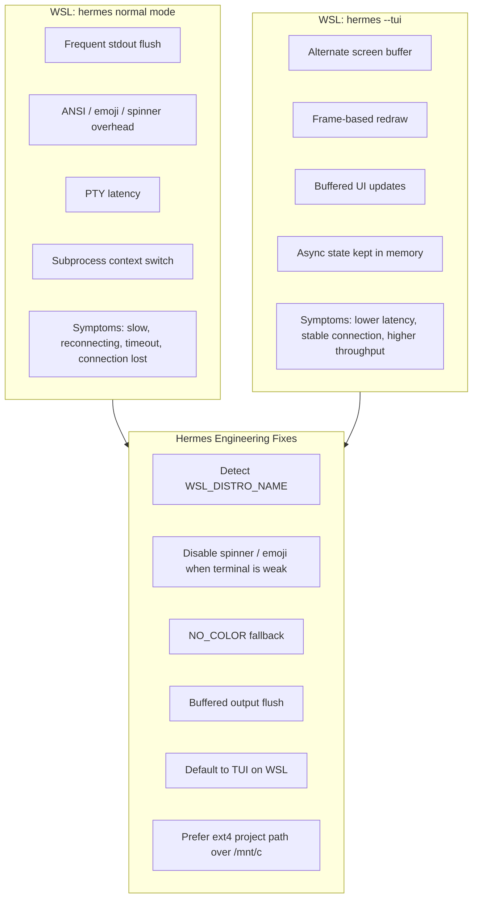

# 06 - Hermes WSL Performance Grid

Status: implementation candidate, local-only

## Definition Of Done

- Detect WSL without assuming the shell is interactive.
- Prefer TUI or low-noise output when WSL PTY is weak.
- Add a local test or diagnostic command before changing runtime behavior.

