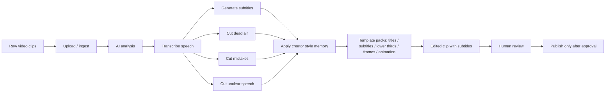

# 07 - AI Video Editing Pipeline Grid

Status: product workflow blueprint, publish blocked

## Definition Of Done

- Raw video, transcript, subtitles, cuts, and style memory are separate artifacts.
- Export is local until human review approves publishing.
- Course or price copy is treated as marketing draft, not verified product claim.

