# 08 - AI Apps 2026 Taxonomy Grid

Status: visual/social taxonomy, unverified ranking

```mermaid
flowchart TB
  ROOT["AI Apps 2026 Ecosystem"]

  ROOT --> GENERAL["General Assistants"]
  GENERAL --> CLAUDE["Claude"]
  GENERAL --> CHATGPT["ChatGPT"]
  GENERAL --> PERP["Perplexity"]

  ROOT --> DEVTOOLS["Development / Programming"]
  DEVTOOLS --> CURSOR["Cursor"]
  DEVTOOLS --> LOVABLE["Lovable"]
  DEVTOOLS --> REPLIT["Replit"]
  DEVTOOLS --> BOLT["Bolt"]
  DEVTOOLS --> CLCODE["Claude Code"]

  ROOT --> CONTENT["Content Creation"]
  CONTENT --> HEYGEN["HeyGen"]
  CONTENT --> SYNTH["Synthesia"]
  CONTENT --> DESCRIPT["Descript"]
  CONTENT --> OPUS["Opus Clip"]
  CONTENT --> BEEHIIV["Beehiiv"]
  CONTENT --> KAPWING["Kapwing"]

  ROOT --> PRODUCTIVITY["Productivity"]
  PRODUCTIVITY --> GRAM["Grammarly"]
  PRODUCTIVITY --> NOTEBOOK["NotebookLM"]
  PRODUCTIVITY --> NOTION["Notion AI"]
  PRODUCTIVITY --> GAMMA["Gamma"]
  PRODUCTIVITY --> GRANOLA["Granola"]
  PRODUCTIVITY --> OTTER["Otter AI"]
  PRODUCTIVITY --> WISPR["Wispr Flow"]

  ROOT --> CREATIVE["Creativity"]
  CREATIVE --> ELEVEN["ElevenLabs"]
  CREATIVE --> SUNO["Suno"]
  CREATIVE --> MID["Midjourney"]
  CREATIVE --> RUNWAY["Runway"]
  CREATIVE --> KLING["Kling"]
  CREATIVE --> PIKA["Pika Labs"]
  CREATIVE --> IDEO["Ideogram"]
  CREATIVE --> CANVA["Canva"]
  CREATIVE --> VEO["Google Veo"]
  CREATIVE --> FIREFLY["Adobe Firefly"]

  ROOT --> AUTO["Automation / Integration"]
  AUTO --> N8N["n8n"]
  AUTO --> ZAP["Zapier"]
  AUTO --> LINDY["Lindy AI"]
  AUTO --> CHATBASE["Chatbase"]
  AUTO --> GEMINI["Gemini"]
  AUTO --> MANUS["Manus AI"]
  AUTO --> MAKE["Make"]
  AUTO --> CLAY["Clay"]
```

## Definition Of Done

- Treat the list as a taxonomy, not a verified ranking.
- Verify pricing, availability, and features before product recommendations.
- Keep SIRINX tool choices approval-gated before connector activation.

