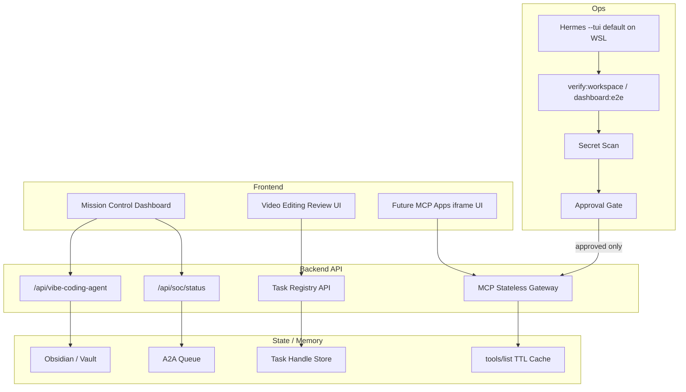

# 09 - Full-Stack Implementation Grid For SIRINX

Status: implementation blueprint, local-only

## Definition Of Done

- Frontend reads only local API state until external approval.
- MCP gateway remains a blueprint until exact implementation approval.
- Every queue/task handle must have provenance and cancellation behavior.

