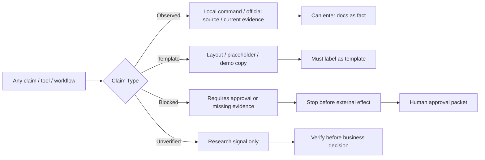

# 10 - Risk / Verification Grid

Status: governance grid

## Definition Of Done

- Claims must be labeled before they enter docs, dashboards, or reports.
- Unverified social claims cannot drive architecture decisions.
- Blocked actions stop at approval packet.

