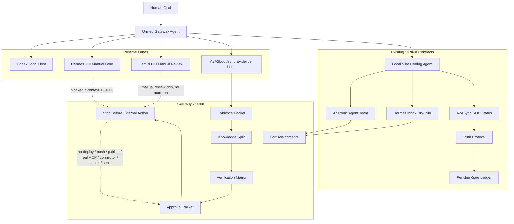

# 11 - Gateway Agent A2A2LoopSync Grid

Status: local-only control contract

## Definition Of Done

- Gateway exposes runtime lanes without invoking them.
- Dry-run planning creates part assignments only.
- A2A2LoopSync emits evidence and next exact steps.
- Existing Vibe Agent remains the safe action planner.
- External actions stop at an approval packet.
