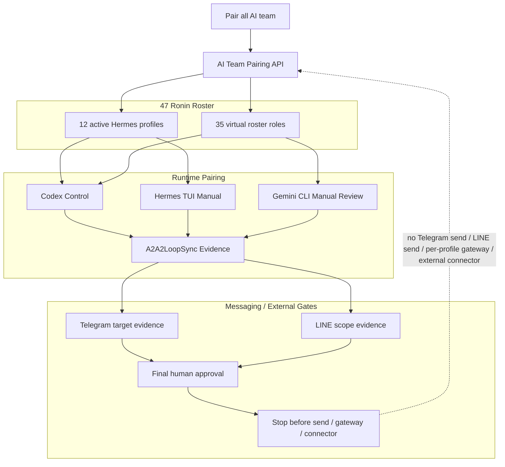

# 12 - AI Team Pairing Grid

Status: local-only pairing contract

## Definition Of Done

- All 47 roles have a local owner profile.
- Every role has a runtime lane and A2A channel.
- Messaging stays blocked until evidence and approval exist.
- No CLI is auto-run from pairing output.
