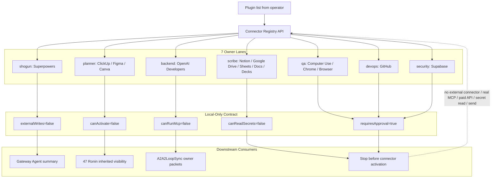

# 13 - Connector Capability Registry Grid

Status: local-only capability registry

## Definition Of Done

- All 15 connectors are represented as local capability records.
- The registry exposes exactly 7 owner packets.
- Gateway Agent includes connector summary without activating anything.
- The wiring map routes `gateway-agent -> connector-registry -> ai-team-pairing`.
