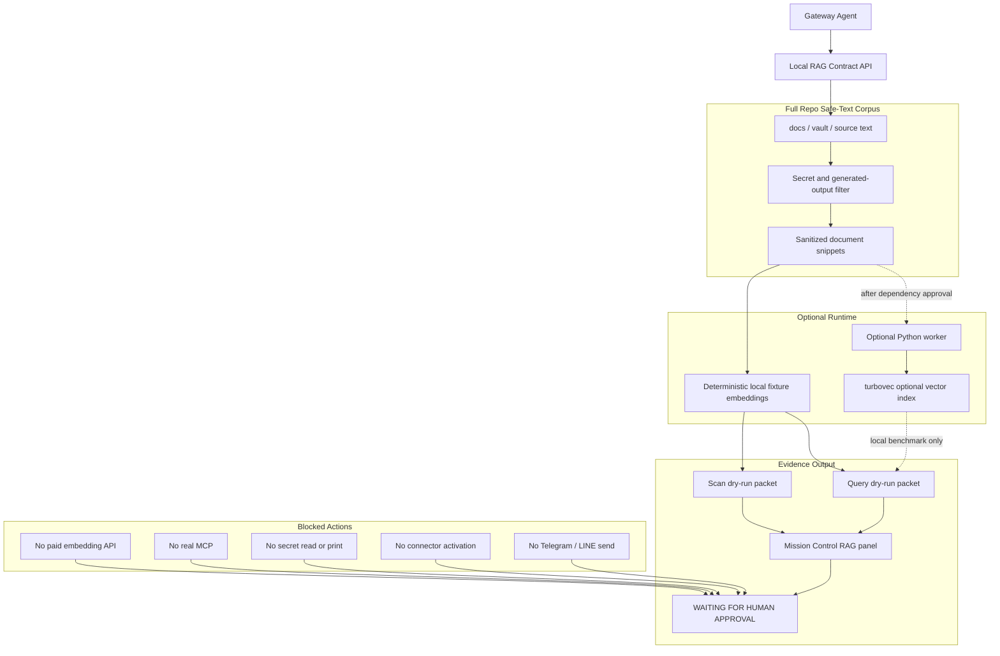

# 14 - Local RAG turbovec Grid

Status: local-only RAG prototype

## Definition Of Done

- Local RAG API reports `full-repo-safe-text` corpus scope.
- Scan dry-run excludes secrets, dependency folders, generated output, binaries, and oversized files.
- Query dry-run uses deterministic local fixture embeddings until local embedding dependencies are approved.
- Mission Control shows dependency status, corpus scope, blocked actions, and approval stop point.
- `turbovec` claims remain upstream claims until local benchmark evidence exists.
