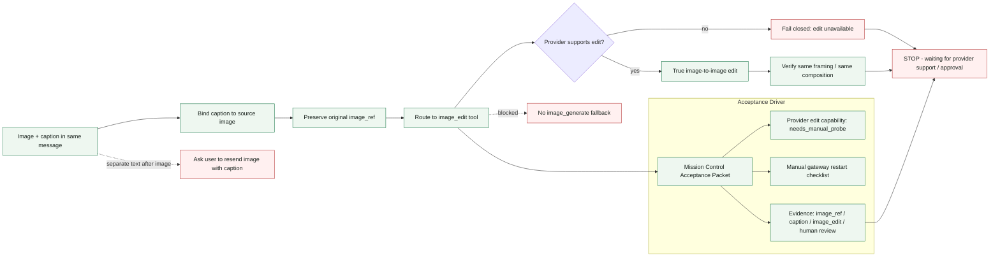

# Hermes Image-to-Image Gateway Grid

Status: LOCAL-ONLY IMAGE EDIT CONTRACT

## Acceptance

- Valid: food photo on a black plate with caption `change only the plate from black to white`.
- Expected route: `image_edit(prompt, image_ref)`.
- Expected result contract: same food, framing, and composition; only the plate color changes.
- Blocked route: describing the image and calling text-to-image generation.

## Acceptance Packet

- `patch_ready=true`
- `gateway_restart_required=true`
- `caption_required=true`
- `provider_edit_capability=needs_manual_probe`
- `text_to_image_fallback=blocked`
- `image_generate` remains unselected when `image_ref` exists.
- Result review stays manual until the edited image is inspected by the operator.

## Stop Rule

No live provider call, paid API, secret read, provider switch, Telegram/LINE send, MCP run, deploy, push, publish, or gateway restart happens in this local-only phase.
