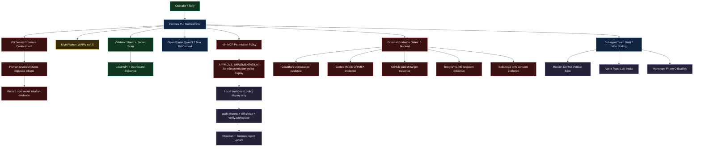
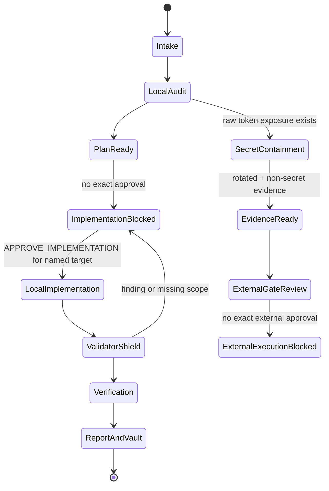
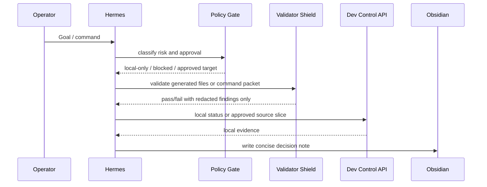

# Godmode Continuation Grid

Status: LOCAL-ONLY GRID CHECKPOINT - NO EXTERNAL MUTATION

This grid turns the current SIRINX Godmode continuation state into a single Mermaid control map.

Source boundary:

- Observed from `.hermes/state.json`, `.hermes/context.md`, `.hermes/reports/*`, and current grid docs.
- Token values are intentionally omitted.
- Provider lanes remain blocked until exposed tokens are revoked/rotated outside chat.

## Node Grid

| Node | Current status | Next action | Approval boundary |
| --- | --- | --- | --- |
| `P0 Secret Exposure Containment` | blocked by human action | revoke/rotate exposed provider tokens outside chat | no token values in chat/docs |
| `Night Watch` | `WARN`, exit 0 | keep callback treating WARN as non-blocking | patch only on true `FAILED` |
| `Validator Shield` | local tests and secret scan pass | pass explicit generated file paths to validator | block on finding |
| `Qwen 1M Context` | configured for deep planning | use for deep planner/reviewer only | no paid provider call without named task approval |
| `n8n MCP Policy` | drafted, not registered | display policy locally after approval | no MCP registration |
| `External Evidence Gates` | 5 blocked | fill one non-secret evidence gate | no external execution |
| `Subagent Team` | draft-only | keep as routing config | no live dispatch |
| `Mission Control` | future | command to approval to evidence to vault | source approval required |

## Gate State

## Execution Sequence

## Implementation Notes

- Keep this file as the top-level Godmode continuation grid.
- Put reusable Mermaid snippets in `docs/knowledge/SIRINX_GODMODE_GRID_MERMAID_SYNTAX_2026-05-28.md`.
- Do not use this file to authorize implementation, provider calls, MCP activation, external sends, deploys, pushes, installs, or clones.
- First local source target remains: `APPROVE_IMPLEMENTATION for n8n permission policy display`.

