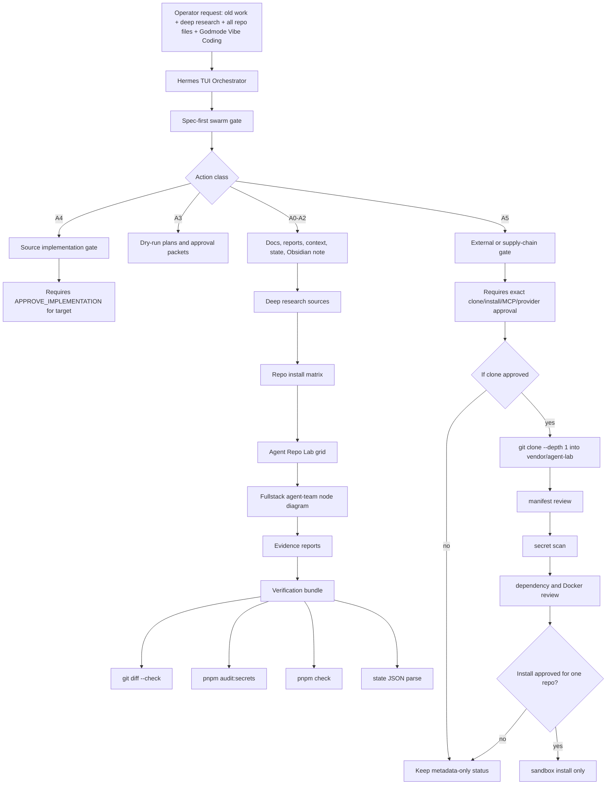
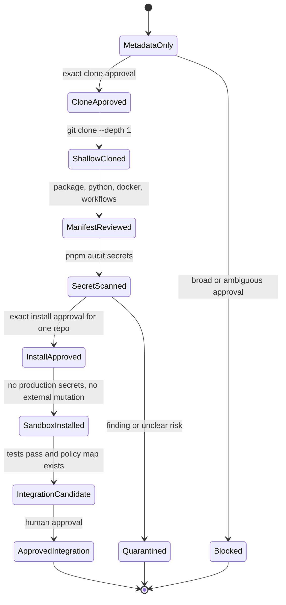
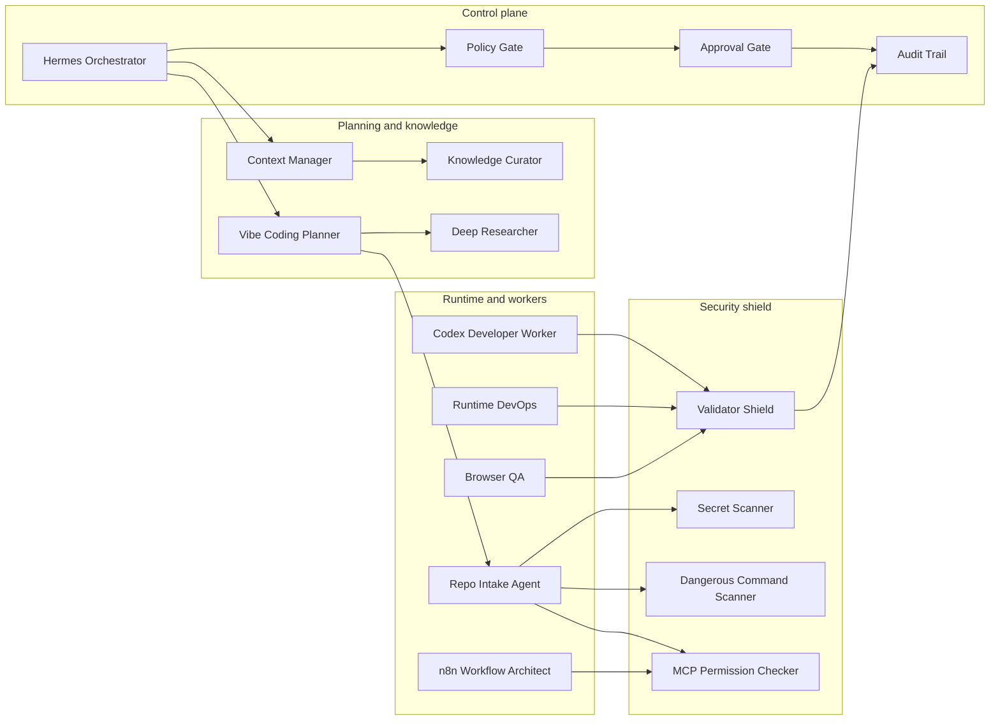

# Agent Repo Lab Install Grid

Status: LOCAL-ONLY, GATED

Scope: Deep research, repo-intake, install matrix, agent-team topology, and next-phase execution gates for SIRINX Godmode Vibe Coding.

No repository was cloned. No package was installed. No third-party code was executed.

## Execution Grid



## Permission Grid

| Lane | Current status | Allowed now | Blocked until |
| --- | --- | --- | --- |
| Old work review | active | docs/report/state | none |
| Deep research | active | official docs and GitHub metadata | none |
| Repo clone | blocked | command plan only | `APPROVE_AGENT_REPO_LAB_CLONE for vendor/agent-lab metadata-only shallow clone` |
| Repo install | blocked | install matrix only | `APPROVE_AGENT_REPO_LAB_INSTALL for <repo-name>` |
| n8n MCP registration | blocked | policy docs only | `APPROVE_HERMES_N8N_MCP_REGISTER` |
| n8n workflow read/write/execute | blocked | capability manifest only | workflow-specific approval |
| Source implementation | blocked | spec and approval packet only | `APPROVE_IMPLEMENTATION for <target>` |
| Provider calls | blocked | config policy only | rotated tokens and explicit provider approval |
| Deploy/push/publish | blocked | release plan only | explicit external gate approval |

## Repo Intake State Machine



## Repository Role Grid

| Repo | Primary role | Node owner | Default state |
| --- | --- | --- | --- |
| `ggml-org/llama.cpp` | local model runtime | Runtime DevOps | candidate |
| `OpenHands/OpenHands` | developer-worker platform reference | Codex Worker Architect | candidate |
| `OpenHands/software-agent-sdk` | composable code-agent SDK reference | Codex Worker Architect | candidate |
| `crewAIInc/crewAI` | crew/flow pattern reference | Agent Team Designer | research only |
| `langchain-ai/langgraph` | durable workflow benchmark | Workflow Researcher | research only |
| `langgenius/dify` | RAG/workflow product reference | Knowledge Product Architect | research only |
| `simular-ai/Agent-S` | computer-use research | Browser QA / Runtime Gatekeeper | high-risk sandbox only |
| `czlonkowski/n8n-mcp` | n8n node-doc bridge | n8n Workflow Architect | policy blocked |
| `n8n-io/n8n` | workflow engine source reference | n8n Workflow Architect | platform reference |

## Node Diagram



## Next Exact Action

The next source-code implementation remains:

```text
APPROVE_IMPLEMENTATION for n8n permission policy display
```

The next repo-lab action, if the operator wants the GitHub repos cloned, is:

```text
APPROVE_AGENT_REPO_LAB_CLONE for vendor/agent-lab metadata-only shallow clone
```

## Stop Rule

If a step requires install, MCP start, provider call, workflow mutation, desktop control, deploy, push, publish, or message send, stop and request the specific approval phrase for that one action.
