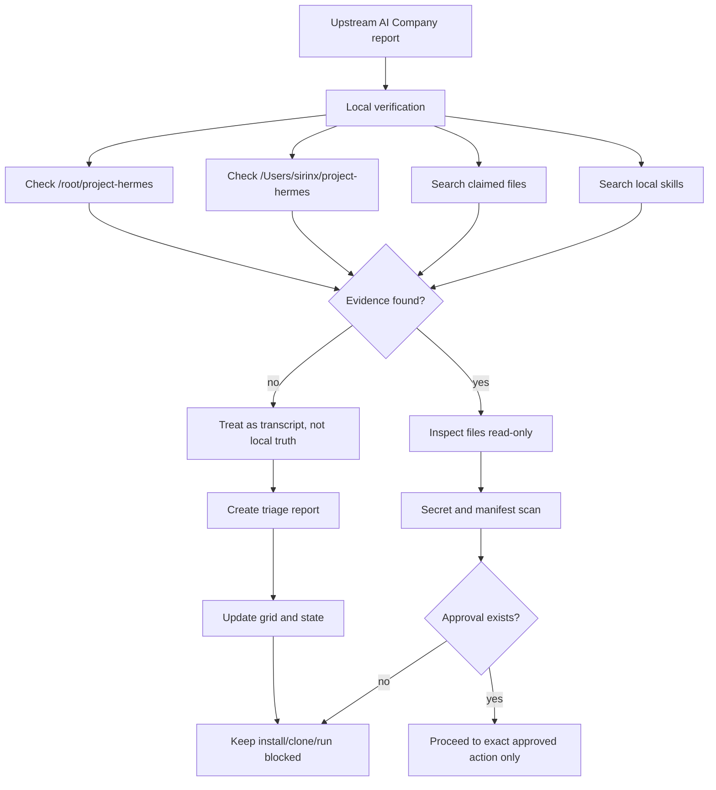
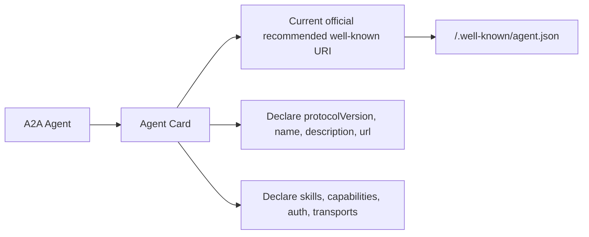
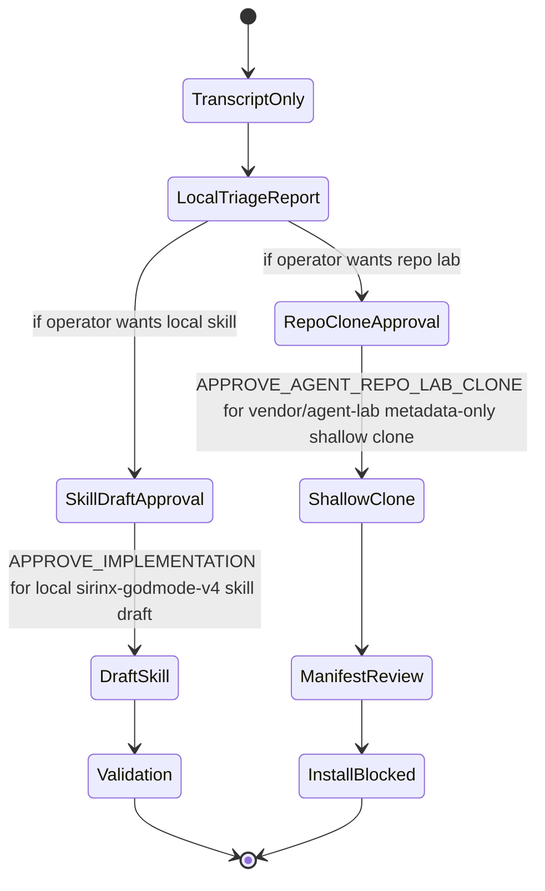

# Upstream Godmode v4 Triage Grid

Status: LOCAL-ONLY TRIAGE

Scope: Validate an upstream AI Company Godmode v4 report before accepting it into SIRINX local truth.

## Triage Flow

## Claim Classification

| Upstream claim | Local state | Decision |
| --- | --- | --- |
| `~/project-hermes` created | not found | do not rely on it |
| `install-all-repos.sh` created | not found | do not run |
| `swarm_v3.py` tested | not found | unverified |
| A2A cards created | not found | unverified |
| `sirinx-godmode-v4` skill created | not found locally | unverified |
| n8n / llama / gateway commands ready | not run | keep blocked |

## Corrected A2A Card Note

## Safe Command Ladder

## Stop Rule

Do not run broad installer blocks from upstream transcripts. Convert them into local approval packets first.
