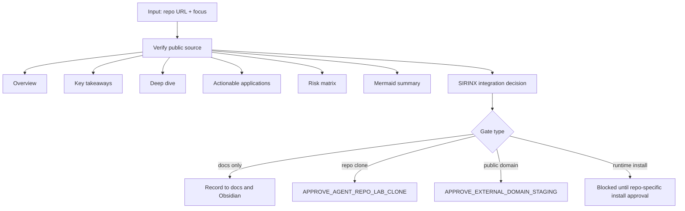
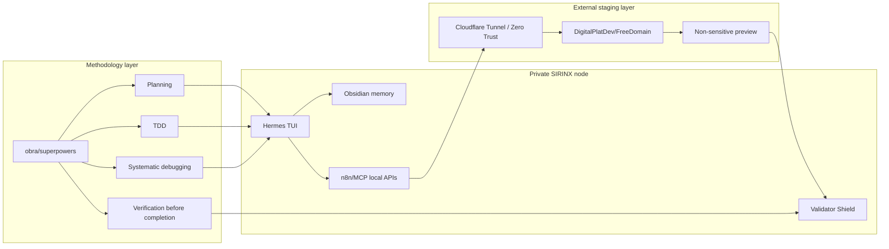

# Repo Analysis Grid: Superpowers + FreeDomain

Status: LOCAL-ONLY ANALYSIS

Scope: Apply the uploaded video-analysis prompt structure to repository analysis for `obra/superpowers` and `DigitalPlatDev/FreeDomain`.

## Repo Learning Flow

## Integration Topology

## Decision Grid

| Component | Adopt now | Why |
| --- | --- | --- |
| Repo-analysis prompt template | yes | docs-only, high leverage |
| Superpowers methodology | yes | aligns with existing SIRINX guardrails |
| Superpowers clone/install | no | unnecessary until repo-lab approval |
| FreeDomain as staging option | yes, as candidate | useful for disposable non-sensitive preview |
| FreeDomain as production domain | no | continuity and trust risk |
| Public tunnel | no | external gate required |

## Stop Rule

Repository analysis is allowed. Clone, install, domain registration, Cloudflare tunnel setup, DNS changes, public exposure, or webhook/callback registration requires a separate exact approval.
