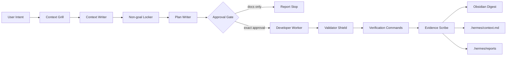
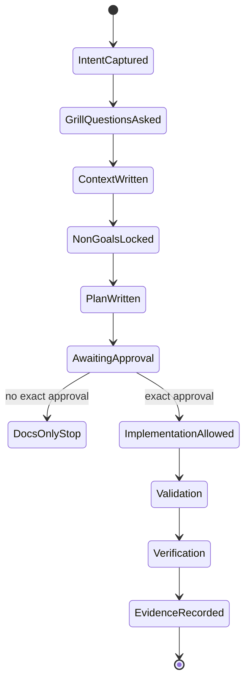

# Context Engineering Gate - Grill With Docs

Status: LOCAL-ONLY GRID CHECKPOINT  
Owner: Hermes / governance / developer worker  
Source: user-provided MilerDev video analysis about `context.md`, Grill with Docs, and Superpowers.

## Objective

Add a context-first gate before non-trivial SIRINX implementation work. The gate converts unclear user intent into a durable context artifact, explicit non-goals, an implementation plan, and a verification checklist before source changes begin.

## Grid

| Node | Responsibility | Input | Output | Gate |
| --- | --- | --- | --- | --- |
| Context Grill | Ask scope and constraint questions | User intent, repo snapshot | Task context | No code |
| Context Writer | Update durable memory | Answers, local evidence | `.hermes/context.md` section | Redact secrets |
| Non-goal Locker | Stop overbuilding | Feature suggestions | Accept/defer/reject matrix | Human-visible |
| Plan Writer | Produce implementation plan | Context and docs | `docs/superpowers/plans/*.md` | Exact files/commands |
| Approval Gate | Decide whether to implement | Plan and risk | Approval phrase or stop | No mutation without approval |
| Developer Worker | Implement approved local changes | Plan | Diff and artifacts | Local-only |
| Validator Shield | Check generated output | Diff/scripts/workflows | Validator report | Block on secrets |
| Evidence Scribe | Record result | Verification output | `.hermes/reports`, Obsidian note | No completion without evidence |

## Node Diagram

## State Machine

## Syntax Grid

| Command pattern | Allowed now | Meaning |
| --- | --- | --- |
| `context-grill --scope <path>` | Yes, docs-only | Ask context questions and update local docs |
| `context-grill --write-plan` | Yes, docs-only | Create or update a Superpowers implementation plan |
| `context-grill --preview-ui` | Yes, local preview only | Create Mermaid/static preview before UI code |
| `context-grill --implement` | No | Requires exact implementation approval |
| `context-grill --external-mcp` | No | Requires manifest and external connector approval |
| `context-grill --deploy` | No | Requires deploy approval and clean verification |

## Required Questions

1. What is the concrete end state?
2. Which roots and files are allowed?
3. What is explicitly out of scope?
4. Which secrets or private data must remain unread and unprinted?
5. Is this docs-only, local preview, local API, or external activation?
6. What exact approval phrase unlocks implementation?
7. What command proves success?
8. Where should the result be recorded?

## Local Acceptance Criteria

- `docs/knowledge/SIRINX_CONTEXT_ENGINEERING_GRILL_WITH_DOCS_2026-05-28.md` exists.
- This grid is linked from `docs/grid/README.md`.
- `.hermes/context.md` points to the new context-engineering decision.
- `.hermes/state.json` has current pointers.
- `.hermes/reports/CONTEXT_ENGINEERING_GRILL_WITH_DOCS_STATUS_2026-05-28.md` records the local-only result.
- Verification commands complete with no new secret exposure.

## Blocked Actions

- Installing new skills or repos.
- Running external provider calls.
- Registering MCP servers.
- Starting tunnels or public domains.
- Deploying, pushing, publishing, or sending messages.
- Reading or printing secret values.

