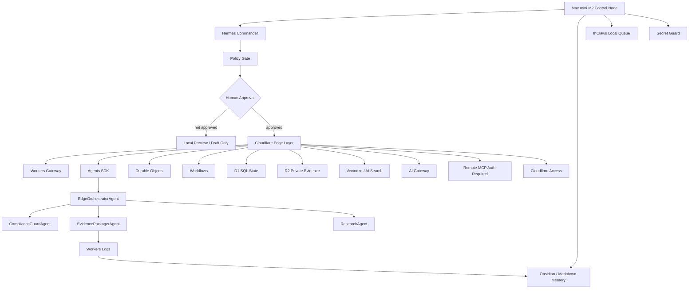

# SIRINXDev v8.2 Cloudflare Edge Agent Team Grid

Status: LOCAL-ONLY GRID CHECKPOINT  
Owner: Hermes / Cloudflare edge planner / security owner  
Boundary: No deploy, DNS edit, Access policy write, secret write, external SaaS mutation, or provider call.

## Objective

Lock SIRINXDev Unified Agent-Native OS v8.2 as an M2-first control-plane architecture with Cloudflare as the approved edge-agent runtime.

## Node Diagram

## Phase Matrix

| Phase | Output | Stop condition |
| --- | --- | --- |
| M2-0 Baseline Audit | local audit and security status | no whole-machine scan |
| M2-1 Skeleton | command center and governance docs | no external mutation |
| M2-2 Hermes + Scoped MCP | scoped local tool boundary | no broad filesystem |
| M2-3 Obsidian Memory | distilled memory and provenance | no secrets |
| M2-4 thClaws Queue | local job schema and logs | no heavy swarm |
| M2-5 Mission Control | local preview dashboard | no public host |
| M2-6 Secret Guard | audit reports and validation matrix | no token printing |
| M2-7 Approval Packet | pre-approval packet | stop before Cloudflare |
| CF-0 Research Packet | Cloudflare docs and service map | no account action |
| CF-1 Local Skeleton | non-deployable edge app skeleton | no deploy |
| CF-2 Local Agent Prototype | three-agent local prototype | no public endpoint |
| CF-3 Schema Draft | D1/R2/Vectorize schemas | no resource creation |
| CF-4 Remote MCP Design | permission matrix | no registration |
| CF-5 Access Plan | private host policy draft | no policy write |
| CF-6 Approval Packet | private preview packet | wait for human |
| CF-7 Private Dev Deploy | Access-protected preview | approval required |

## Current Local Artifacts

- `docs/knowledge/SIRINXDEV_UNIFIED_AGENT_NATIVE_OS_V8_2_CLOUDFLARE_EDGE_PLAN_2026-05-30.md`
- `docs/cloudflare/CLOUDFLARE_AGENT_TEAM_RESEARCH.md`
- `docs/cloudflare/CLOUDFLARE_SERVICE_MAP.md`
- `docs/cloudflare/ACCESS_POLICY_PLAN.md`
- `docs/cloudflare/MCP_PERMISSION_MATRIX.md`
- `docs/cloudflare/CLOUDFLARE_RISK_REGISTER.md`
- `docs/cloudflare/DEPLOYMENT_APPROVAL_RUNBOOK.md`
- `00_COMMAND_CENTER/PRE_APPROVAL_PACKET_CLOUDFLARE_DEV.md`
- `apps/cloudflare-agent-team/`

## Guardrail

Cloudflare is edge runtime after approval, not a replacement for the Mac mini M2 control node.

