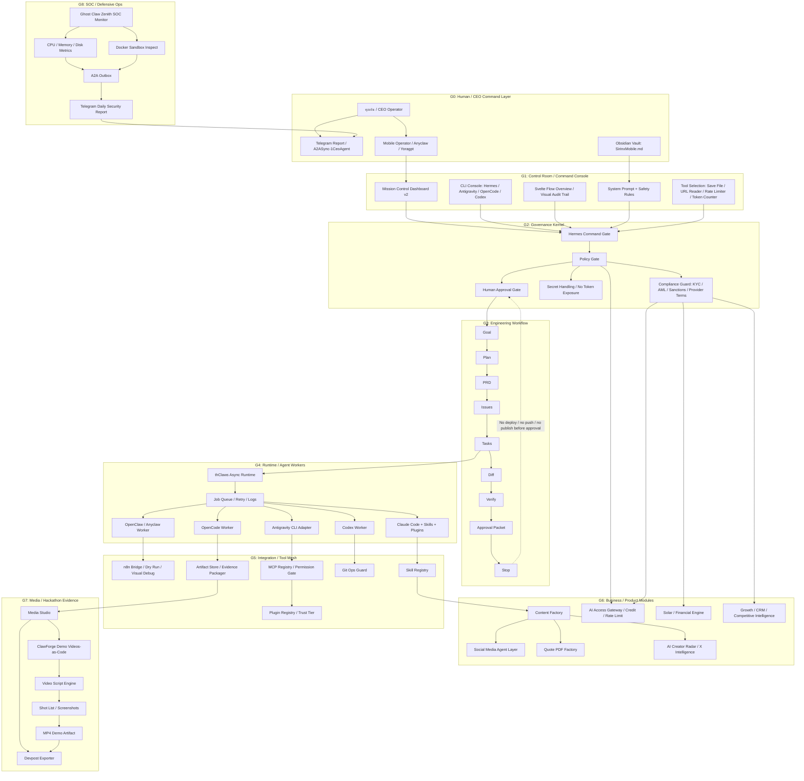

# 01 - Master Grid: SIRINXDev Unified Agent-Native OS

```mermaid
flowchart TB
  subgraph G0["G0: Human / CEO Command Layer"]
    CEO["คุณต้น / CEO Operator"]
    TG["Telegram Report / A2ASync-1CeoAgent"]
    MOBILE["Mobile Operator / Anyclaw / Yoragpt"]
    OBS["Obsidian Vault: SirinxMobile.md"]
  end
  subgraph G1["G1: Control Room / Command Console"]
    MC["Mission Control Dashboard v2"]
    CLI["CLI Console: Hermes / Antigravity / OpenCode / Codex"]
    FLOW["Svelte Flow Overview / Visual Audit Trail"]
    SYS["System Prompt + Safety Rules"]
    TOOL["Tool Selection: Save File / URL Reader / Rate Limiter / Token Counter"]
  end
  subgraph G2["G2: Governance Kernel"]
    HERMES["Hermes Command Gate"]
    POLICY["Policy Gate"]
    APPROVAL["Human Approval Gate"]
    SECRET["Secret Handling / No Token Exposure"]
    COMPLIANCE["Compliance Guard: KYC / AML / Sanctions / Provider Terms"]
  end
  subgraph G3["G3: Engineering Workflow"]
    GOAL["Goal"]
    PLAN["Plan"]
    PRD["PRD"]
    ISSUES["Issues"]
    TASKS["Tasks"]
    DIFF["Diff"]
    VERIFY["Verify"]
    PACKET["Approval Packet"]
    STOP["Stop"]
  end
  subgraph G4["G4: Runtime / Agent Workers"]
    TH["thClaws Async Runtime"]
    Q["Job Queue / Retry / Logs"]
    OPENCLAW["OpenClaw / Anyclaw Worker"]
    CODEX["Codex Worker"]
    OPENCODE["OpenCode Worker"]
    CLAUDE["Claude Code + Skills + Plugins"]
    AGCLI["Antigravity CLI Adapter"]
  end
  subgraph G5["G5: Integration / Tool Mesh"]
    N8N["n8n Bridge / Dry Run / Visual Debug"]
    MCP["MCP Registry / Permission Gate"]
    PLUGIN["Plugin Registry / Trust Tier"]
    SKILL["Skill Registry"]
    GIT["Git Ops Guard"]
    ARTIFACT["Artifact Store / Evidence Packager"]
  end
  subgraph G6["G6: Business / Product Modules"]
    CONTENT["Content Factory"]
    SOCIAL["Social Media Agent Layer"]
    QUOTE["Quote PDF Factory"]
    ACCESS["AI Access Gateway / Credit / Rate Limit"]
    RADAR["AI Creator Radar / X Intelligence"]
    SOLAR["Solar / Financial Engine"]
    GROWTH["Growth / CRM / Competitive Intelligence"]
  end
  subgraph G7["G7: Media / Hackathon Evidence"]
    MEDIA["Media Studio"]
    DEVPOST["Devpost Exporter"]
    CLAWFORGE["ClawForge Demo Videos-as-Code"]
    VIDEO["Video Script Engine"]
    SHOT["Shot List / Screenshots"]
    MP4["MP4 Demo Artifact"]
  end
  subgraph G8["G8: SOC / Defensive Ops"]
    SOC["Ghost Claw Zenith SOC Monitor"]
    CPU["CPU / Memory / Disk Metrics"]
    DOCKER["Docker Sandbox Inspect"]
    A2A["A2A Outbox"]
    REPORT["Telegram Daily Security Report"]
  end
  CEO --> MOBILE --> MC
  CEO --> TG
  OBS --> SYS
  MC --> HERMES
  CLI --> HERMES
  FLOW --> HERMES
  SYS --> HERMES
  TOOL --> HERMES
  HERMES --> POLICY --> APPROVAL
  POLICY --> SECRET
  POLICY --> COMPLIANCE
  APPROVAL --> GOAL
  GOAL --> PLAN --> PRD --> ISSUES --> TASKS --> DIFF --> VERIFY --> PACKET --> STOP
  TASKS --> TH --> Q
  Q --> OPENCLAW
  Q --> CODEX
  Q --> OPENCODE
  Q --> CLAUDE
  Q --> AGCLI
  OPENCLAW --> N8N
  CODEX --> GIT
  OPENCODE --> ARTIFACT
  CLAUDE --> SKILL
  AGCLI --> MCP
  MCP --> PLUGIN
  SKILL --> CONTENT
  CONTENT --> SOCIAL
  CONTENT --> QUOTE
  CONTENT --> RADAR
  POLICY --> ACCESS
  COMPLIANCE --> ACCESS
  COMPLIANCE --> GROWTH
  COMPLIANCE --> SOLAR
  ARTIFACT --> MEDIA
  MEDIA --> DEVPOST
  MEDIA --> CLAWFORGE
  CLAWFORGE --> VIDEO --> SHOT --> MP4 --> DEVPOST
  SOC --> CPU
  SOC --> DOCKER
  CPU --> A2A
  DOCKER --> A2A
  A2A --> REPORT --> TG
  STOP -. "No deploy / no push / no publish before approval" .-> APPROVAL
```

