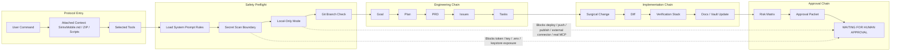

# 02 - Local-Only Execution Protocol

```mermaid
flowchart LR
  subgraph P0["Protocol Entry"]
    INPUT["User Command"]
    CONTEXT["Attached Context: SirinxMobile.md / ZIP / Scripts"]
    TOOLSET["Selected Tools"]
  end
  subgraph P1["Safety Preflight"]
    RULES["Load System Prompt Rules"]
    SECRETS["Secret Scan Boundary"]
    LOCAL["Local-Only Mode"]
    BRANCH["Git Branch Check"]
  end
  subgraph P2["Engineering Chain"]
    GOAL["Goal"]
    PLAN["Plan"]
    PRD["PRD"]
    ISSUE["Issues"]
    TASK["Tasks"]
  end
  subgraph P3["Implementation Chain"]
    PATCH["Surgical Change"]
    DIFF["Diff"]
    TEST["Verification Stack"]
    DOC["Docs / Vault Update"]
  end
  subgraph P4["Approval Chain"]
    RISK["Risk Matrix"]
    PACKET["Approval Packet"]
    STOP["WAITING FOR HUMAN APPROVAL"]
  end
  INPUT --> CONTEXT --> TOOLSET
  TOOLSET --> RULES --> SECRETS --> LOCAL --> BRANCH
  BRANCH --> GOAL --> PLAN --> PRD --> ISSUE --> TASK
  TASK --> PATCH --> DIFF --> TEST --> DOC
  DOC --> RISK --> PACKET --> STOP
  LOCAL -. "Blocks deploy / push / publish / external connector / real MCP" .-> STOP
  SECRETS -. "Blocks token / key / .env / keystore exposure" .-> STOP
```

