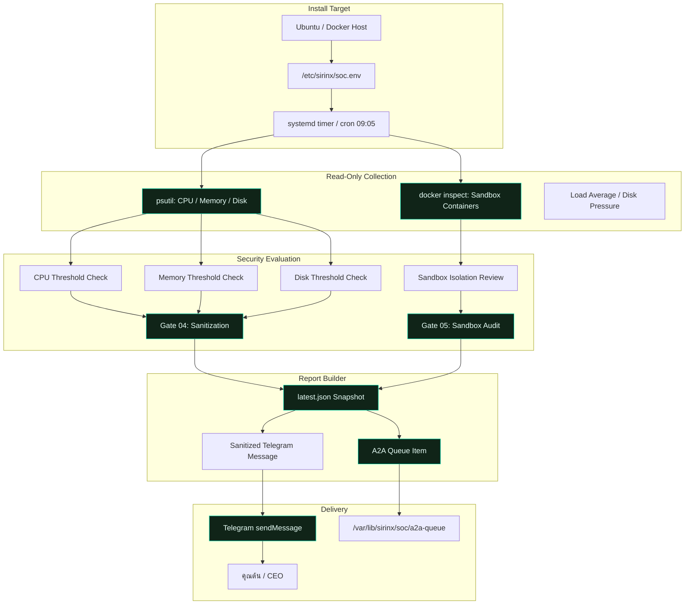

# 03 - A2ASync-1CeoAgent SOC Monitor

```mermaid
flowchart TB
  subgraph S0["Install Target"]
    HOST["Ubuntu / Docker Host"]
    ENV["/etc/sirinx/soc.env"]
    TIMER["systemd timer / cron 09:05"]
  end
  subgraph S1["Read-Only Collection"]
    PSUTIL["psutil: CPU / Memory / Disk"]
    DOCKER["docker inspect: Sandbox Containers"]
    LOAD["Load Average / Disk Pressure"]
  end
  subgraph S2["Security Evaluation"]
    CPUCHECK["CPU Threshold Check"]
    MEMCHECK["Memory Threshold Check"]
    DISKCHECK["Disk Threshold Check"]
    SANDBOX["Sandbox Isolation Review"]
    GATE04["Gate 04: Sanitization"]
    GATE05["Gate 05: Sandbox Audit"]
  end
  subgraph S3["Report Builder"]
    JSON["latest.json Snapshot"]
    MSG["Sanitized Telegram Message"]
    A2A["A2A Queue Item"]
  end
  subgraph S4["Delivery"]
    TELEGRAM["Telegram sendMessage"]
    OUTBOX["/var/lib/sirinx/soc/a2a-queue"]
    CEO["คุณต้น / CEO"]
  end
  HOST --> ENV --> TIMER
  TIMER --> PSUTIL
  TIMER --> DOCKER
  PSUTIL --> CPUCHECK
  PSUTIL --> MEMCHECK
  PSUTIL --> DISKCHECK
  DOCKER --> SANDBOX
  SANDBOX --> GATE05
  CPUCHECK --> GATE04
  MEMCHECK --> GATE04
  DISKCHECK --> GATE04
  GATE04 --> JSON
  GATE05 --> JSON
  JSON --> MSG
  JSON --> A2A
  MSG --> TELEGRAM --> CEO
  A2A --> OUTBOX
  classDef safe fill:#102418,stroke:#00d4aa,color:#e8fff8
  classDef warn fill:#2a1f00,stroke:#e5c100,color:#fff7cc
  classDef block fill:#2b1010,stroke:#ff4d4d,color:#ffecec
  class PSUTIL,DOCKER,GATE04,GATE05,JSON,A2A,TELEGRAM safe
```

## Local Boundary

Telegram delivery is a post-approval action. Before approval, only local dry-run JSON/A2A artifacts are allowed.

