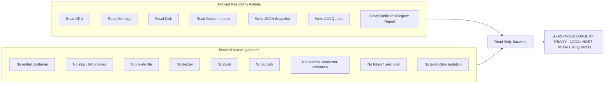

# 04 - SOC Defensive Boundary

```mermaid
flowchart LR
  subgraph ALLOW["Allowed Read-Only Actions"]
    A1["Read CPU"]
    A2["Read Memory"]
    A3["Read Disk"]
    A4["Read Docker Inspect"]
    A5["Write JSON Snapshot"]
    A6["Write A2A Queue"]
    A7["Send Sanitized Telegram Report"]
  end
  subgraph DENY["Blocked Mutating Actions"]
    B1["No restart container"]
    B2["No stop / kill process"]
    B3["No delete file"]
    B4["No deploy"]
    B5["No push"]
    B6["No publish"]
    B7["No external connector activation"]
    B8["No token / .env print"]
    B9["No production mutation"]
  end
  ALLOW --> SAFE["Read-Only Baseline"]
  DENY --> SAFE
  SAFE --> STATUS["A2ASYNC-1CEOAGENT READY - LOCAL HOST INSTALL REQUIRED"]
```

## Local Boundary

`Send Sanitized Telegram Report` is listed as an intended capability, but remains blocked until Telegram evidence and explicit approval exist.

