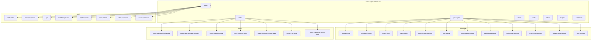

# 05 - Full-Stack Monorepo Architecture

```mermaid
flowchart TB
  subgraph ROOT["sirinx-agent-native-os/"]
    APPS["apps/"]
    PACKAGES["packages/"]
    SKILLS["skills/"]
    DOCS["docs/"]
    VAULT["vault/"]
    INFRA["infra/"]
    SCRIPTS["scripts/"]
    SCHEMAS["schemas/"]
  end
  subgraph APPS_GRID["apps"]
    WEB["web-sirinx"]
    MISSION["mission-control"]
    API["api"]
    MOBILE["mobile-operator"]
    MEDIA["media-studio"]
    SOLARADMIN["solar-admin"]
    SOLARCUST["solar-customer"]
    SOLARTECH["solar-contractor"]
  end
  subgraph PKG_GRID["packages"]
    CORE["hermes-core"]
    RUNTIME["thclaws-runtime"]
    POLICY["policy-gate"]
    SKILLLOADER["skill-loader"]
    CLIH["cli-anything-harness"]
    N8N["n8n-bridge"]
    EVIDENCE["evidence-packager"]
    DEVPOST["devpost-exporter"]
    CLAW["clawforge-adapter"]
    ACCESS["ai-access-gateway"]
    FUSION["model-fusion-router"]
    SOC["soc-monitor"]
  end
  subgraph SKILL_GRID["skills"]
    KARPATHY["sirinx-karpathy-discipline"]
    REALENG["sirinx-real-engineer-system"]
    APPROVAL["sirinx-approval-gate"]
    SECURITY["sirinx-security-audit"]
    COMPLIANCE["sirinx-compliance-risk-gate"]
    XRADAR["sirinx-x-ai-radar"]
    VIDEO["sirinx-clawforge-demo-video"]
  end
  ROOT --> APPS
  ROOT --> PACKAGES
  ROOT --> SKILLS
  ROOT --> DOCS
  ROOT --> VAULT
  ROOT --> INFRA
  ROOT --> SCRIPTS
  ROOT --> SCHEMAS
  APPS --> WEB
  APPS --> MISSION
  APPS --> API
  APPS --> MOBILE
  APPS --> MEDIA
  APPS --> SOLARADMIN
  APPS --> SOLARCUST
  APPS --> SOLARTECH
  PACKAGES --> CORE
  PACKAGES --> RUNTIME
  PACKAGES --> POLICY
  PACKAGES --> SKILLLOADER
  PACKAGES --> CLIH
  PACKAGES --> N8N
  PACKAGES --> EVIDENCE
  PACKAGES --> DEVPOST
  PACKAGES --> CLAW
  PACKAGES --> ACCESS
  PACKAGES --> FUSION
  PACKAGES --> SOC
  SKILLS --> KARPATHY
  SKILLS --> REALENG
  SKILLS --> APPROVAL
  SKILLS --> SECURITY
  SKILLS --> COMPLIANCE
  SKILLS --> XRADAR
  SKILLS --> VIDEO
```

