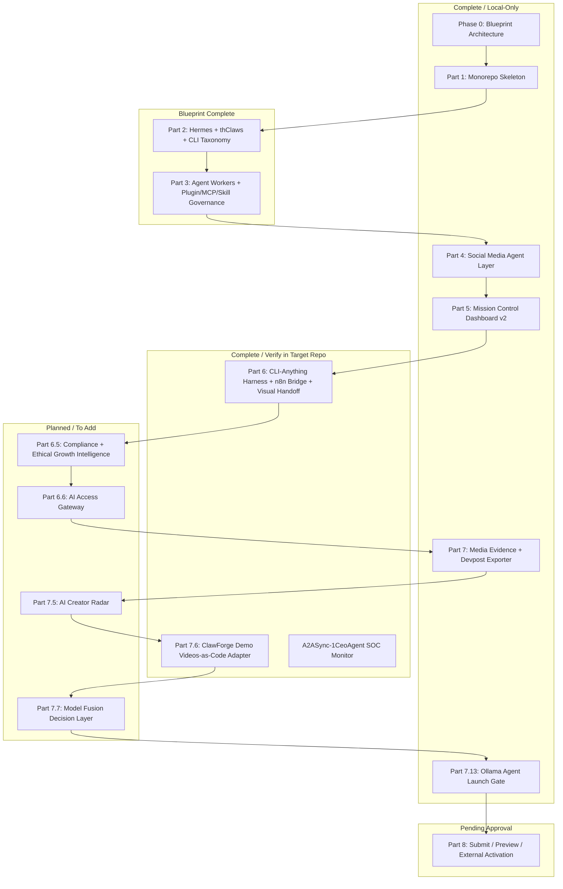

# 06 - Part Status Map

```mermaid
flowchart TB
  subgraph COMPLETE["Complete / Local-Only"]
    P0["Phase 0: Blueprint Architecture"]
    P1["Part 1: Monorepo Skeleton"]
    P4["Part 4: Social Media Agent Layer"]
    P5["Part 5: Mission Control Dashboard v2"]
    P7["Part 7: Media Evidence + Devpost Exporter"]
    P713["Part 7.13: Ollama Agent Launch Gate"]
  end
  subgraph VERIFY["Complete / Verify in Target Repo"]
    P6["Part 6: CLI-Anything Harness + n8n Bridge + Visual Handoff"]
    P76["Part 7.6: ClawForge Demo Videos-as-Code Adapter"]
    SOC["A2ASync-1CeoAgent SOC Monitor"]
  end
  subgraph BLUEPRINT["Blueprint Complete"]
    P2["Part 2: Hermes + thClaws + CLI Taxonomy"]
    P3["Part 3: Agent Workers + Plugin/MCP/Skill Governance"]
  end
  subgraph PLANNED["Planned / To Add"]
    P65["Part 6.5: Compliance + Ethical Growth Intelligence"]
    P66["Part 6.6: AI Access Gateway"]
    P75["Part 7.5: AI Creator Radar"]
    P77["Part 7.7: Model Fusion Decision Layer"]
  end
  subgraph APPROVAL["Pending Approval"]
    P8["Part 8: Submit / Preview / External Activation"]
  end
  P0 --> P1 --> P2 --> P3 --> P4 --> P5 --> P6 --> P65 --> P66 --> P7 --> P75 --> P76 --> P77 --> P713 --> P8
```
