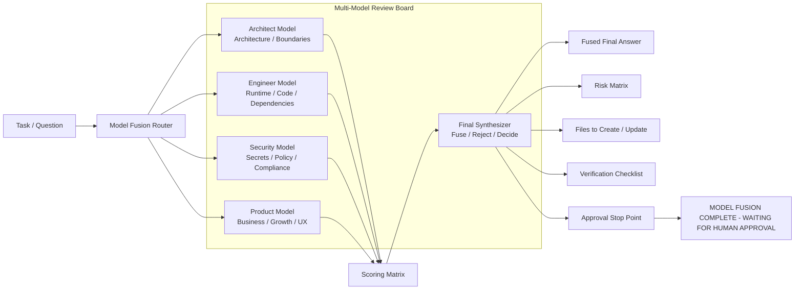

# 07 - Model Fusion Decision Layer

```mermaid
flowchart LR
  TASK["Task / Question"] --> ROUTER["Model Fusion Router"]
  subgraph PANEL["Multi-Model Review Board"]
    ARCH["Architect Model\nArchitecture / Boundaries"]
    ENG["Engineer Model\nRuntime / Code / Dependencies"]
    SEC["Security Model\nSecrets / Policy / Compliance"]
    PROD["Product Model\nBusiness / Growth / UX"]
    SYN["Final Synthesizer\nFuse / Reject / Decide"]
  end
  ROUTER --> ARCH
  ROUTER --> ENG
  ROUTER --> SEC
  ROUTER --> PROD
  ARCH --> SCORE["Scoring Matrix"]
  ENG --> SCORE
  SEC --> SCORE
  PROD --> SCORE
  SCORE --> SYN
  SYN --> FINAL["Fused Final Answer"]
  SYN --> RISK["Risk Matrix"]
  SYN --> FILES["Files to Create / Update"]
  SYN --> VERIFY["Verification Checklist"]
  SYN --> APPROVAL["Approval Stop Point"]
  APPROVAL --> STOP["MODEL FUSION COMPLETE - WAITING FOR HUMAN APPROVAL"]
```

